# Enterprise AI Agent Management System - Database Schema

## Entity Relationship Diagram

```mermaid
erDiagram
    %% Core Entities
    ORGANIZATIONS ||--o{ TEAMS : has
    ORGANIZATIONS ||--o{ EMPLOYEES : has
    ORGANIZATIONS ||--o{ SUBSCRIPTIONS : has
    ORGANIZATIONS ||--o{ USAGE_RECORDS : tracks
    
    TEAMS ||--o{ EMPLOYEES : contains
    TEAMS ||--o{ TEAM_POLICIES : has
    
    EMPLOYEES ||--o{ EMPLOYEE_AGENTS : assigned
    EMPLOYEES ||--o{ EMPLOYEE_MCP_CONFIGS : has
    EMPLOYEES ||--o{ SESSIONS : creates
    EMPLOYEES ||--o{ AGENT_REQUESTS : submits
    EMPLOYEES ||--o{ MISSIONS : executes
    EMPLOYEES }o--|| ROLES : has
    
    %% Agent Configuration
    AGENT_TEMPLATES ||--o{ EMPLOYEE_AGENTS : instantiates
    AGENT_TEMPLATES ||--o{ AGENT_TEMPLATE_TOOLS : includes
    AGENT_TEMPLATES ||--o{ AGENT_TEMPLATE_POLICIES : defines
    
    EMPLOYEE_AGENTS ||--o{ AGENT_EXECUTION_LOGS : generates
    EMPLOYEE_AGENTS }o--o{ TOOLS : uses
    EMPLOYEE_AGENTS }o--o{ POLICIES : enforces
    
    %% MCP Configuration
    MCP_REGISTRY ||--o{ EMPLOYEE_MCP_CONFIGS : provides
    MCP_REGISTRY ||--o{ MCP_CATEGORIES : categorized_by
    
    EMPLOYEE_MCP_CONFIGS ||--o{ MCP_USAGE_LOGS : tracks
    
    %% Missions & Tasks
    MISSIONS ||--o{ TASKS : contains
    MISSIONS ||--o{ ARTIFACTS : produces
    MISSIONS ||--o{ EVENTS : emits
    
    TASKS ||--o{ TASK_DEPENDENCIES : has
    TASKS ||--o{ EVENTS : emits
    TASKS }o--|| EMPLOYEE_AGENTS : executed_by
    
    %% Approvals & Requests
    AGENT_REQUESTS ||--o{ APPROVALS : requires
    APPROVALS }o--|| EMPLOYEES : approved_by
    
    %% Audit & Analytics
    EVENTS ||--o{ EVENT_METADATA : contains
    USAGE_RECORDS }o--|| EMPLOYEES : attributed_to
    USAGE_RECORDS }o--|| EMPLOYEE_AGENTS : generated_by

    %% Organization Entity
    ORGANIZATIONS {
        uuid id PK
        string name
        string slug UK
        string plan
        jsonb settings
        int max_employees
        int max_agents_per_employee
        timestamp created_at
        timestamp updated_at
        timestamp deleted_at
    }

    %% Subscription Entity
    SUBSCRIPTIONS {
        uuid id PK
        uuid org_id FK
        string plan_type
        decimal monthly_budget_usd
        decimal current_spending_usd
        timestamp billing_period_start
        timestamp billing_period_end
        string status
        timestamp created_at
        timestamp updated_at
    }

    %% Team Entity
    TEAMS {
        uuid id PK
        uuid org_id FK
        string name
        string description
        jsonb settings
        timestamp created_at
        timestamp updated_at
    }

    %% Role Entity
    ROLES {
        uuid id PK
        string name UK
        string description
        jsonb permissions
        timestamp created_at
    }

    %% Employee Entity
    EMPLOYEES {
        uuid id PK
        uuid org_id FK
        uuid team_id FK
        uuid role_id FK
        string email UK
        string full_name
        string status
        jsonb preferences
        timestamp last_login_at
        timestamp created_at
        timestamp updated_at
        timestamp deleted_at
    }

    %% Session Entity
    SESSIONS {
        uuid id PK
        uuid employee_id FK
        string token_hash
        string ip_address
        string user_agent
        timestamp expires_at
        timestamp created_at
    }

    %% Agent Template Entity
    AGENT_TEMPLATES {
        uuid id PK
        string name UK
        string type
        string description
        jsonb default_config
        jsonb capabilities
        string llm_provider
        string llm_model
        bool is_public
        uuid created_by_org_id FK
        timestamp created_at
        timestamp updated_at
    }

    %% Agent Template Tools (Many-to-Many)
    AGENT_TEMPLATE_TOOLS {
        uuid agent_template_id FK
        uuid tool_id FK
        jsonb config
        timestamp created_at
    }

    %% Agent Template Policies (Many-to-Many)
    AGENT_TEMPLATE_POLICIES {
        uuid agent_template_id FK
        uuid policy_id FK
        timestamp created_at
    }

    %% Employee Agent Instance
    EMPLOYEE_AGENTS {
        uuid id PK
        uuid employee_id FK
        uuid agent_template_id FK
        string name
        string status
        jsonb config_override
        jsonb runtime_state
        timestamp last_used_at
        timestamp created_at
        timestamp updated_at
    }

    %% Tool Registry
    TOOLS {
        uuid id PK
        string name UK
        string type
        string description
        jsonb schema
        jsonb default_params
        bool requires_approval
        timestamp created_at
        timestamp updated_at
    }

    %% Policy Registry
    POLICIES {
        uuid id PK
        string name UK
        string type
        jsonb rules
        string severity
        timestamp created_at
        timestamp updated_at
    }

    %% Team Policies
    TEAM_POLICIES {
        uuid id PK
        uuid team_id FK
        uuid policy_id FK
        jsonb overrides
        timestamp created_at
    }

    %% MCP Registry
    MCP_REGISTRY {
        uuid id PK
        string name UK
        string provider
        string version
        string description
        jsonb connection_schema
        jsonb capabilities
        bool requires_credentials
        bool is_approved
        timestamp created_at
        timestamp updated_at
    }

    %% MCP Categories
    MCP_CATEGORIES {
        uuid id PK
        string name UK
        string description
        timestamp created_at
    }

    %% Employee MCP Configuration
    EMPLOYEE_MCP_CONFIGS {
        uuid id PK
        uuid employee_id FK
        uuid mcp_server_id FK
        string status
        jsonb connection_config
        jsonb credentials_encrypted
        timestamp last_sync_at
        timestamp created_at
        timestamp updated_at
    }

    %% Agent Request (for approval workflows)
    AGENT_REQUESTS {
        uuid id PK
        uuid employee_id FK
        string request_type
        jsonb request_data
        string status
        string reason
        timestamp created_at
        timestamp resolved_at
    }

    %% Approval Workflow
    APPROVALS {
        uuid id PK
        uuid request_id FK
        uuid approver_id FK
        string status
        string comment
        timestamp created_at
        timestamp resolved_at
    }

    %% Mission Execution
    MISSIONS {
        uuid id PK
        uuid employee_id FK
        string title
        string intent
        string status
        jsonb plan
        jsonb context
        timestamp started_at
        timestamp completed_at
        timestamp created_at
    }

    %% Task Execution
    TASKS {
        uuid id PK
        uuid mission_id FK
        uuid agent_id FK
        string type
        string status
        jsonb input
        jsonb output
        int retry_count
        timestamp started_at
        timestamp completed_at
        timestamp created_at
    }

    %% Task Dependencies
    TASK_DEPENDENCIES {
        uuid task_id FK
        uuid depends_on_task_id FK
        string dependency_type
        timestamp created_at
    }

    %% Artifacts
    ARTIFACTS {
        uuid id PK
        uuid mission_id FK
        uuid task_id FK
        string sha256 UK
        string artifact_type
        string file_path
        int64 size_bytes
        jsonb metadata
        timestamp created_at
    }

    %% Events (Audit Trail)
    EVENTS {
        uuid id PK
        uuid org_id FK
        uuid employee_id FK
        uuid mission_id FK
        uuid task_id FK
        string event_type
        string event_category
        jsonb payload
        timestamp created_at
    }

    %% Event Metadata (for efficient querying)
    EVENT_METADATA {
        uuid event_id FK
        string key
        string value
        timestamp created_at
    }

    %% Agent Execution Logs
    AGENT_EXECUTION_LOGS {
        uuid id PK
        uuid agent_id FK
        uuid task_id FK
        string log_level
        text message
        jsonb context
        timestamp created_at
    }

    %% MCP Usage Logs
    MCP_USAGE_LOGS {
        uuid id PK
        uuid mcp_config_id FK
        uuid task_id FK
        string operation
        int64 duration_ms
        string status
        jsonb metadata
        timestamp created_at
    }

    %% Usage Records (for billing/analytics)
    USAGE_RECORDS {
        uuid id PK
        uuid org_id FK
        uuid employee_id FK
        uuid agent_id FK
        string resource_type
        int64 quantity
        decimal cost_usd
        timestamp period_start
        timestamp period_end
        jsonb metadata
        timestamp created_at
    }
```



## Table Indexes

```sql
-- Organizations
CREATE INDEX idx_organizations_slug ON organizations(slug);
CREATE INDEX idx_organizations_plan ON organizations(plan);

-- Employees
CREATE INDEX idx_employees_org_id ON employees(org_id);
CREATE INDEX idx_employees_team_id ON employees(team_id);
CREATE INDEX idx_employees_email ON employees(email);
CREATE INDEX idx_employees_status ON employees(status);

-- Employee Agents
CREATE INDEX idx_employee_agents_employee_id ON employee_agents(employee_id);
CREATE INDEX idx_employee_agents_template_id ON employee_agents(agent_template_id);
CREATE INDEX idx_employee_agents_status ON employee_agents(status);

-- MCP Configs
CREATE INDEX idx_employee_mcp_configs_employee_id ON employee_mcp_configs(employee_id);
CREATE INDEX idx_employee_mcp_configs_status ON employee_mcp_configs(status);

-- Missions
CREATE INDEX idx_missions_employee_id ON missions(employee_id);
CREATE INDEX idx_missions_status ON missions(status);
CREATE INDEX idx_missions_created_at ON missions(created_at DESC);

-- Tasks
CREATE INDEX idx_tasks_mission_id ON tasks(mission_id);
CREATE INDEX idx_tasks_agent_id ON tasks(agent_id);
CREATE INDEX idx_tasks_status ON tasks(status);

-- Events
CREATE INDEX idx_events_org_id ON events(org_id);
CREATE INDEX idx_events_employee_id ON events(employee_id);
CREATE INDEX idx_events_event_type ON events(event_type);
CREATE INDEX idx_events_created_at ON events(created_at DESC);
CREATE INDEX idx_events_mission_id ON events(mission_id);

-- Usage Records
CREATE INDEX idx_usage_records_org_id ON usage_records(org_id);
CREATE INDEX idx_usage_records_employee_id ON usage_records(employee_id);
CREATE INDEX idx_usage_records_period ON usage_records(period_start, period_end);

-- Approvals
CREATE INDEX idx_approvals_request_id ON approvals(request_id);
CREATE INDEX idx_approvals_approver_id ON approvals(approver_id);
CREATE INDEX idx_approvals_status ON approvals(status);
```

## Key Design Decisions

### 1. Multi-Tenancy
- **Organization-centric**: All data partitioned by `org_id`
- **Row-level security**: Use PostgreSQL RLS for tenant isolation
- **Soft deletes**: `deleted_at` for compliance/audit requirements

### 2. Agent Management
- **Template Pattern**: `agent_templates` define reusable agent configs
- **Instance Pattern**: `employee_agents` are per-employee instances with overrides
- **Flexibility**: JSON columns for config/capabilities allow evolution without migrations

### 3. MCP Integration
- **Registry**: Central catalog of available MCP servers
- **Per-Employee Config**: Each employee has their own MCP connections
- **Credentials**: Encrypted storage for API keys/secrets

### 4. Approval Workflows
- **Request-based**: Employees submit requests for new agents/MCPs
- **Multi-stage**: Support multiple approvers per request
- **Audit trail**: Full history of approvals/rejections

### 5. Cost Tracking
- **Usage Records**: Granular tracking of LLM tokens, compute time
- **Subscription Model**: Per-org budgets with real-time spending tracking
- **Attribution**: Usage tied to employee, agent, and mission

### 6. Event System
- **Comprehensive Audit**: Every action generates events
- **Metadata Indexing**: Separate table for efficient event querying
- **Retention Policies**: Can archive old events for cost optimization

## Sample Queries

### Get employee's assigned agents with templates
```sql
SELECT 
    ea.id,
    ea.name,
    at.type,
    ea.status,
    ea.last_used_at
FROM employee_agents ea
JOIN agent_templates at ON ea.agent_template_id = at.id
WHERE ea.employee_id = $1
AND ea.status = 'active';
```

### Check org spending vs budget
```sql
SELECT 
    s.monthly_budget_usd,
    s.current_spending_usd,
    (s.current_spending_usd / s.monthly_budget_usd * 100) as usage_pct
FROM subscriptions s
WHERE s.org_id = $1
AND s.status = 'active'
AND CURRENT_TIMESTAMP BETWEEN s.billing_period_start AND s.billing_period_end;
```

### Agent usage analytics per team
```sql
SELECT 
    t.name as team_name,
    at.type as agent_type,
    COUNT(DISTINCT m.id) as missions_count,
    SUM(ur.cost_usd) as total_cost
FROM teams t
JOIN employees e ON e.team_id = t.id
JOIN missions m ON m.employee_id = e.id
JOIN tasks tk ON tk.mission_id = m.id
JOIN employee_agents ea ON ea.id = tk.agent_id
JOIN agent_templates at ON at.id = ea.agent_template_id
LEFT JOIN usage_records ur ON ur.employee_id = e.id
WHERE t.org_id = $1
AND m.created_at >= $2
GROUP BY t.id, t.name, at.type
ORDER BY total_cost DESC;
```

### Pending approval requests
```sql
SELECT 
    ar.id,
    ar.request_type,
    e.full_name as requester,
    ar.reason,
    ar.created_at
FROM agent_requests ar
JOIN employees e ON ar.employee_id = e.id
WHERE ar.status = 'pending'
AND e.org_id = $1
ORDER BY ar.created_at ASC;
```
