# Ubik Enterprise - Marketing Strategy Diagrams

This document contains Mermaid diagrams visualizing the key concepts from MARKETING.md.

---

## 1. Product Vision & Value Flow


---

## 2. Customer Personas & Stakeholders


---

## 3. The Demo Flow (3-Minute Aha Moment)

```mermaid
sequenceDiagram
    participant IT as IT Admin
    participant Dashboard as Ubik Dashboard
    participant Platform as Ubik Platform
    participant Dev as Developer
    participant Agent as Claude Code

    Note over IT,Agent: Scene 1: IT Setup (2 min)
    IT->>Dashboard: Configure Claude Code
    Dashboard->>Dashboard: Set model, temp, limits
    Dashboard->>Dashboard: Set path restrictions
    Dashboard->>Dashboard: Set $500/month budget
    IT->>Dashboard: Save configuration
    Dashboard->>Platform: Deploy to team (50 devs)

    Note over IT,Agent: Scene 2: Developer Use (1 min)
    Dev->>Platform: $ ubik login
    Platform->>Dev: ✓ Authenticated
    Dev->>Platform: $ ubik
    Platform->>Agent: Launch Claude Code
    Agent-->>Dev: 💻 Full AI Experience
    Note over Dev: No setup, no config, just works

    Note over IT,Agent: Scene 3: IT Visibility (1 min)
    Platform->>Dashboard: Real-time usage data
    Dashboard->>IT: Show usage graphs
    Dashboard->>IT: Show cost breakdown
    Dashboard->>IT: Show audit logs
    Note over IT: "Wait, that's it? You just solved it?"
```



---

## 4. Revenue Model & Pricing Tiers

```mermaid
graph TB
    subgraph "Tier 1: Starter"
        T1A["$50/dev/month"]
        T1B[Up to 50 devs]
        T1C[Core Features]
        T1D[Target: Small Tech]
    end

    subgraph "Tier 2: Professional"
        T2A["$75/dev/month"]
        T2B[50-500 devs]
        T2C[Advanced Policies + SSO]
        T2D[Target: Mid-size]
    end

    subgraph "Tier 3: Enterprise"
        T3A[Custom Pricing]
        T3B[500+ devs]
        T3C[Custom Integration + SLA]
        T3D[Target: Large Enterprise]
    end

    subgraph "Revenue Projections"
        Y1[Year 1: $1.8M ARR<br/>20 customers × 100 devs]
        Y2[Year 2: $13.5M ARR<br/>100 customers × 150 devs]
        Y3[Year 3: $84M ARR<br/>500 customers × 200 devs]
    end

    T1A --> T1B --> T1C --> T1D
    T2A --> T2B --> T2C --> T2D
    T3A --> T3B --> T3C --> T3D

    T1D --> Y1
    T2D --> Y2
    T3D --> Y3

    style T1A fill:#90EE90
    style T2A fill:#FFD700
    style T3A fill:#FF69B4
    style Y1 fill:#E6E6FA
    style Y2 fill:#DDA0DD
    style Y3 fill:#BA55D3
```



---

## 5. Go-to-Market Timeline


---

## 6. Product Roadmap (Business View)


---

## 7. Value Delivery by Persona


---

## 8. Competitive Positioning

```mermaid
quadrantChart
    title Competitive Landscape
    x-axis Low Dev Experience --> High Dev Experience
    y-axis Low Enterprise Control --> High Enterprise Control

    quadrant-1 Ideal (Ubik Target)
    quadrant-2 Enterprise but Clunky
    quadrant-3 Neither
    quadrant-4 Dev-Friendly but Risky

    Ubik: [0.85, 0.90]
    DIY Solutions: [0.40, 0.30]
    AI Vendor Tools: [0.70, 0.40]
    General IAM: [0.35, 0.75]
    Nothing/Wild West: [0.80, 0.10]
```

---

## 9. Customer Journey Flow


---

## 10. Success Metrics Flow


---

## 11. Launch Campaign Structure


---

## 12. Defensibility Moat


---

## 13. Risk Mitigation Map


---

## Usage Notes

All diagrams above are written in Mermaid syntax and will render automatically in:
- GitHub
- GitLab
- VSCode with Mermaid plugin
- Notion
- Obsidian
- Other Markdown renderers with Mermaid support

To view these diagrams:
1. **GitHub/GitLab**: Open this file directly
2. **VSCode**: Install "Markdown Preview Mermaid Support" extension
3. **Online**: Copy diagram code to https://mermaid.live

---

**Document Version:** 1.0
**Source:** MARKETING.md
**Last Updated:** 2025-10-30
