# pivot

## Tables

| Name | Columns | Comment | Type |
| ---- | ------- | ------- | ---- |
| [public.organizations](public.organizations.md) | 9 |  | BASE TABLE |
| [public.subscriptions](public.subscriptions.md) | 10 |  | BASE TABLE |
| [public.teams](public.teams.md) | 6 |  | BASE TABLE |
| [public.roles](public.roles.md) | 5 |  | BASE TABLE |
| [public.employees](public.employees.md) | 13 |  | BASE TABLE |
| [public.sessions](public.sessions.md) | 7 |  | BASE TABLE |
| [public.agents](public.agents.md) | 12 |  | BASE TABLE |
| [public.tools](public.tools.md) | 8 |  | BASE TABLE |
| [public.policies](public.policies.md) | 7 |  | BASE TABLE |
| [public.agent_tools](public.agent_tools.md) | 4 |  | BASE TABLE |
| [public.agent_policies](public.agent_policies.md) | 3 |  | BASE TABLE |
| [public.team_policies](public.team_policies.md) | 5 |  | BASE TABLE |
| [public.org_agent_configs](public.org_agent_configs.md) | 7 |  | BASE TABLE |
| [public.team_agent_configs](public.team_agent_configs.md) | 7 |  | BASE TABLE |
| [public.employee_agent_configs](public.employee_agent_configs.md) | 9 |  | BASE TABLE |
| [public.system_prompts](public.system_prompts.md) | 8 |  | BASE TABLE |
| [public.employee_policies](public.employee_policies.md) | 5 |  | BASE TABLE |
| [public.mcp_categories](public.mcp_categories.md) | 4 |  | BASE TABLE |
| [public.mcp_catalog](public.mcp_catalog.md) | 12 |  | BASE TABLE |
| [public.employee_mcp_configs](public.employee_mcp_configs.md) | 10 |  | BASE TABLE |
| [public.agent_requests](public.agent_requests.md) | 8 |  | BASE TABLE |
| [public.approvals](public.approvals.md) | 7 |  | BASE TABLE |
| [public.activity_logs](public.activity_logs.md) | 7 |  | BASE TABLE |
| [public.usage_records](public.usage_records.md) | 11 |  | BASE TABLE |
| [public.v_employee_agents](public.v_employee_agents.md) | 12 | Complete view of employee agent configurations with catalog details | VIEW |
| [public.v_employee_mcps](public.v_employee_mcps.md) | 11 | Complete view of employee MCP configurations with catalog details | VIEW |
| [public.v_pending_approvals](public.v_pending_approvals.md) | 10 | Pending approval requests with full requester context | VIEW |

## Stored procedures and functions

| Name | ReturnType | Arguments | Type |
| ---- | ------- | ------- | ---- |
| public.uuid_nil | uuid |  | FUNCTION |
| public.uuid_ns_dns | uuid |  | FUNCTION |
| public.uuid_ns_url | uuid |  | FUNCTION |
| public.uuid_ns_oid | uuid |  | FUNCTION |
| public.uuid_ns_x500 | uuid |  | FUNCTION |
| public.uuid_generate_v1 | uuid |  | FUNCTION |
| public.uuid_generate_v1mc | uuid |  | FUNCTION |
| public.uuid_generate_v3 | uuid | namespace uuid, name text | FUNCTION |
| public.uuid_generate_v4 | uuid |  | FUNCTION |
| public.uuid_generate_v5 | uuid | namespace uuid, name text | FUNCTION |
| public.update_updated_at_column | trigger |  | FUNCTION |
| public.generate_sync_token | trigger |  | FUNCTION |

## Relations

```mermaid
erDiagram

"public.subscriptions" }o--|| "public.organizations" : "FOREIGN KEY (org_id) REFERENCES organizations(id) ON DELETE CASCADE"
"public.teams" }o--|| "public.organizations" : "FOREIGN KEY (org_id) REFERENCES organizations(id) ON DELETE CASCADE"
"public.employees" }o--|| "public.organizations" : "FOREIGN KEY (org_id) REFERENCES organizations(id) ON DELETE CASCADE"
"public.employees" }o--o| "public.teams" : "FOREIGN KEY (team_id) REFERENCES teams(id) ON DELETE SET NULL"
"public.employees" }o--|| "public.roles" : "FOREIGN KEY (role_id) REFERENCES roles(id)"
"public.sessions" }o--|| "public.employees" : "FOREIGN KEY (employee_id) REFERENCES employees(id) ON DELETE CASCADE"
"public.agent_tools" }o--|| "public.agents" : "FOREIGN KEY (agent_id) REFERENCES agents(id) ON DELETE CASCADE"
"public.agent_tools" }o--|| "public.tools" : "FOREIGN KEY (tool_id) REFERENCES tools(id) ON DELETE CASCADE"
"public.agent_policies" }o--|| "public.agents" : "FOREIGN KEY (agent_id) REFERENCES agents(id) ON DELETE CASCADE"
"public.agent_policies" }o--|| "public.policies" : "FOREIGN KEY (policy_id) REFERENCES policies(id) ON DELETE CASCADE"
"public.team_policies" }o--|| "public.teams" : "FOREIGN KEY (team_id) REFERENCES teams(id) ON DELETE CASCADE"
"public.team_policies" }o--|| "public.policies" : "FOREIGN KEY (policy_id) REFERENCES policies(id) ON DELETE CASCADE"
"public.org_agent_configs" }o--|| "public.organizations" : "FOREIGN KEY (org_id) REFERENCES organizations(id) ON DELETE CASCADE"
"public.org_agent_configs" }o--|| "public.agents" : "FOREIGN KEY (agent_id) REFERENCES agents(id) ON DELETE RESTRICT"
"public.team_agent_configs" }o--|| "public.teams" : "FOREIGN KEY (team_id) REFERENCES teams(id) ON DELETE CASCADE"
"public.team_agent_configs" }o--|| "public.agents" : "FOREIGN KEY (agent_id) REFERENCES agents(id) ON DELETE RESTRICT"
"public.employee_agent_configs" }o--|| "public.employees" : "FOREIGN KEY (employee_id) REFERENCES employees(id) ON DELETE CASCADE"
"public.employee_agent_configs" }o--|| "public.agents" : "FOREIGN KEY (agent_id) REFERENCES agents(id) ON DELETE RESTRICT"
"public.system_prompts" }o--o| "public.agents" : "FOREIGN KEY (agent_id) REFERENCES agents(id) ON DELETE CASCADE"
"public.employee_policies" }o--|| "public.employees" : "FOREIGN KEY (employee_id) REFERENCES employees(id) ON DELETE CASCADE"
"public.employee_policies" }o--|| "public.policies" : "FOREIGN KEY (policy_id) REFERENCES policies(id) ON DELETE CASCADE"
"public.mcp_catalog" }o--o| "public.mcp_categories" : "FOREIGN KEY (category_id) REFERENCES mcp_categories(id) ON DELETE SET NULL"
"public.employee_mcp_configs" }o--|| "public.employees" : "FOREIGN KEY (employee_id) REFERENCES employees(id) ON DELETE CASCADE"
"public.employee_mcp_configs" }o--|| "public.mcp_catalog" : "FOREIGN KEY (mcp_catalog_id) REFERENCES mcp_catalog(id) ON DELETE CASCADE"
"public.agent_requests" }o--|| "public.employees" : "FOREIGN KEY (employee_id) REFERENCES employees(id) ON DELETE CASCADE"
"public.approvals" }o--|| "public.employees" : "FOREIGN KEY (approver_id) REFERENCES employees(id) ON DELETE CASCADE"
"public.approvals" }o--|| "public.agent_requests" : "FOREIGN KEY (request_id) REFERENCES agent_requests(id) ON DELETE CASCADE"
"public.activity_logs" }o--|| "public.organizations" : "FOREIGN KEY (org_id) REFERENCES organizations(id) ON DELETE CASCADE"
"public.activity_logs" }o--o| "public.employees" : "FOREIGN KEY (employee_id) REFERENCES employees(id) ON DELETE SET NULL"
"public.usage_records" }o--|| "public.organizations" : "FOREIGN KEY (org_id) REFERENCES organizations(id) ON DELETE CASCADE"
"public.usage_records" }o--o| "public.employees" : "FOREIGN KEY (employee_id) REFERENCES employees(id) ON DELETE SET NULL"
"public.usage_records" }o--o| "public.employee_agent_configs" : "FOREIGN KEY (agent_config_id) REFERENCES employee_agent_configs(id) ON DELETE SET NULL"

"public.organizations" {
  uuid id
  varchar_255_ name
  varchar_100_ slug
  varchar_50_ plan
  jsonb settings
  integer max_employees
  integer max_agents_per_employee
  timestamp_without_time_zone created_at
  timestamp_without_time_zone updated_at
}
"public.subscriptions" {
  uuid id
  uuid org_id FK
  varchar_50_ plan_type
  numeric_10_2_ monthly_budget_usd
  numeric_10_2_ current_spending_usd
  timestamp_without_time_zone billing_period_start
  timestamp_without_time_zone billing_period_end
  varchar_50_ status
  timestamp_without_time_zone created_at
  timestamp_without_time_zone updated_at
}
"public.teams" {
  uuid id
  uuid org_id FK
  varchar_255_ name
  text description
  timestamp_without_time_zone created_at
  timestamp_without_time_zone updated_at
}
"public.roles" {
  uuid id
  varchar_100_ name
  text description
  jsonb permissions
  timestamp_without_time_zone created_at
}
"public.employees" {
  uuid id
  uuid org_id FK
  uuid team_id FK
  uuid role_id FK
  varchar_255_ email
  varchar_255_ full_name
  varchar_255_ password_hash
  varchar_50_ status
  jsonb preferences
  timestamp_without_time_zone last_login_at
  timestamp_without_time_zone created_at
  timestamp_without_time_zone updated_at
  timestamp_without_time_zone deleted_at
}
"public.sessions" {
  uuid id
  uuid employee_id FK
  varchar_255_ token_hash
  varchar_45_ ip_address
  text user_agent
  timestamp_without_time_zone expires_at
  timestamp_without_time_zone created_at
}
"public.agents" {
  uuid id
  varchar_255_ name
  varchar_100_ type
  text description
  varchar_100_ provider
  jsonb default_config
  jsonb capabilities
  varchar_50_ llm_provider
  varchar_100_ llm_model
  boolean is_public
  timestamp_without_time_zone created_at
  timestamp_without_time_zone updated_at
}
"public.tools" {
  uuid id
  varchar_100_ name
  varchar_50_ type
  text description
  jsonb schema
  boolean requires_approval
  timestamp_without_time_zone created_at
  timestamp_without_time_zone updated_at
}
"public.policies" {
  uuid id
  varchar_100_ name
  varchar_50_ type
  jsonb rules
  varchar_20_ severity
  timestamp_without_time_zone created_at
  timestamp_without_time_zone updated_at
}
"public.agent_tools" {
  uuid agent_id FK
  uuid tool_id FK
  jsonb config
  timestamp_without_time_zone created_at
}
"public.agent_policies" {
  uuid agent_id FK
  uuid policy_id FK
  timestamp_without_time_zone created_at
}
"public.team_policies" {
  uuid id
  uuid team_id FK
  uuid policy_id FK
  jsonb overrides
  timestamp_without_time_zone created_at
}
"public.org_agent_configs" {
  uuid id
  uuid org_id FK
  uuid agent_id FK
  jsonb config
  boolean is_enabled
  timestamp_without_time_zone created_at
  timestamp_without_time_zone updated_at
}
"public.team_agent_configs" {
  uuid id
  uuid team_id FK
  uuid agent_id FK
  jsonb config_override
  boolean is_enabled
  timestamp_without_time_zone created_at
  timestamp_without_time_zone updated_at
}
"public.employee_agent_configs" {
  uuid id
  uuid employee_id FK
  uuid agent_id FK
  jsonb config_override
  boolean is_enabled
  varchar_255_ sync_token
  timestamp_without_time_zone last_synced_at
  timestamp_without_time_zone created_at
  timestamp_without_time_zone updated_at
}
"public.system_prompts" {
  uuid id
  varchar_20_ scope_type
  uuid scope_id
  uuid agent_id FK
  text prompt
  integer priority
  timestamp_without_time_zone created_at
  timestamp_without_time_zone updated_at
}
"public.employee_policies" {
  uuid id
  uuid employee_id FK
  uuid policy_id FK
  jsonb overrides
  timestamp_without_time_zone created_at
}
"public.mcp_categories" {
  uuid id
  varchar_100_ name
  text description
  timestamp_without_time_zone created_at
}
"public.mcp_catalog" {
  uuid id
  varchar_255_ name
  varchar_255_ provider
  varchar_50_ version
  text description
  jsonb connection_schema
  jsonb capabilities
  boolean requires_credentials
  boolean is_approved
  uuid category_id FK
  timestamp_without_time_zone created_at
  timestamp_without_time_zone updated_at
}
"public.employee_mcp_configs" {
  uuid id
  uuid employee_id FK
  uuid mcp_catalog_id FK
  varchar_50_ status
  jsonb connection_config
  text credentials_encrypted
  varchar_255_ sync_token
  timestamp_without_time_zone last_sync_at
  timestamp_without_time_zone created_at
  timestamp_without_time_zone updated_at
}
"public.agent_requests" {
  uuid id
  uuid employee_id FK
  varchar_50_ request_type
  jsonb request_data
  varchar_50_ status
  text reason
  timestamp_without_time_zone created_at
  timestamp_without_time_zone resolved_at
}
"public.approvals" {
  uuid id
  uuid request_id FK
  uuid approver_id FK
  varchar_50_ status
  text comment
  timestamp_without_time_zone created_at
  timestamp_without_time_zone resolved_at
}
"public.activity_logs" {
  uuid id
  uuid org_id FK
  uuid employee_id FK
  varchar_100_ event_type
  varchar_50_ event_category
  jsonb payload
  timestamp_without_time_zone created_at
}
"public.usage_records" {
  uuid id
  uuid org_id FK
  uuid employee_id FK
  uuid agent_config_id FK
  varchar_50_ resource_type
  bigint quantity
  numeric_10_4_ cost_usd
  timestamp_without_time_zone period_start
  timestamp_without_time_zone period_end
  jsonb metadata
  timestamp_without_time_zone created_at
}
"public.v_employee_agents" {
  uuid id
  uuid employee_id
  varchar_255_ employee_name
  varchar_255_ employee_email
  varchar_255_ agent_name
  varchar_100_ agent_type
  varchar_100_ provider
  boolean is_enabled
  jsonb config_override
  varchar_255_ sync_token
  timestamp_without_time_zone last_synced_at
  timestamp_without_time_zone created_at
}
"public.v_employee_mcps" {
  uuid id
  uuid employee_id
  varchar_255_ employee_name
  varchar_255_ employee_email
  varchar_255_ mcp_name
  varchar_255_ provider
  varchar_50_ version
  varchar_50_ status
  varchar_255_ sync_token
  timestamp_without_time_zone last_sync_at
  timestamp_without_time_zone created_at
}
"public.v_pending_approvals" {
  uuid request_id
  varchar_50_ request_type
  jsonb request_data
  text reason
  timestamp_without_time_zone requested_at
  uuid employee_id
  varchar_255_ requester_name
  varchar_255_ requester_email
  varchar_255_ team_name
  varchar_255_ org_name
}
```

---

> Generated by [tbls](https://github.com/k1LoW/tbls)
