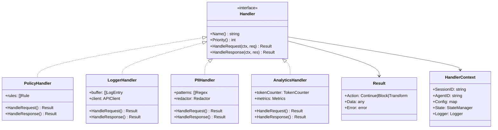

# Control Service Architecture

A robust, extensible architecture for intercepting, analyzing, and controlling LLM API traffic.

## Design Principles

1. **Pipeline Pattern** - Requests/responses flow through a chain of handlers
2. **Single Responsibility** - Each handler does one thing well
3. **Open/Closed** - Add new handlers without modifying existing ones
4. **Fail-Safe** - If a handler fails, traffic continues (configurable)

---

## Architecture Overview


---

## Handler Pipeline Detail


---

## Handler Interface Design



---

## State Management


---

## Request Lifecycle


---

## Extensibility: Adding New Handlers


---

## Future Extensions


---

## Directory Structure

```
services/cli/internal/control/
├── control.go              # Main Control Service
├── handler.go              # Handler interface
├── pipeline.go             # Pipeline orchestration
├── state.go                # State manager
├── router.go               # Traffic router
│
├── handlers/
│   ├── policy.go           # Policy enforcement
│   ├── logger.go           # Logging handler
│   ├── pii.go              # PII detection
│   ├── analytics.go        # Analytics collection
│   └── ratelimit.go        # Rate limiting
│
├── proxy/
│   └── proxy.go            # MITM proxy (existing)
│
└── config/
    └── config.go           # Configuration loading
```

---

## Key Benefits

| Aspect | Benefit |
|--------|---------|
| **Extensibility** | Add handlers without touching existing code |
| **Testability** | Each handler is independently testable |
| **Flexibility** | Enable/disable handlers via config |
| **Performance** | Async logging, non-blocking pipeline |
| **Maintainability** | Single responsibility per handler |
| **Future-proof** | Easy to add PII, rate limiting, etc. |

---

## Migration Path


