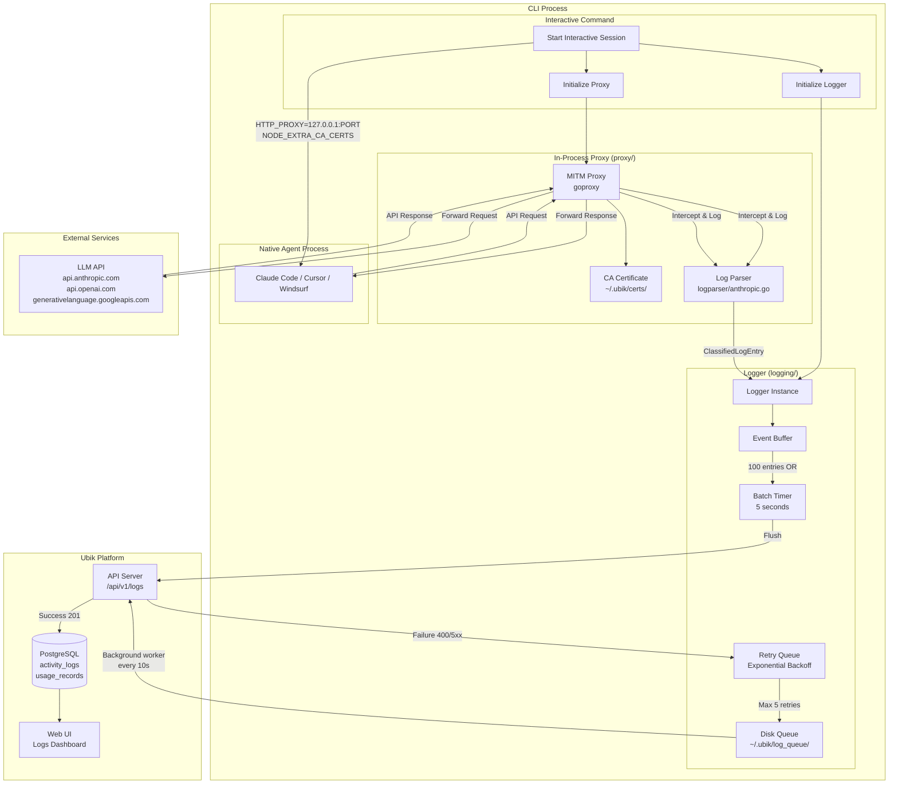

# Logging Architecture

This document describes how the CLI captures and sends logs to the Ubik platform.

## Flow Diagram



## Components

| Component | Location | Purpose |
|-----------|----------|---------|
| **Proxy** | `services/cli/internal/proxy/proxy.go` | MITM intercepts LLM API calls |
| **Logger** | `services/cli/internal/logging/logger.go` | Batches & sends logs to API |
| **Parser** | `services/cli/internal/logparser/anthropic.go` | Extracts tokens, tools from JSON |
| **API Client** | `services/cli/internal/api/client.go` | HTTP calls to platform |

## Data Flow

### 1. Initialization

When `ubik interactive` starts:
1. Logger instance created with batching config (100 entries, 5s interval)
2. Proxy starts on available port (8082-8091)
3. CA certificate loaded/generated at `~/.ubik/certs/`
4. Agent process spawned with proxy environment variables

### 2. Request Interception

```
Agent makes API call (e.g., to api.anthropic.com)
    |
Proxy intercepts via MITM
    |
Parser extracts: model, tokens, tool calls
    |
Logger.LogClassified() called
    |
Request forwarded to LLM
```

### 3. Response Interception

```
LLM returns response
    |
Proxy intercepts
    |
Parser extracts: usage stats, tool results, errors
    |
Logger.LogClassified() called
    |
Response forwarded to Agent
```

### 4. Log Batching & Sending

```
Events accumulate in buffer
    |
Flush triggered by:
  - Buffer reaches 100 entries
  - 5 second timer fires
    |
POST /api/v1/logs with batch
    |
Success: Logs stored in DB
Failure: Retry with exponential backoff (1s, 2s, 4s, 8s, 16s)
    |
After 5 retries: Queue to disk (~/.ubik/log_queue/)
    |
Background worker retries every 10 seconds
```

## Event Types

| Event Type | Category | Description |
|------------|----------|-------------|
| `session_start` | session | CLI session began |
| `session_end` | session | CLI session ended |
| `api_request` | proxy | Outgoing LLM API request |
| `api_response` | proxy | Incoming LLM API response |
| `user_prompt` | classified | Parsed user message |
| `ai_text` | classified | Parsed AI response |
| `tool_call` | classified | AI invoked a tool |
| `tool_result` | classified | Tool execution result |

## Configuration

### Logger Config

```go
loggerConfig := &logging.Config{
    Enabled:       true,
    BatchSize:     100,              // Entries per batch
    BatchInterval: 5 * time.Second,  // Max wait time
    MaxRetries:    5,                // Retry attempts
    RetryBackoff:  1 * time.Second,  // Initial backoff
}
```

### Proxy Environment Variables

```bash
HTTP_PROXY=http://127.0.0.1:8082
HTTPS_PROXY=http://127.0.0.1:8082
NODE_EXTRA_CA_CERTS=~/.ubik/certs/ubik-ca.pem
UBIK_SESSION_ID=<uuid>
UBIK_AGENT_ID=<agent-id>
```

## Local Storage

| Path | Purpose |
|------|---------|
| `~/.ubik/certs/ubik-ca.pem` | CA certificate for HTTPS interception |
| `~/.ubik/certs/ubik-ca-key.pem` | CA private key |
| `~/.ubik/log_queue/logs_*.json` | Failed logs queued for retry |
| `~/.ubik/config.json` | CLI configuration with API token |

## Troubleshooting

### Logs Not Appearing in UI

**Check the disk queue:**
```bash
ls -la ~/.ubik/log_queue/
```

If files exist, logs are failing to send. Common causes:
- API returning 400 (invalid event_type enum)
- API returning 401 (expired token)
- Network issues

**Check queued log content:**
```bash
head -c 500 ~/.ubik/log_queue/logs_*.json
```

**Clear queue after fixing issues:**
```bash
rm ~/.ubik/log_queue/*.json
```
