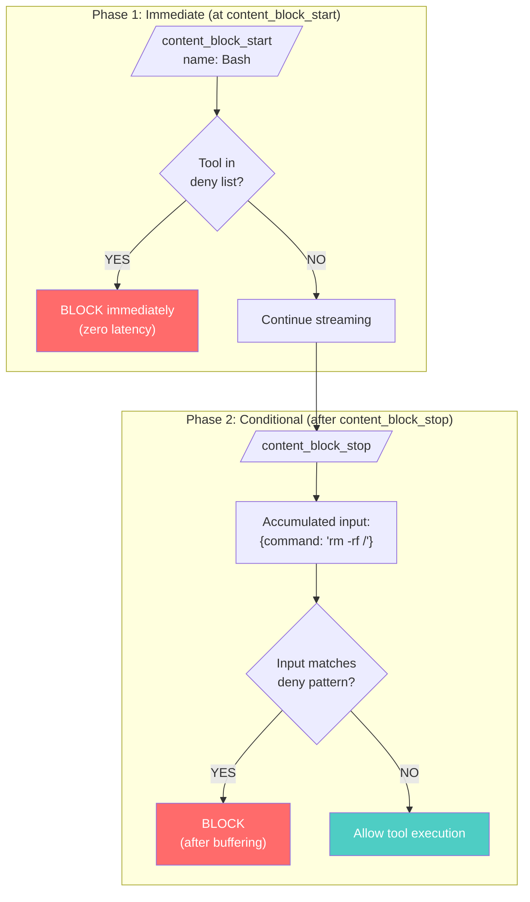
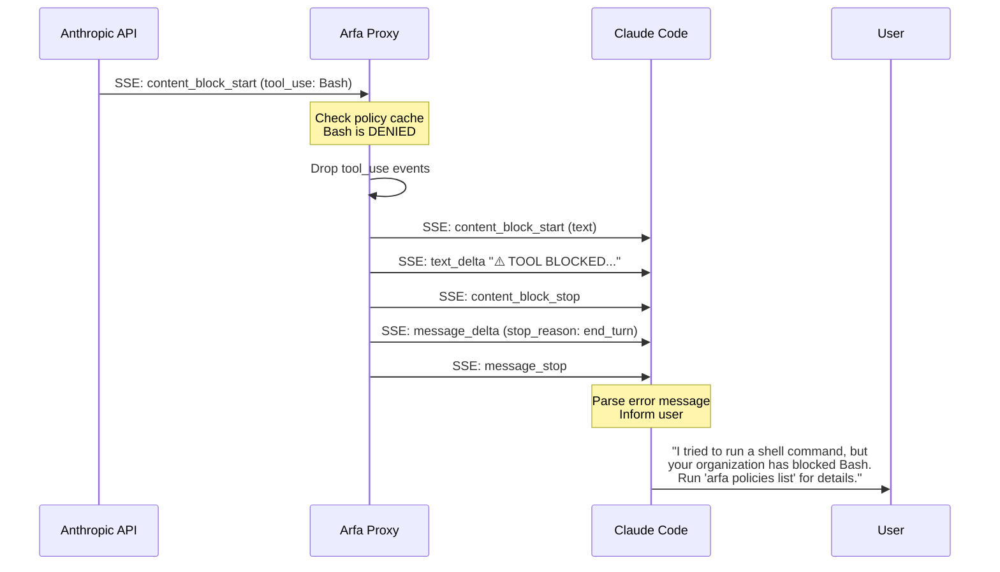
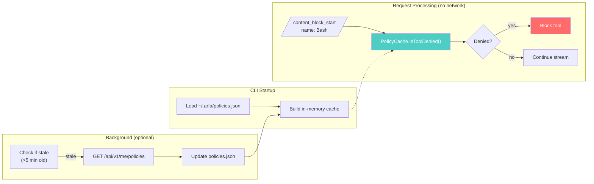
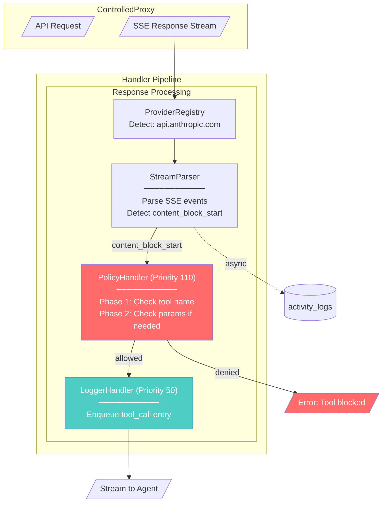

# Tool Call Extraction Design

**Status:** Proposal
**Date:** 2025-12-21
**Author:** Claude Code

---

## Overview

Design for parsing intercepted LLM API requests to extract tool calls, providing admin visibility into tool usage by employee/org/session, with policy-based blocking capability.

---

## Decisions

| Decision | Choice | Rationale |
|----------|--------|-----------|
| Storage | Same `activity_logs` table | Better for Kibana (single index), session correlation |
| Tool data | Names + full inputs | Full visibility for admin |
| Blocking behavior | Return error to agent | Agent sees failure, can retry or inform user |
| Policy model | AWS IAM-aligned | Industry standard, well-understood, security-first |
| Architecture | Multi-provider extensible | Support Anthropic, OpenAI, Google via registry pattern |
| Blocking efficiency | Early exit when possible | Block at tool name for simple policies, buffer only for param checks |
| Policy sync | Local cache + background refresh | Zero network calls during agent requests, invisible to user |
| Wildcard matching | Prefix list | Simple, covers MCP `mcp__server__%` patterns |
| Large inputs | Allow + log warning | Don't block on size, but alert admin for review |
| Offline behavior | Block all tools | Security-first when cache expired and API unreachable |
| Case sensitivity | Normalize to lowercase | `Bash` == `bash`, consistent matching |

---

## Real Tool Call Structure (From Production Data)

### Anthropic SSE Stream Format

Tool calls appear in the **RESPONSE** stream (not request), in this sequence:

```
┌─────────────────────────────────────────────────────────────────────────────┐
│ 1. content_block_start  ← TOOL NAME AVAILABLE HERE                          │
│    {"type":"content_block_start","index":1,                                 │
│     "content_block":{                                                       │
│       "type":"tool_use",                                                    │
│       "id":"toolu_01TTCB3Bgb48Gn6632nAtmmf",                                │
│       "name":"Bash",           ← Tool name immediately available            │
│       "input":{},              ← Empty at start                             │
│       "caller":{"type":"direct"}                                            │
│     }}                                                                      │
├─────────────────────────────────────────────────────────────────────────────┤
│ 2. content_block_delta (multiple)  ← INPUT CHUNKS                           │
│    {"type":"content_block_delta","index":1,                                 │
│     "delta":{"type":"input_json_delta","partial_json":"{\"command\": \"cd"}}│
│                                                                             │
│    {"type":"content_block_delta","index":1,                                 │
│     "delta":{"type":"input_json_delta","partial_json":" /Users/..."}}       │
│    ... more chunks ...                                                      │
├─────────────────────────────────────────────────────────────────────────────┤
│ 3. content_block_stop  ← TOOL CALL COMPLETE                                 │
│    {"type":"content_block_stop","index":1}                                  │
├─────────────────────────────────────────────────────────────────────────────┤
│ 4. message_delta                                                            │
│    {"type":"message_delta","delta":{"stop_reason":"tool_use"}}              │
├─────────────────────────────────────────────────────────────────────────────┤
│ 5. message_stop                                                             │
│    {"type":"message_stop"}                                                  │
└─────────────────────────────────────────────────────────────────────────────┘
```

### Real Example: Bash Tool Call

```
content_block_start:
  name: "Bash"
  id: "toolu_01TTCB3Bgb48Gn6632nAtmmf"

input_json_delta chunks (accumulated):
  {"
  comman
  d": "cd /U
  sers/serg
  eirastrig
  in/Projec
  ts/arfa... ORDER BY crea
  ted_at DESC L
  IMIT
   3;\"
  ", "desc
  ript
  ion": "Extr
  act to
  ol_use bl
  ock cont
  ext"}

Final input (reconstructed):
  {"command": "cd /Users/.../arfa... ORDER BY created_at DESC LIMIT 3;",
   "description": "Extract tool_use block context"}
```

---

## Efficient Blocking Strategy

### Key Insight: Early Exit

Tool NAME is available immediately in `content_block_start`. This enables **zero-latency blocking** for simple policies:

| Policy Type | When to Evaluate | Latency Impact |
|-------------|------------------|----------------|
| Block tool entirely | `content_block_start` | **Zero** |
| Block with param conditions | After `content_block_stop` | Must buffer chunks |
| Audit only (no blocking) | Async after stream | **Zero** |

### Two-Phase Blocking



### Blocking Implementation

```go
func (h *PolicyHandler) HandleStreamEvent(ctx *HandlerContext, event SSEEvent) BlockDecision {
    switch event.Type {
    case "content_block_start":
        if event.ContentBlock.Type == "tool_use" {
            toolName := event.ContentBlock.Name

            // Phase 1: Check for unconditional deny
            if h.isToolDenied(ctx.EmployeeID, toolName) {
                return BlockDecision{
                    Block:  true,
                    Reason: fmt.Sprintf("Tool '%s' blocked by policy", toolName),
                }
            }

            // Check if we need to buffer for param-based policies
            if h.hasParamPolicies(ctx.EmployeeID, toolName) {
                h.startBuffering(event.Index)
            }
        }

    case "input_json_delta":
        if h.isBuffering(event.Index) {
            h.accumulateInput(event.Index, event.Delta.PartialJSON)
        }

    case "content_block_stop":
        if h.isBuffering(event.Index) {
            input := h.getAccumulatedInput(event.Index)

            // Phase 2: Check param-based policies
            if blocked, reason := h.checkParamPolicies(ctx.EmployeeID, toolName, input); blocked {
                return BlockDecision{
                    Block:  true,
                    Reason: reason,
                }
            }
        }
    }

    return BlockDecision{Block: false}
}
```

### Param-Based Blocking: Latency Analysis

**Key insight:** We only buffer the `tool_use` block, not the entire response. Text and thinking blocks stream through normally.

#### What Gets Buffered

```
┌─ content_block (index:0, type:thinking) ───────────┐
│   thinking_delta chunks...                          │  ← Streams through immediately
│   content_block_stop                                │
└─────────────────────────────────────────────────────┘

┌─ content_block (index:1, type:text) ───────────────┐
│   text_delta chunks...                              │  ← Streams through immediately
│   content_block_stop                                │
└─────────────────────────────────────────────────────┘

┌─ content_block (index:2, type:tool_use) ───────────┐
│   name: "Bash" ← KNOWN IMMEDIATELY                  │
│   input_json_delta: {"command": "rm...             │  ← BUFFER ONLY THIS
│   input_json_delta: " -rf /"}                       │
│   content_block_stop ← EVALUATE HERE                │
└─────────────────────────────────────────────────────┘
```

#### Latency Breakdown

| Phase | What Happens | Duration |
|-------|--------------|----------|
| Tool name check | Check `denyList[toolName]` | <1μs |
| Buffer decision | Check `hasConditions(toolName)` | <1μs |
| Accumulate chunks | Append strings in memory | ~10μs total |
| Parse JSON | `json.Unmarshal` accumulated input | ~5-50μs |
| Evaluate conditions | Regex/string ops | ~1-100μs |
| **Total added latency** | | **<200μs** |

#### User Impact: Almost Invisible

The agent must receive complete `content_block_stop` before executing the tool anyway. Our processing adds <1ms to a block that takes 100-500ms to stream. User sees no perceptible difference.

#### Worst Case Scenarios

| Scenario | Input Size | Parse Time | Condition Eval | Total |
|----------|------------|------------|----------------|-------|
| Simple Bash command | 100 bytes | 5μs | 10μs | ~20μs |
| Complex Bash with long path | 1KB | 20μs | 50μs | ~100μs |
| Write with large content | 100KB | 500μs | 100μs | ~1ms |
| Read with many file paths | 10KB | 100μs | 200μs | ~500μs |

Even the worst case (100KB tool input) adds only ~1ms of latency.

---

## MCP Servers as Tools

**MCP tools appear as regular tool calls** with naming convention `mcp__<server>__<tool>`.

### Tool Name Examples

```
Regular tools:     Bash, Read, Write, Edit, Grep, Glob, WebSearch
MCP tools:         mcp__postgres__query
                   mcp__slack__send_message
                   mcp__github__create_issue
                   mcp__playwright__browser_click
                   mcp__qdrant__search
                   mcp__gcloud__run_gcloud_command
```

### MCP Tool Call Structure

```json
{
  "type": "content_block_start",
  "content_block": {
    "type": "tool_use",
    "id": "toolu_abc123",
    "name": "mcp__qdrant__search",
    "input": {}
  }
}

// Followed by input_json_delta chunks:
{
  "collection": "embeddings",
  "query": "sensitive data",
  "limit": 10
}
```

### MCP Policy Options

| Policy Target | Pattern | Use Case |
|---------------|---------|----------|
| Block entire MCP server | `mcp__playwright__%` | No browser automation |
| Block specific MCP tool | `mcp__gcloud__run_gcloud_command` | No gcloud CLI |
| Block by params | `conditions: {contains: "DROP TABLE"}` | Block dangerous SQL |

### MCP Policy Examples

```sql
-- Block all playwright browser tools
INSERT INTO tool_policies (org_id, tool_name, action, reason)
VALUES ('org-1', 'mcp__playwright__%', 'deny', 'Browser automation disabled');

-- Block gcloud destructive commands
INSERT INTO tool_policies (org_id, tool_name, conditions, action, reason)
VALUES (
    'org-1',
    'mcp__gcloud__run_gcloud_command',
    '{
        "any": [
            {"param_path": "command", "operator": "contains", "value": "delete"},
            {"param_path": "command", "operator": "contains", "value": "destroy"}
        ]
    }',
    'deny',
    'Destructive gcloud commands blocked'
);

-- Block SQL injection patterns in any database MCP
INSERT INTO tool_policies (org_id, tool_name, conditions, action, reason)
VALUES (
    'org-1',
    'mcp__%__query',
    '{
        "any": [
            {"param_path": "query", "operator": "matches", "value": ";\\s*(DROP|DELETE|TRUNCATE)"},
            {"param_path": "query", "operator": "contains", "value": "-- "}
        ]
    }',
    'deny',
    'Potential SQL injection blocked'
);
```

---

## Blocking Response & Error Handling

### How Tool Calling Works

**Key insight:** Claude API does NOT execute tools. The flow is:

1. Agent sends request with `tools[]` definitions
2. API returns `tool_use` block (name + input)
3. **Agent executes tool locally** ← This is what we block
4. Agent sends `tool_result` back to API
5. API continues conversation

**Arfa Proxy intercepts step 2** - we modify the response before the agent sees it.

### Stream Modification

When we block a tool, we replace the `tool_use` content block with a `text` block:

```
Original stream:                    Modified stream:
─────────────────                   ────────────────
content_block_start (thinking)  ──► content_block_start (thinking)
thinking_delta...               ──► thinking_delta...
content_block_stop              ──► content_block_stop

content_block_start (tool_use)  ─┐
  name: "Bash"                   │
  id: "toolu_abc"                │
input_json_delta...              │  content_block_start (text)
content_block_stop              ─┘  text_delta: "[POLICY BLOCK] ..."
                                    content_block_stop

message_delta (stop_reason:     ──► message_delta (stop_reason:
  tool_use)                           end_turn)
message_stop                    ──► message_stop
```

### Error Message Format

**For tool-level blocking:**

```
⚠️ TOOL BLOCKED BY ORGANIZATION POLICY

Tool: Bash
Reason: Shell commands are restricted by your organization's security policy.

This restriction is set by your company administrator. To see all tool
restrictions for your account, run:

  arfa policies list

Or view the cached policies at:

  ~/.arfa/policies.json

If you believe this is an error, contact your administrator.
```

**For param-based blocking:**

```
⚠️ TOOL BLOCKED BY ORGANIZATION POLICY

Tool: Bash
Command: rm -rf /etc/...
Reason: Dangerous shell command pattern detected (rm -rf outside project directory).

This restriction is set by your company administrator. The tool itself is allowed,
but this specific usage pattern is blocked.

To see all tool restrictions for your account, run:

  arfa policies list

If you believe this is an error, contact your administrator.
```

### Blocking Implementation

```go
func (h *PolicyHandler) CreateBlockResponse(toolName, reason string, index int) []SSEEvent {
    errorText := fmt.Sprintf(`⚠️ TOOL BLOCKED BY ORGANIZATION POLICY

Tool: %s
Reason: %s

This restriction is set by your company administrator. To see all tool
restrictions for your account, run:

  arfa policies list

Or view the cached policies at:

  ~/.arfa/policies.json

If you believe this is an error, contact your administrator.`, toolName, reason)

    return []SSEEvent{
        {Type: "content_block_start", Data: ContentBlockStart{
            Type:  "content_block_start",
            Index: index,
            ContentBlock: ContentBlock{Type: "text", Text: ""},
        }},
        {Type: "content_block_delta", Data: ContentBlockDelta{
            Type:  "content_block_delta",
            Index: index,
            Delta: TextDelta{Type: "text_delta", Text: errorText},
        }},
        {Type: "content_block_stop", Data: ContentBlockStop{
            Type:  "content_block_stop",
            Index: index,
        }},
    }
}
```

### Blocking Flow



### CLI Command: `arfa policies list`

```
$ arfa policies list

Tool Policies for john@acme.com
Organization: Acme Corp
Last synced: 2025-12-21 12:00:00

BLOCKED TOOLS
─────────────
• Bash          - Shell commands restricted by security policy
• Write         - Only allowed in project directories (./*)

CONDITIONAL RESTRICTIONS
─────────────────────────
• Read          - Blocked outside: ./, /home/user/project
• Edit          - Blocked patterns: /etc/*, ~/.ssh/*

MCP RESTRICTIONS
────────────────
• mcp__gcloud__*     - All gcloud commands blocked
• mcp__playwright__* - Browser automation disabled

Run 'arfa policies sync' to refresh from server.
```

### Multiple Tool Calls Handling

When a response contains multiple tool calls:

```
[tool_use index:0 Read] → [tool_use index:1 Bash] → [tool_use index:2 Write]
```

**Behavior:**
- Each tool is evaluated independently
- Allowed tools stream through normally
- Blocked tools are replaced with error text
- Agent receives mix of successful tools and error messages

**Example output to agent:**
```
[tool_use: Read]                    ← Allowed, executes normally
[text: "⚠️ TOOL BLOCKED: Bash..."] ← Blocked, replaced with error
[tool_use: Write]                   ← Allowed, executes normally
```

---

## Multi-Provider Architecture

### Provider Comparison

| Provider | URL Pattern | Tool Call Event | Input Format |
|----------|-------------|-----------------|--------------|
| **Anthropic** | `api.anthropic.com` | `content_block_start` type:tool_use | `input_json_delta` chunks |
| **OpenAI** | `api.openai.com` | `tool_calls` in delta | Incremental JSON |
| **Google** | `generativelanguage.googleapis.com` | `functionCall` in candidates | Complete in response |

### Provider Registry Pattern

```go
// Provider interface - each provider implements this
type StreamProvider interface {
    // Match returns true if this provider handles the URL
    Match(url string) bool

    // ParseStreamEvent parses a single SSE event
    ParseStreamEvent(event []byte) (*StreamEvent, error)

    // Name returns provider identifier
    Name() string
}

// Normalized event structure across all providers
type StreamEvent struct {
    Type           string          // content_block_start, input_json_delta, etc.
    Index          int             // Content block index
    ToolName       string          // Available at start
    ToolID         string          // Provider-specific ID
    PartialInput   string          // JSON chunk
    IsToolComplete bool            // True at content_block_stop
}

// Registry holds all registered providers
type ProviderRegistry struct {
    providers []StreamProvider
}

func (r *ProviderRegistry) GetProvider(url string) StreamProvider {
    for _, p := range r.providers {
        if p.Match(url) {
            return p
        }
    }
    return &UnknownProvider{} // Pass-through, no parsing
}
```

### Provider Implementations

```go
// Anthropic provider
type AnthropicProvider struct{}

func (p *AnthropicProvider) Match(url string) bool {
    return strings.Contains(url, "api.anthropic.com")
}

func (p *AnthropicProvider) ParseStreamEvent(data []byte) (*StreamEvent, error) {
    // Parse: event: content_block_start
    //        data: {"type":"content_block_start",...}
    var raw struct {
        Type         string `json:"type"`
        Index        int    `json:"index"`
        ContentBlock struct {
            Type  string `json:"type"`
            Name  string `json:"name"`
            ID    string `json:"id"`
        } `json:"content_block"`
        Delta struct {
            Type        string `json:"type"`
            PartialJSON string `json:"partial_json"`
        } `json:"delta"`
    }

    if err := json.Unmarshal(data, &raw); err != nil {
        return nil, err
    }

    event := &StreamEvent{
        Type:  raw.Type,
        Index: raw.Index,
    }

    switch raw.Type {
    case "content_block_start":
        if raw.ContentBlock.Type == "tool_use" {
            event.ToolName = raw.ContentBlock.Name
            event.ToolID = raw.ContentBlock.ID
        }
    case "content_block_delta":
        if raw.Delta.Type == "input_json_delta" {
            event.PartialInput = raw.Delta.PartialJSON
        }
    case "content_block_stop":
        event.IsToolComplete = true
    }

    return event, nil
}
```

---

## Policy Design - Industry Best Practices

### Research Summary

Policy evaluation is a well-established problem. AWS IAM is the industry standard:

| Provider | Default | Deny Behavior | Inheritance |
|----------|---------|---------------|-------------|
| **AWS IAM** | Implicit Deny | Explicit Deny wins always | Boundaries = intersection |
| **GCP IAM** | No access | Deny policies exist | Union (additive) |
| **Azure RBAC** | Deny | Deny assignments win | RBAC + Policy combined |

### Arfa Policy Model (AWS-Aligned)

```
Evaluation Order:
1. Check for EXPLICIT DENY at any level
   └── If found → DENY (no override possible)

2. Check for EXPLICIT ALLOW
   └── If found → ALLOW

3. Default → ALLOW (tools usable unless blocked)
```

### Policy Schema

```sql
CREATE TABLE tool_policies (
    id UUID PRIMARY KEY DEFAULT gen_random_uuid(),
    org_id UUID NOT NULL REFERENCES organizations(id),
    team_id UUID REFERENCES teams(id),
    employee_id UUID REFERENCES employees(id),

    -- What to match
    tool_name TEXT NOT NULL,              -- "Bash", "Read", "*"

    -- Conditions (optional, for param-based blocking)
    conditions JSONB,                     -- See condition syntax below

    -- Action
    action TEXT NOT NULL DEFAULT 'deny',  -- 'deny', 'audit'
    reason TEXT,

    -- Metadata
    created_by UUID REFERENCES employees(id),
    created_at TIMESTAMPTZ DEFAULT NOW(),

    CONSTRAINT valid_action CHECK (action IN ('deny', 'audit'))
);

CREATE INDEX idx_tool_policies_lookup
ON tool_policies (org_id, team_id, employee_id, tool_name);
```

### Condition Syntax (for param-based policies)

```json
{
  "conditions": {
    "any": [
      {"param_path": "command", "operator": "matches", "value": "rm\\s+-rf"},
      {"param_path": "command", "operator": "contains", "value": "sudo"},
      {"param_path": "file_path", "operator": "not_starts_with", "value": "./"}
    ]
  }
}
```

**Operators:**
- `equals`, `not_equals` - Exact match
- `matches`, `not_matches` - Regex
- `contains`, `not_contains` - Substring
- `starts_with`, `not_starts_with` - Path prefix
- `in`, `not_in` - Value in list

---

## Policy Sync & Local Caching

**Principle:** Zero network calls during agent requests. All policy evaluation happens against local cache.

### Sync Points

| When | Trigger |
|------|---------|
| Login | `arfa login` fetches resolved policies |
| Manual sync | `arfa sync` refreshes policies |
| CLI startup | Load from disk cache, background refresh if stale |
| Background | Optional periodic refresh (e.g., every 5 min while proxy running) |

### Local Storage

```
~/.arfa/
├── config.json          # Auth, API URL
├── policies.json        # Cached resolved policies
└── policies_meta.json   # Last sync timestamp, version
```

**policies.json format:**
```json
{
  "employee_id": "emp-123",
  "org_id": "org-456",
  "synced_at": "2025-12-21T12:00:00Z",
  "version": 42,
  "tool_policies": {
    "Bash": {"action": "deny", "reason": "Shell blocked"},
    "Write": {"action": "deny", "conditions": {"any": [...]}},
    "Read": {"action": "allow"}
  }
}
```

### In-Memory Cache (O(1) Lookup)

```go
type PolicyCache struct {
    denyList       map[string]bool           // Tool name -> denied (no conditions)
    conditionalMap map[string][]Condition    // Tool name -> conditions to check
    version        int64
    syncedAt       time.Time
    mu             sync.RWMutex
}

func (c *PolicyCache) IsToolDenied(toolName string) (bool, string) {
    c.mu.RLock()
    defer c.mu.RUnlock()

    // Fast path: unconditional deny
    if c.denyList[toolName] || c.denyList["*"] {
        return true, "Tool blocked by policy"
    }
    return false, ""
}

func (c *PolicyCache) HasConditions(toolName string) bool {
    c.mu.RLock()
    defer c.mu.RUnlock()
    return len(c.conditionalMap[toolName]) > 0
}

func (c *PolicyCache) LoadFromDisk(path string) error {
    data, err := os.ReadFile(path)
    if err != nil {
        return err // No cache yet, allow all
    }
    // Parse and build maps...
}
```

### Sync Flow



### API Endpoint for Policy Sync

```
GET /api/v1/me/policies
Authorization: Bearer <token>

Response:
{
  "version": 42,
  "synced_at": "2025-12-21T12:00:00Z",
  "policies": [
    {
      "tool_name": "Bash",
      "action": "deny",
      "reason": "Shell access blocked per security policy"
    },
    {
      "tool_name": "Write",
      "action": "deny",
      "conditions": {
        "any": [
          {"param_path": "file_path", "operator": "not_starts_with", "value": "./"}
        ]
      },
      "reason": "Write restricted to project directory"
    }
  ]
}
```

### Performance Characteristics

| Operation | Latency | When |
|-----------|---------|------|
| Tool name lookup | **<1μs** | Every tool call (in-memory map) |
| Condition check | **<10μs** | Only if tool has conditions (regex/string ops) |
| Disk cache load | **<5ms** | CLI startup only |
| Policy sync (network) | **~100ms** | Login/sync only, never during agent requests |

### Staleness Handling

```go
const (
    PolicyRefreshInterval = 5 * time.Minute
    PolicyMaxAge          = 24 * time.Hour
)

func (c *PolicyCache) NeedsRefresh() bool {
    return time.Since(c.syncedAt) > PolicyRefreshInterval
}

func (c *PolicyCache) IsExpired() bool {
    return time.Since(c.syncedAt) > PolicyMaxAge
}
```

**Behavior:**
- **Fresh (<5 min):** Use cache, no refresh
- **Stale (5 min - 24h):** Use cache, background refresh
- **Expired (>24h):** Block all tools until refresh completes (security-first)

---

## Edge Cases & Safeguards

### Wildcard Pattern Matching (Prefix List)

For MCP patterns like `mcp__playwright__%`, use prefix matching:

```go
type PolicyCache struct {
    denyList       map[string]bool        // Exact matches: "Bash" -> true
    prefixDenyList []string               // Prefix patterns: ["mcp__playwright__", "mcp__gcloud__"]
    // ...
}

func (c *PolicyCache) IsToolDenied(toolName string) (bool, string) {
    c.mu.RLock()
    defer c.mu.RUnlock()

    // Normalize to lowercase
    toolName = strings.ToLower(toolName)

    // Check exact match
    if c.denyList[toolName] || c.denyList["*"] {
        return true, c.reasons[toolName]
    }

    // Check prefix patterns
    for _, prefix := range c.prefixDenyList {
        if strings.HasPrefix(toolName, prefix) {
            return true, c.prefixReasons[prefix]
        }
    }

    return false, ""
}
```

### Large Tool Input Handling

```go
const MaxToolInputSize = 1 * 1024 * 1024 // 1MB

func (h *PolicyHandler) accumulateInput(index int, chunk string) {
    h.mu.Lock()
    defer h.mu.Unlock()

    current := h.inputBuffers[index]
    if len(current)+len(chunk) > MaxToolInputSize {
        // Log warning for admin, but don't block
        h.logOversizeInput(index, len(current)+len(chunk))
        h.skipParamCheck[index] = true // Skip param evaluation, allow tool
        return
    }

    h.inputBuffers[index] = current + chunk
}
```

**Admin alert in activity_logs:**
```json
{
  "event_type": "tool_call_warning",
  "payload": {
    "tool_name": "Write",
    "warning": "input_size_exceeded",
    "size_bytes": 5242880,
    "limit_bytes": 1048576,
    "param_check_skipped": true
  }
}
```

### Offline/Expired Cache Behavior

```go
func (c *PolicyCache) IsExpired() bool {
    return time.Since(c.syncedAt) > PolicyMaxAge // 24 hours
}

func (h *PolicyHandler) HandleStreamEvent(ctx *HandlerContext, event SSEEvent) BlockDecision {
    // Security-first: block everything if cache is expired and can't refresh
    if h.cache.IsExpired() && !h.cache.CanRefresh() {
        return BlockDecision{
            Block:  true,
            Reason: "Policy cache expired. Run 'arfa policies sync' to refresh.",
        }
    }
    // ... normal evaluation
}
```

**User sees:**
```
⚠️ TOOL BLOCKED - POLICY CACHE EXPIRED

Your local policy cache has expired and cannot be refreshed.
This may be due to network issues or server unavailability.

To resolve, run:

  arfa policies sync

If the problem persists, contact your administrator.
```

### Case Normalization

All tool names are normalized to lowercase for consistent matching:

```go
func normalizeTool(name string) string {
    return strings.ToLower(name)
}

// When loading policies from API:
for _, policy := range apiResponse.Policies {
    toolName := normalizeTool(policy.ToolName)
    cache.denyList[toolName] = true
}

// When checking tool calls:
func (c *PolicyCache) IsToolDenied(toolName string) (bool, string) {
    toolName = normalizeTool(toolName) // "Bash" -> "bash"
    // ...
}
```

### ReDoS Protection (Regex Timeout)

For regex-based conditions, use timeout to prevent CPU hang:

```go
import "github.com/dlclark/regexp2"

const RegexTimeout = 100 * time.Millisecond

func (c *ConditionEvaluator) matchesRegex(pattern, input string) (bool, error) {
    re, err := regexp2.Compile(pattern, regexp2.RE2)
    if err != nil {
        return false, err
    }
    re.MatchTimeout = RegexTimeout

    match, err := re.MatchString(input)
    if err != nil {
        // Timeout or error - log warning, treat as no match (allow)
        c.logRegexTimeout(pattern, len(input))
        return false, nil
    }
    return match, nil
}
```

### Nested JSON Path Support

For accessing nested fields like `options.recursive`:

```go
func getValueByPath(data map[string]any, path string) (any, bool) {
    parts := strings.Split(path, ".")
    current := any(data)

    for _, part := range parts {
        switch v := current.(type) {
        case map[string]any:
            var ok bool
            current, ok = v[part]
            if !ok {
                return nil, false
            }
        default:
            return nil, false
        }
    }

    return current, true
}

// Usage:
// path: "options.path"
// data: {"options": {"path": "/etc/passwd"}}
// returns: "/etc/passwd", true
```

**Policy example:**
```json
{
  "conditions": {
    "any": [
      {"param_path": "options.recursive", "operator": "equals", "value": true},
      {"param_path": "options.force", "operator": "equals", "value": true}
    ]
  }
}
```

---

## Implementation Phases

### Phase 1: Tool Call Extraction (Visibility)

**Goal:** Extract and log all tool calls for admin visibility

**New Files:**
- `services/cli/internal/control/stream_parser.go` - Parse SSE stream
- `services/cli/internal/control/provider_registry.go` - Provider detection
- `services/cli/internal/control/providers/anthropic.go` - Anthropic parser

**Changes:**
- Modify `LoggerHandler` to parse tool calls from response stream
- Add `event_type: 'tool_call'` entries to `activity_logs`

**Deliverables:**
- Tool calls extracted with: name, id, input, model, tokens
- Admin can query by `event_type = 'tool_call'`
- Session timeline shows complete flow

### Phase 2: Simple Blocking (Tool Name)

**Goal:** Block tools entirely based on name (zero latency)

**New Files:**
- `services/cli/internal/control/policy_handler.go` - Policy evaluation

**Changes:**
- Add `tool_policies` table
- PolicyHandler checks tool name at `content_block_start`
- Block immediately if tool is denied

**Policy sync:**
- CLI fetches resolved policies on login/sync
- Policies cached locally for fast evaluation

### Phase 3: Conditional Blocking (Parameters)

**Goal:** Block based on tool input parameters

**Changes:**
- Buffer `input_json_delta` chunks when param policies exist
- Evaluate conditions after `content_block_stop`
- Block if conditions match

**Example policies:**
- Block `Bash` with `rm -rf` in command
- Block `Read` outside project directory
- Block `Write` to sensitive paths

### Phase 4: Advanced Analytics

- Tool usage aggregation per org/team/employee
- Anomaly detection (unusual tool patterns)
- Cost attribution by tool type
- Kibana dashboards

---

## Handler Pipeline



---

## Tool Call Log Entry

```json
{
  "event_type": "tool_call",
  "event_category": "llm_interaction",
  "payload": {
    "tool_name": "Bash",
    "tool_id": "toolu_01TTCB3Bgb48Gn6632nAtmmf",
    "tool_input": {
      "command": "cd /Users/dev/project && git status",
      "description": "Check git status"
    },
    "model": "claude-opus-4-5-20251101",
    "provider": "anthropic",
    "tokens_input": 8,
    "tokens_output": 305,
    "blocked": false
  }
}
```

---

## Policy Examples

### Block dangerous tools org-wide (Phase 2)
```sql
INSERT INTO tool_policies (org_id, tool_name, action, reason)
VALUES
  ('org-1', 'Bash', 'deny', 'Shell access blocked per security policy');
```

### Block dangerous patterns (Phase 3)
```sql
INSERT INTO tool_policies (org_id, tool_name, conditions, action, reason)
VALUES (
    'org-1',
    'Bash',
    '{
        "any": [
            {"param_path": "command", "operator": "matches", "value": "rm\\s+-rf\\s+/"},
            {"param_path": "command", "operator": "contains", "value": "sudo"},
            {"param_path": "command", "operator": "matches", "value": "curl.*\\|.*sh"}
        ]
    }',
    'deny',
    'Dangerous shell command blocked'
);
```

### Block file access outside project (Phase 3)
```sql
INSERT INTO tool_policies (org_id, tool_name, conditions, action, reason)
VALUES (
    'org-1',
    'Read',
    '{
        "all": [
            {"param_path": "file_path", "operator": "not_starts_with", "value": "./"},
            {"param_path": "file_path", "operator": "not_starts_with", "value": "/home/user/project"}
        ]
    }',
    'deny',
    'File access restricted to project directory'
);
```

---

## Admin Query Examples

### All tool calls for an employee
```sql
SELECT * FROM activity_logs
WHERE employee_id = 'emp-123'
  AND event_type = 'tool_call'
ORDER BY created_at DESC;
```

### Blocked tool calls
```sql
SELECT
  e.email,
  al.payload->>'tool_name' as tool,
  al.payload->>'reason' as block_reason,
  al.created_at
FROM activity_logs al
JOIN employees e ON e.id = al.employee_id
WHERE al.event_type = 'tool_call'
  AND (al.payload->>'blocked')::boolean = true
ORDER BY al.created_at DESC;
```

### Most used tools by org
```sql
SELECT
  payload->>'tool_name' as tool,
  COUNT(*) as count
FROM activity_logs
WHERE org_id = 'org-456'
  AND event_type = 'tool_call'
GROUP BY payload->>'tool_name'
ORDER BY count DESC;
```

---

## References

- [AWS Policy Evaluation Logic](https://docs.aws.amazon.com/IAM/latest/UserGuide/reference_policies_evaluation-logic.html)
- [Anthropic Streaming Messages](https://docs.anthropic.com/en/docs/build-with-claude/streaming)
- [OpenAI Streaming API](https://platform.openai.com/docs/guides/streaming-responses)
- [Google Gemini Function Calling](https://ai.google.dev/gemini-api/docs/function-calling)
- [Cloudflare Firewall for AI](https://blog.cloudflare.com/block-unsafe-llm-prompts-with-firewall-for-ai/)
- [Pangea AI Guard](https://pangea.cloud/docs/integration-options/api-gateways/litellm)

---

## Next Steps

1. Review and approve this design
2. Create GitHub issue for Phase 1 (tool call extraction)
3. Implement StreamParser with provider registry
4. Add tool_call logging
5. Phase 2: Add simple tool blocking
6. Phase 3: Add conditional blocking
