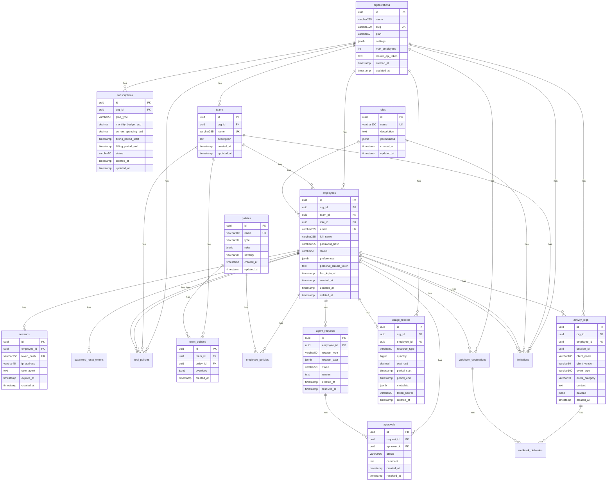

# Enterprise AI Agent Management Platform - Entity Relationship Diagram

## Database Schema Overview

This Mermaid ERD diagram visualizes all tables and their relationships in the Ubik Enterprise platform.

**⚠️ AUTO-GENERATED FILE - DO NOT EDIT MANUALLY**
- Generated from: `docs/schema.json`
- Script: `scripts/generate-erd-overview.py`
- To update: `make generate-erd`



## Table Groups

### 🏢 Core Organization (5 tables)
- **organizations** - Top-level tenant
- **subscriptions** - Billing and budget tracking
- **teams** - Group employees
- **roles** - Define permissions
- **employees** - User accounts

### 🤖 Agent Management (7 tables)
- **agent_catalog** - Available AI agents (Claude Code, Cursor, etc.)
- **tools** - Available tools (fs, git, http, etc.)
- **policies** - Usage policies and restrictions
- **agent_tools** - Many-to-many: agents ↔ tools
- **agent_policies** - Many-to-many: agents ↔ policies
- **team_policies** - Team-specific policy overrides
- **employee_agent_configs** - Per-employee agent instances

### 🔌 MCP Configuration (3 tables)
- **mcp_categories** - Organize MCP servers
- **mcp_catalog** - Available MCP servers
- **employee_mcp_configs** - Per-employee MCP instances

### 🔐 Authentication (1 table)
- **sessions** - JWT session tracking

### ✅ Approvals (2 tables)
- **agent_requests** - Employee requests for agents/MCPs
- **approvals** - Manager approval workflow

### 📊 Analytics (2 tables)
- **activity_logs** - Audit trail
- **usage_records** - Cost and resource tracking

## Key Relationships

### Multi-Tenancy
```
organizations (1) ──→ (N) employees
organizations (1) ──→ (N) teams
organizations (1) ──→ (N) activity_logs
```

### Employee Configuration
```
employees (1) ──→ (N) employee_agent_configs
employees (1) ──→ (N) employee_mcp_configs
employees (1) ──→ (N) sessions
```

### Agent System
```
agent_catalog (1) ──→ (N) employee_agent_configs
agent_catalog (M) ←→ (N) tools (via agent_tools)
agent_catalog (M) ←→ (N) policies (via agent_policies)
```

### MCP System
```
mcp_catalog (1) ──→ (N) employee_mcp_configs
mcp_categories (1) ──→ (N) mcp_catalog
```

### Approval Workflow
```
agent_requests (1) ──→ (N) approvals
employees (1) ──→ (N) agent_requests (requester)
employees (1) ──→ (N) approvals (approver)
```

## Views

The schema also includes {len(views)} materialized views for common queries:

1. **v_pending_approvals** - Pending approval requests with context

## Indexes

All tables have appropriate indexes on:
- Primary keys (id)
- Foreign keys
- Unique constraints (email, slug, sync_token)
- Frequently queried columns (status, org_id, created_at)

## Database Statistics

- **Total Tables**: 18
- **Junction Tables**: 3 (agent_tools, agent_policies, team_policies)
- **Views**: 1
- **Total Columns**: ~165
- **Foreign Keys**: 31+
- **Indexes**: 74+

## Legend

- **PK**: Primary Key
- **FK**: Foreign Key
- **UK**: Unique Key
- **(1) ──→ (N)**: One-to-Many relationship
- **(M) ←→ (N)**: Many-to-Many relationship

---

**Schema Version**: 1.0.0
**Database**: PostgreSQL 15+
