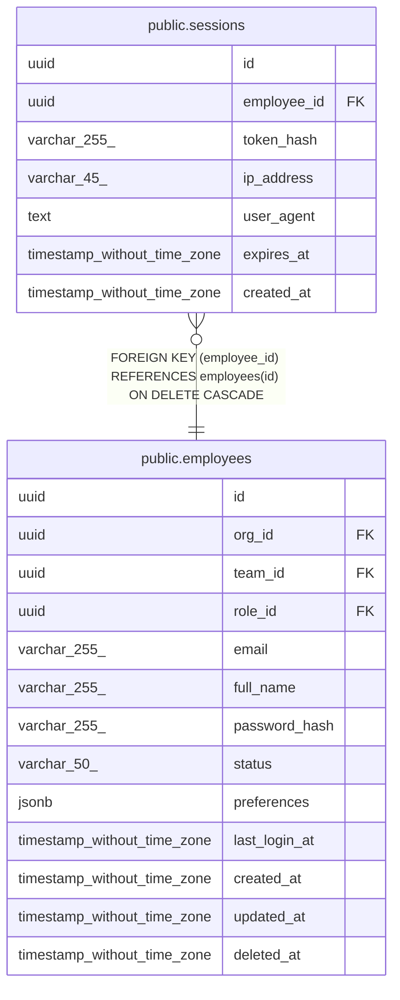

# public.sessions

## Description

## Columns

| Name | Type | Default | Nullable | Children | Parents | Comment |
| ---- | ---- | ------- | -------- | -------- | ------- | ------- |
| id | uuid | uuid_generate_v4() | false |  |  |  |
| employee_id | uuid |  | false |  | [public.employees](public.employees.md) |  |
| token_hash | varchar(255) |  | false |  |  |  |
| ip_address | varchar(45) |  | true |  |  |  |
| user_agent | text |  | true |  |  |  |
| expires_at | timestamp without time zone |  | false |  |  |  |
| created_at | timestamp without time zone | now() | false |  |  |  |

## Constraints

| Name | Type | Definition |
| ---- | ---- | ---------- |
| sessions_employee_id_fkey | FOREIGN KEY | FOREIGN KEY (employee_id) REFERENCES employees(id) ON DELETE CASCADE |
| sessions_pkey | PRIMARY KEY | PRIMARY KEY (id) |
| sessions_token_hash_key | UNIQUE | UNIQUE (token_hash) |

## Indexes

| Name | Definition |
| ---- | ---------- |
| sessions_pkey | CREATE UNIQUE INDEX sessions_pkey ON public.sessions USING btree (id) |
| sessions_token_hash_key | CREATE UNIQUE INDEX sessions_token_hash_key ON public.sessions USING btree (token_hash) |
| idx_sessions_employee_id | CREATE INDEX idx_sessions_employee_id ON public.sessions USING btree (employee_id) |
| idx_sessions_token_hash | CREATE INDEX idx_sessions_token_hash ON public.sessions USING btree (token_hash) |
| idx_sessions_expires_at | CREATE INDEX idx_sessions_expires_at ON public.sessions USING btree (expires_at) |

## Relations

---

> Generated by [tbls](https://github.com/k1LoW/tbls)
