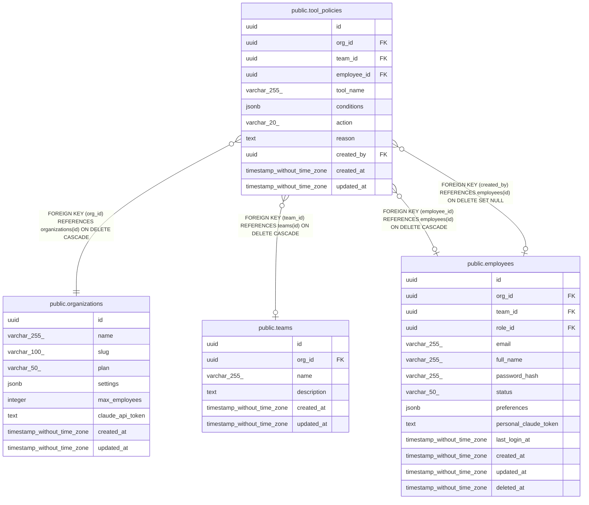

# public.tool_policies

## Description

## Columns

| Name | Type | Default | Nullable | Children | Parents | Comment |
| ---- | ---- | ------- | -------- | -------- | ------- | ------- |
| id | uuid | uuid_generate_v4() | false |  |  |  |
| org_id | uuid |  | false |  | [public.organizations](public.organizations.md) |  |
| team_id | uuid |  | true |  | [public.teams](public.teams.md) |  |
| employee_id | uuid |  | true |  | [public.employees](public.employees.md) |  |
| tool_name | varchar(255) |  | false |  |  |  |
| conditions | jsonb |  | true |  |  |  |
| action | varchar(20) | 'deny'::character varying | false |  |  |  |
| reason | text |  | true |  |  |  |
| created_by | uuid |  | true |  | [public.employees](public.employees.md) |  |
| created_at | timestamp without time zone | now() | false |  |  |  |
| updated_at | timestamp without time zone | now() | false |  |  |  |

## Constraints

| Name | Type | Definition |
| ---- | ---- | ---------- |
| tool_policies_action_check | CHECK | CHECK (((action)::text = ANY ((ARRAY['deny'::character varying, 'audit'::character varying])::text[]))) |
| tool_policies_has_org | CHECK | CHECK ((org_id IS NOT NULL)) |
| tool_policies_org_id_fkey | FOREIGN KEY | FOREIGN KEY (org_id) REFERENCES organizations(id) ON DELETE CASCADE |
| tool_policies_team_id_fkey | FOREIGN KEY | FOREIGN KEY (team_id) REFERENCES teams(id) ON DELETE CASCADE |
| tool_policies_created_by_fkey | FOREIGN KEY | FOREIGN KEY (created_by) REFERENCES employees(id) ON DELETE SET NULL |
| tool_policies_employee_id_fkey | FOREIGN KEY | FOREIGN KEY (employee_id) REFERENCES employees(id) ON DELETE CASCADE |
| tool_policies_pkey | PRIMARY KEY | PRIMARY KEY (id) |

## Indexes

| Name | Definition |
| ---- | ---------- |
| tool_policies_pkey | CREATE UNIQUE INDEX tool_policies_pkey ON public.tool_policies USING btree (id) |
| idx_tool_policies_org_id | CREATE INDEX idx_tool_policies_org_id ON public.tool_policies USING btree (org_id) |
| idx_tool_policies_team_id | CREATE INDEX idx_tool_policies_team_id ON public.tool_policies USING btree (team_id) WHERE (team_id IS NOT NULL) |
| idx_tool_policies_employee_id | CREATE INDEX idx_tool_policies_employee_id ON public.tool_policies USING btree (employee_id) WHERE (employee_id IS NOT NULL) |
| idx_tool_policies_lookup | CREATE INDEX idx_tool_policies_lookup ON public.tool_policies USING btree (org_id, team_id, employee_id, tool_name) |

## Relations

---

> Generated by [tbls](https://github.com/k1LoW/tbls)
