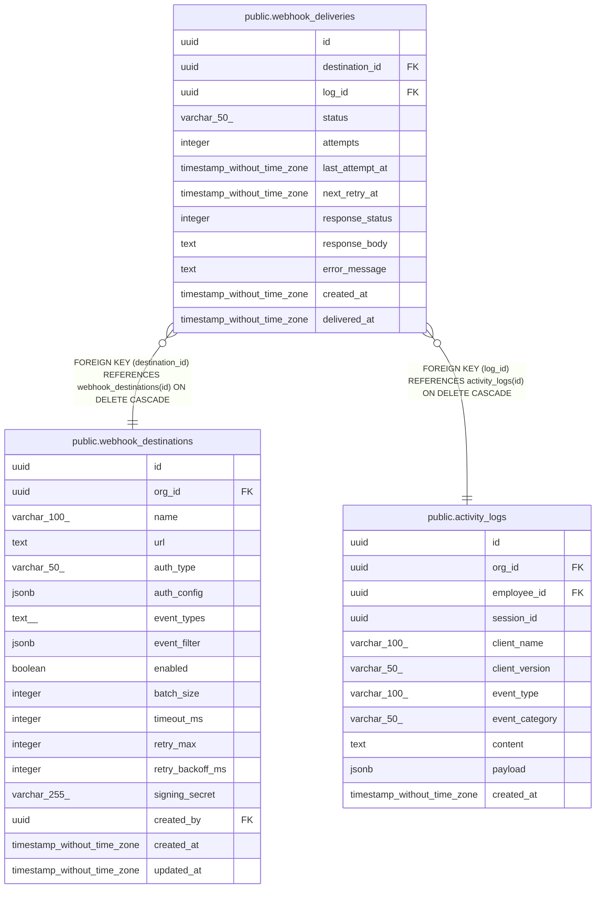

# public.webhook_deliveries

## Description

## Columns

| Name | Type | Default | Nullable | Children | Parents | Comment |
| ---- | ---- | ------- | -------- | -------- | ------- | ------- |
| id | uuid | gen_random_uuid() | false |  |  |  |
| destination_id | uuid |  | false |  | [public.webhook_destinations](public.webhook_destinations.md) |  |
| log_id | uuid |  | false |  | [public.activity_logs](public.activity_logs.md) |  |
| status | varchar(50) | 'pending'::character varying | false |  |  |  |
| attempts | integer | 0 | false |  |  |  |
| last_attempt_at | timestamp without time zone |  | true |  |  |  |
| next_retry_at | timestamp without time zone |  | true |  |  |  |
| response_status | integer |  | true |  |  |  |
| response_body | text |  | true |  |  |  |
| error_message | text |  | true |  |  |  |
| created_at | timestamp without time zone | now() | false |  |  |  |
| delivered_at | timestamp without time zone |  | true |  |  |  |

## Constraints

| Name | Type | Definition |
| ---- | ---- | ---------- |
| webhook_deliveries_status_check | CHECK | CHECK (((status)::text = ANY ((ARRAY['pending'::character varying, 'delivered'::character varying, 'failed'::character varying, 'dead'::character varying])::text[]))) |
| webhook_deliveries_log_id_fkey | FOREIGN KEY | FOREIGN KEY (log_id) REFERENCES activity_logs(id) ON DELETE CASCADE |
| webhook_deliveries_destination_id_fkey | FOREIGN KEY | FOREIGN KEY (destination_id) REFERENCES webhook_destinations(id) ON DELETE CASCADE |
| webhook_deliveries_pkey | PRIMARY KEY | PRIMARY KEY (id) |
| webhook_deliveries_destination_id_log_id_key | UNIQUE | UNIQUE (destination_id, log_id) |

## Indexes

| Name | Definition |
| ---- | ---------- |
| webhook_deliveries_pkey | CREATE UNIQUE INDEX webhook_deliveries_pkey ON public.webhook_deliveries USING btree (id) |
| webhook_deliveries_destination_id_log_id_key | CREATE UNIQUE INDEX webhook_deliveries_destination_id_log_id_key ON public.webhook_deliveries USING btree (destination_id, log_id) |
| idx_webhook_deliveries_pending | CREATE INDEX idx_webhook_deliveries_pending ON public.webhook_deliveries USING btree (status, next_retry_at) WHERE ((status)::text = ANY ((ARRAY['pending'::character varying, 'failed'::character varying])::text[])) |
| idx_webhook_deliveries_destination | CREATE INDEX idx_webhook_deliveries_destination ON public.webhook_deliveries USING btree (destination_id) |
| idx_webhook_deliveries_log | CREATE INDEX idx_webhook_deliveries_log ON public.webhook_deliveries USING btree (log_id) |

## Relations

---

> Generated by [tbls](https://github.com/k1LoW/tbls)
