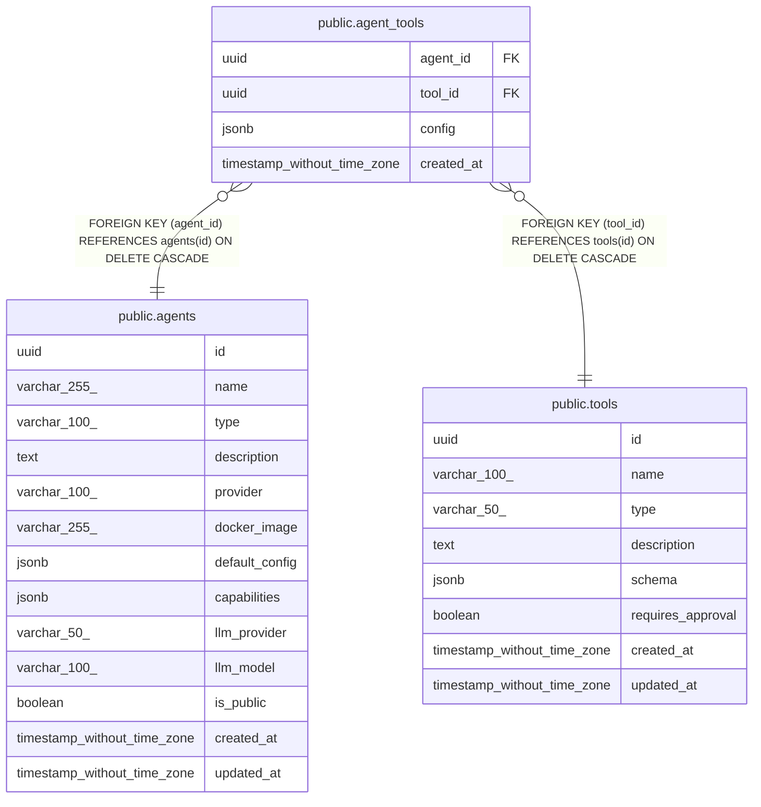

# public.agent_tools

## Description

## Columns

| Name | Type | Default | Nullable | Children | Parents | Comment |
| ---- | ---- | ------- | -------- | -------- | ------- | ------- |
| agent_id | uuid |  | false |  | [public.agents](public.agents.md) |  |
| tool_id | uuid |  | false |  | [public.tools](public.tools.md) |  |
| config | jsonb | '{}'::jsonb | false |  |  |  |
| created_at | timestamp without time zone | now() | false |  |  |  |

## Constraints

| Name | Type | Definition |
| ---- | ---- | ---------- |
| agent_tools_agent_id_fkey | FOREIGN KEY | FOREIGN KEY (agent_id) REFERENCES agents(id) ON DELETE CASCADE |
| agent_tools_tool_id_fkey | FOREIGN KEY | FOREIGN KEY (tool_id) REFERENCES tools(id) ON DELETE CASCADE |
| agent_tools_pkey | PRIMARY KEY | PRIMARY KEY (agent_id, tool_id) |

## Indexes

| Name | Definition |
| ---- | ---------- |
| agent_tools_pkey | CREATE UNIQUE INDEX agent_tools_pkey ON public.agent_tools USING btree (agent_id, tool_id) |

## Relations

---

> Generated by [tbls](https://github.com/k1LoW/tbls)
