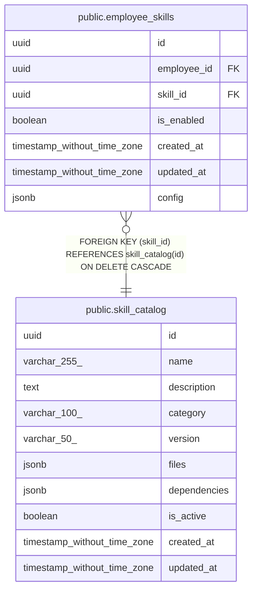

# public.skill_catalog

## Description

## Columns

| Name | Type | Default | Nullable | Children | Parents | Comment |
| ---- | ---- | ------- | -------- | -------- | ------- | ------- |
| id | uuid | uuid_generate_v4() | false | [public.employee_skills](public.employee_skills.md) |  |  |
| name | varchar(255) |  | false |  |  |  |
| description | text |  | true |  |  |  |
| category | varchar(100) |  | true |  |  |  |
| version | varchar(50) |  | false |  |  |  |
| files | jsonb | '[]'::jsonb | false |  |  |  |
| dependencies | jsonb | '{}'::jsonb | false |  |  |  |
| is_active | boolean | true | false |  |  |  |
| created_at | timestamp without time zone | now() | false |  |  |  |
| updated_at | timestamp without time zone | now() | false |  |  |  |

## Constraints

| Name | Type | Definition |
| ---- | ---- | ---------- |
| skill_catalog_pkey | PRIMARY KEY | PRIMARY KEY (id) |
| skill_catalog_name_key | UNIQUE | UNIQUE (name) |

## Indexes

| Name | Definition |
| ---- | ---------- |
| skill_catalog_pkey | CREATE UNIQUE INDEX skill_catalog_pkey ON public.skill_catalog USING btree (id) |
| skill_catalog_name_key | CREATE UNIQUE INDEX skill_catalog_name_key ON public.skill_catalog USING btree (name) |

## Relations

---

> Generated by [tbls](https://github.com/k1LoW/tbls)
