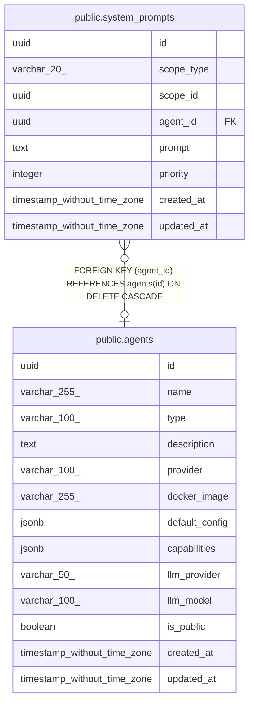

# public.system_prompts

## Description

## Columns

| Name | Type | Default | Nullable | Children | Parents | Comment |
| ---- | ---- | ------- | -------- | -------- | ------- | ------- |
| id | uuid | uuid_generate_v4() | false |  |  |  |
| scope_type | varchar(20) |  | false |  |  |  |
| scope_id | uuid |  | false |  |  |  |
| agent_id | uuid |  | true |  | [public.agents](public.agents.md) |  |
| prompt | text |  | false |  |  |  |
| priority | integer | 0 | false |  |  |  |
| created_at | timestamp without time zone | now() | false |  |  |  |
| updated_at | timestamp without time zone | now() | false |  |  |  |

## Constraints

| Name | Type | Definition |
| ---- | ---- | ---------- |
| system_prompts_scope_type_check | CHECK | CHECK (((scope_type)::text = ANY ((ARRAY['org'::character varying, 'team'::character varying, 'employee'::character varying])::text[]))) |
| system_prompts_agent_id_fkey | FOREIGN KEY | FOREIGN KEY (agent_id) REFERENCES agents(id) ON DELETE CASCADE |
| system_prompts_pkey | PRIMARY KEY | PRIMARY KEY (id) |
| unique_system_prompt | UNIQUE | UNIQUE (scope_type, scope_id, agent_id, priority) |

## Indexes

| Name | Definition |
| ---- | ---------- |
| system_prompts_pkey | CREATE UNIQUE INDEX system_prompts_pkey ON public.system_prompts USING btree (id) |
| unique_system_prompt | CREATE UNIQUE INDEX unique_system_prompt ON public.system_prompts USING btree (scope_type, scope_id, agent_id, priority) |
| idx_system_prompts_scope | CREATE INDEX idx_system_prompts_scope ON public.system_prompts USING btree (scope_type, scope_id, agent_id) |

## Relations

---

> Generated by [tbls](https://github.com/k1LoW/tbls)
