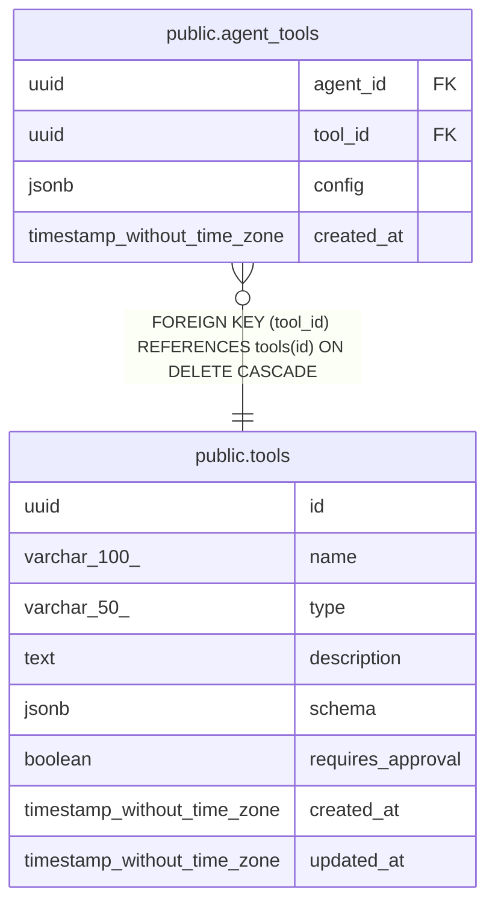

# public.tools

## Description

## Columns

| Name | Type | Default | Nullable | Children | Parents | Comment |
| ---- | ---- | ------- | -------- | -------- | ------- | ------- |
| id | uuid | uuid_generate_v4() | false | [public.agent_tools](public.agent_tools.md) |  |  |
| name | varchar(100) |  | false |  |  |  |
| type | varchar(50) |  | false |  |  |  |
| description | text |  | false |  |  |  |
| schema | jsonb | '{}'::jsonb | false |  |  |  |
| requires_approval | boolean | false | false |  |  |  |
| created_at | timestamp without time zone | now() | false |  |  |  |
| updated_at | timestamp without time zone | now() | false |  |  |  |

## Constraints

| Name | Type | Definition |
| ---- | ---- | ---------- |
| tools_pkey | PRIMARY KEY | PRIMARY KEY (id) |
| tools_name_key | UNIQUE | UNIQUE (name) |

## Indexes

| Name | Definition |
| ---- | ---------- |
| tools_pkey | CREATE UNIQUE INDEX tools_pkey ON public.tools USING btree (id) |
| tools_name_key | CREATE UNIQUE INDEX tools_name_key ON public.tools USING btree (name) |

## Triggers

| Name | Definition |
| ---- | ---------- |
| update_tools_updated_at | CREATE TRIGGER update_tools_updated_at BEFORE UPDATE ON public.tools FOR EACH ROW EXECUTE FUNCTION update_updated_at_column() |

## Relations

---

> Generated by [tbls](https://github.com/k1LoW/tbls)
