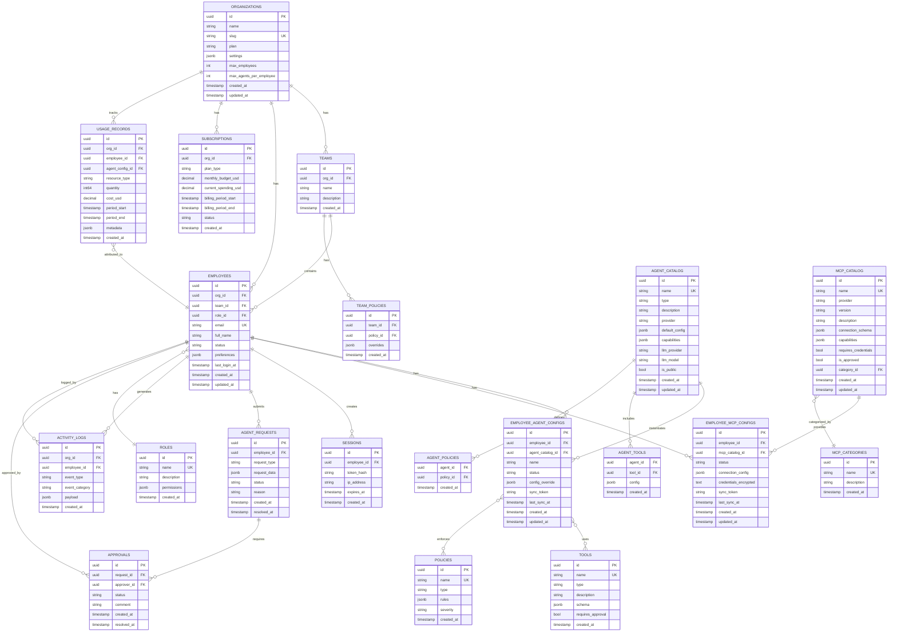

# Enterprise AI Agent Management System - Database Schema (Simplified)

## Core Purpose
Centralized management platform for companies to configure and control AI agents (Claude Code, Cursor, etc.) and MCP servers for their employees.

## Entity Relationship Diagram



## Key Simplifications

### Removed
- ❌ **Missions/Tasks**: No orchestration - agents are configured, not executed centrally
- ❌ **Artifacts**: No central storage of agent outputs
- ❌ **Events table**: Simplified to activity_logs for basic audit
- ❌ **Agent execution logs**: Employees' local logs stay local
- ❌ **Task dependencies**: No inter-agent communication

### Core Focus
- ✅ **Agent Configuration Management**: What agents can each employee use
- ✅ **MCP Configuration Management**: What MCP servers are available
- ✅ **Policy Enforcement**: What agents/MCPs can do
- ✅ **Approval Workflows**: Request/approve new agents or MCPs
- ✅ **Usage Tracking**: Monitor usage for billing/analytics
- ✅ **Sync Mechanism**: Employees sync configs to their local machines

## Table Definitions

### Organizations & Teams
```sql
organizations:
- id, name, slug
- plan (starter/pro/enterprise)
- max_employees, max_agents_per_employee
- settings (JSON for org-level config)

teams:
- id, org_id, name, description
- Purpose: Group employees for policy inheritance

employees:
- id, org_id, team_id, role_id
- email, full_name, status
- preferences (JSON for employee settings)
```

### Agent Configuration
```sql
agent_catalog:
- Available agent types (Claude Code, Cursor, Windsurf, etc.)
- Each entry defines: name, provider, capabilities, default LLM config

employee_agent_configs:
- Per-employee agent instances
- Links employee → agent_catalog with config overrides
- sync_token: Used by CLI to pull latest config
- status: active, disabled, pending_approval
```

### MCP Configuration
```sql
mcp_catalog:
- Available MCP servers (filesystem, github, slack, etc.)
- connection_schema: JSON schema for connection params
- is_approved: Admin must approve before employees can use

employee_mcp_configs:
- Per-employee MCP instances
- credentials_encrypted: Store API keys/tokens securely
- sync_token: Used by CLI to pull latest config
```

### Policies & Tools
```sql
tools:
- Registry of available tools (fs, git, http, shell, docker)
- requires_approval: If true, tool usage needs manager approval

policies:
- Rules like "no /etc access", "max 100 LLM calls/hour"
- Applied at: agent_catalog level OR team level OR employee level

team_policies:
- Override org-wide policies for specific teams
```

### Approval Workflow
```sql
agent_requests:
- Employee submits: "I need GitHub MCP" or "I need Coder agent"
- request_type: new_agent, new_mcp, increase_budget
- status: pending, approved, rejected

approvals:
- Manager/admin approves or rejects
- Can have multiple approvers per request
```

### Analytics
```sql
activity_logs:
- Audit trail: "Alice installed Coder agent"
- event_type: agent.installed, mcp.configured, config.synced
- Lightweight compared to full event sourcing

usage_records:
- Track: LLM tokens used, API calls made
- Aggregated by: org, employee, agent
- Used for billing and cost allocation
```

## Sample Queries

### Get employee's current agent configs
```sql
SELECT 
    eac.id,
    eac.name,
    ac.type as agent_type,
    ac.provider,
    eac.status,
    eac.last_sync_at
FROM employee_agent_configs eac
JOIN agent_catalog ac ON eac.agent_catalog_id = ac.id
WHERE eac.employee_id = $1
AND eac.status = 'active';
```

### Get employee's MCP configs for sync
```sql
SELECT 
    emc.id,
    mc.name,
    mc.provider,
    emc.connection_config,
    emc.credentials_encrypted,
    emc.sync_token
FROM employee_mcp_configs emc
JOIN mcp_catalog mc ON emc.mcp_catalog_id = mc.id
WHERE emc.employee_id = $1
AND emc.status = 'active';
```

### Check org spending vs budget
```sql
SELECT 
    s.monthly_budget_usd,
    s.current_spending_usd,
    (s.current_spending_usd / s.monthly_budget_usd * 100) as usage_pct
FROM subscriptions s
WHERE s.org_id = $1
AND s.status = 'active';
```

### Pending approval requests for manager
```sql
SELECT 
    ar.id,
    ar.request_type,
    e.full_name as requester,
    ar.reason,
    ar.created_at
FROM agent_requests ar
JOIN employees e ON ar.employee_id = e.id
WHERE e.org_id = $1
AND ar.status = 'pending'
ORDER BY ar.created_at ASC;
```

### Team usage analytics
```sql
SELECT 
    t.name as team_name,
    COUNT(DISTINCT e.id) as employee_count,
    COUNT(DISTINCT eac.id) as total_agents,
    SUM(ur.cost_usd) as total_cost_usd
FROM teams t
JOIN employees e ON e.team_id = t.id
LEFT JOIN employee_agent_configs eac ON eac.employee_id = e.id
LEFT JOIN usage_records ur ON ur.employee_id = e.id
WHERE t.org_id = $1
AND ur.period_start >= $2
GROUP BY t.id, t.name
ORDER BY total_cost_usd DESC;
```

## Indexes

```sql
-- Core lookups
CREATE INDEX idx_employees_org_id ON employees(org_id);
CREATE INDEX idx_employees_email ON employees(email);
CREATE INDEX idx_employee_agent_configs_employee_id ON employee_agent_configs(employee_id);
CREATE INDEX idx_employee_agent_configs_status ON employee_agent_configs(status);
CREATE INDEX idx_employee_mcp_configs_employee_id ON employee_mcp_configs(employee_id);
CREATE INDEX idx_employee_mcp_configs_status ON employee_mcp_configs(status);

-- Sync tokens for CLI
CREATE INDEX idx_employee_agent_configs_sync_token ON employee_agent_configs(sync_token);
CREATE INDEX idx_employee_mcp_configs_sync_token ON employee_mcp_configs(sync_token);

-- Analytics
CREATE INDEX idx_usage_records_org_id ON usage_records(org_id);
CREATE INDEX idx_usage_records_employee_id ON usage_records(employee_id);
CREATE INDEX idx_usage_records_period ON usage_records(period_start, period_end);
CREATE INDEX idx_activity_logs_org_id ON activity_logs(org_id);
CREATE INDEX idx_activity_logs_created_at ON activity_logs(created_at DESC);

-- Approvals
CREATE INDEX idx_agent_requests_employee_id ON agent_requests(employee_id);
CREATE INDEX idx_agent_requests_status ON agent_requests(status);
```

## Row Count Estimates (1000 employee org)

```
organizations:              1
teams:                     10
employees:              1,000
roles:                      5
agent_catalog:             20  (Claude Code, Cursor, Windsurf, etc.)
mcp_catalog:              100  (All available MCP servers)
employee_agent_configs: 3,000  (avg 3 agents/employee)
employee_mcp_configs:   5,000  (avg 5 MCPs/employee)
activity_logs:        500,000  (grows over time)
usage_records:      1,000,000  (grows over time)
```

Total: ~1.5M rows for a 1000-employee org (mostly logs/usage)
