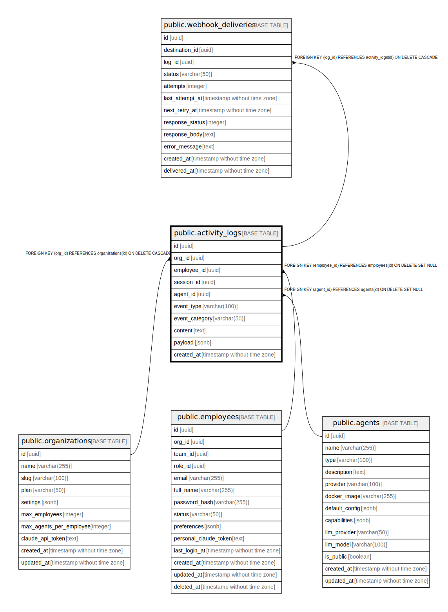

# public.activity_logs

## Description

## Columns

| Name | Type | Default | Nullable | Children | Parents | Comment |
| ---- | ---- | ------- | -------- | -------- | ------- | ------- |
| id | uuid | uuid_generate_v4() | false |  |  |  |
| org_id | uuid |  | false |  | [public.organizations](public.organizations.md) |  |
| employee_id | uuid |  | true |  | [public.employees](public.employees.md) |  |
| event_type | varchar(100) |  | false |  |  |  |
| event_category | varchar(50) |  | false |  |  |  |
| payload | jsonb | '{}'::jsonb | false |  |  |  |
| created_at | timestamp without time zone | now() | false |  |  |  |

## Constraints

| Name | Type | Definition |
| ---- | ---- | ---------- |
| activity_logs_org_id_fkey | FOREIGN KEY | FOREIGN KEY (org_id) REFERENCES organizations(id) ON DELETE CASCADE |
| activity_logs_employee_id_fkey | FOREIGN KEY | FOREIGN KEY (employee_id) REFERENCES employees(id) ON DELETE SET NULL |
| activity_logs_pkey | PRIMARY KEY | PRIMARY KEY (id) |

## Indexes

| Name | Definition |
| ---- | ---------- |
| activity_logs_pkey | CREATE UNIQUE INDEX activity_logs_pkey ON public.activity_logs USING btree (id) |
| idx_activity_logs_org_id | CREATE INDEX idx_activity_logs_org_id ON public.activity_logs USING btree (org_id) |
| idx_activity_logs_employee_id | CREATE INDEX idx_activity_logs_employee_id ON public.activity_logs USING btree (employee_id) |
| idx_activity_logs_event_type | CREATE INDEX idx_activity_logs_event_type ON public.activity_logs USING btree (event_type) |
| idx_activity_logs_created_at | CREATE INDEX idx_activity_logs_created_at ON public.activity_logs USING btree (created_at DESC) |

## Relations

---

> Generated by [tbls](https://github.com/k1LoW/tbls)
