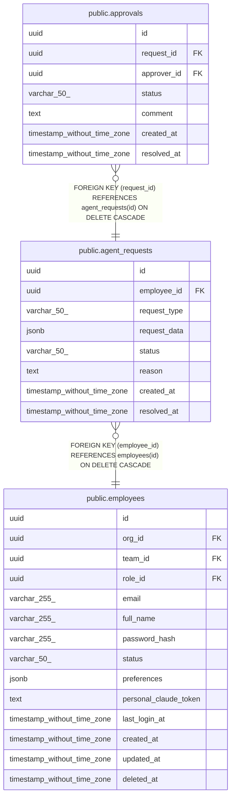

# public.agent_requests

## Description

## Columns

| Name | Type | Default | Nullable | Children | Parents | Comment |
| ---- | ---- | ------- | -------- | -------- | ------- | ------- |
| id | uuid | uuid_generate_v4() | false | [public.approvals](public.approvals.md) |  |  |
| employee_id | uuid |  | false |  | [public.employees](public.employees.md) |  |
| request_type | varchar(50) |  | false |  |  |  |
| request_data | jsonb |  | false |  |  |  |
| status | varchar(50) | 'pending'::character varying | false |  |  |  |
| reason | text |  | true |  |  |  |
| created_at | timestamp without time zone | now() | false |  |  |  |
| resolved_at | timestamp without time zone |  | true |  |  |  |

## Constraints

| Name | Type | Definition |
| ---- | ---- | ---------- |
| agent_requests_employee_id_fkey | FOREIGN KEY | FOREIGN KEY (employee_id) REFERENCES employees(id) ON DELETE CASCADE |
| agent_requests_pkey | PRIMARY KEY | PRIMARY KEY (id) |

## Indexes

| Name | Definition |
| ---- | ---------- |
| agent_requests_pkey | CREATE UNIQUE INDEX agent_requests_pkey ON public.agent_requests USING btree (id) |
| idx_agent_requests_employee_id | CREATE INDEX idx_agent_requests_employee_id ON public.agent_requests USING btree (employee_id) |
| idx_agent_requests_status | CREATE INDEX idx_agent_requests_status ON public.agent_requests USING btree (status) |
| idx_agent_requests_created_at | CREATE INDEX idx_agent_requests_created_at ON public.agent_requests USING btree (created_at DESC) |

## Relations

---

> Generated by [tbls](https://github.com/k1LoW/tbls)
