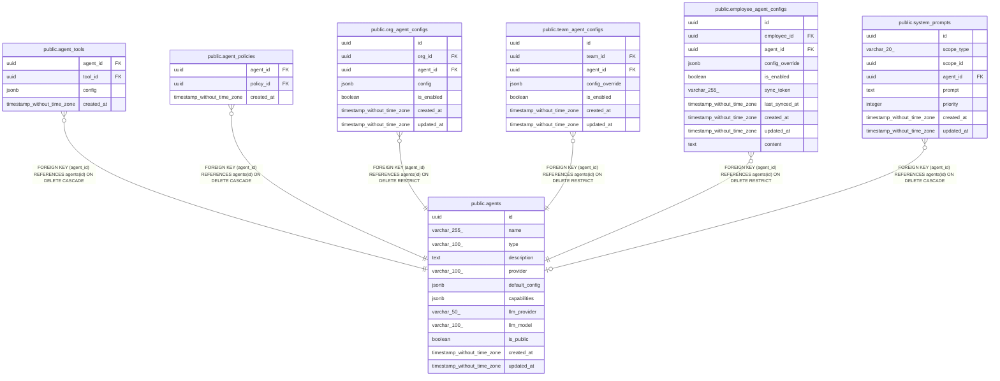

# public.agents

## Description

## Columns

| Name | Type | Default | Nullable | Children | Parents | Comment |
| ---- | ---- | ------- | -------- | -------- | ------- | ------- |
| id | uuid | uuid_generate_v4() | false | [public.agent_tools](public.agent_tools.md) [public.agent_policies](public.agent_policies.md) [public.org_agent_configs](public.org_agent_configs.md) [public.team_agent_configs](public.team_agent_configs.md) [public.employee_agent_configs](public.employee_agent_configs.md) [public.system_prompts](public.system_prompts.md) |  |  |
| name | varchar(255) |  | false |  |  |  |
| type | varchar(100) |  | false |  |  |  |
| description | text |  | false |  |  |  |
| provider | varchar(100) |  | false |  |  |  |
| default_config | jsonb | '{}'::jsonb | false |  |  |  |
| capabilities | jsonb | '[]'::jsonb | false |  |  |  |
| llm_provider | varchar(50) | 'anthropic'::character varying | false |  |  |  |
| llm_model | varchar(100) | 'claude-3-5-sonnet-20241022'::character varying | false |  |  |  |
| is_public | boolean | true | false |  |  |  |
| created_at | timestamp without time zone | now() | false |  |  |  |
| updated_at | timestamp without time zone | now() | false |  |  |  |

## Constraints

| Name | Type | Definition |
| ---- | ---- | ---------- |
| agents_pkey | PRIMARY KEY | PRIMARY KEY (id) |
| agents_name_key | UNIQUE | UNIQUE (name) |

## Indexes

| Name | Definition |
| ---- | ---------- |
| agents_pkey | CREATE UNIQUE INDEX agents_pkey ON public.agents USING btree (id) |
| agents_name_key | CREATE UNIQUE INDEX agents_name_key ON public.agents USING btree (name) |

## Triggers

| Name | Definition |
| ---- | ---------- |
| update_agents_updated_at | CREATE TRIGGER update_agents_updated_at BEFORE UPDATE ON public.agents FOR EACH ROW EXECUTE FUNCTION update_updated_at_column() |

## Relations

---

> Generated by [tbls](https://github.com/k1LoW/tbls)
