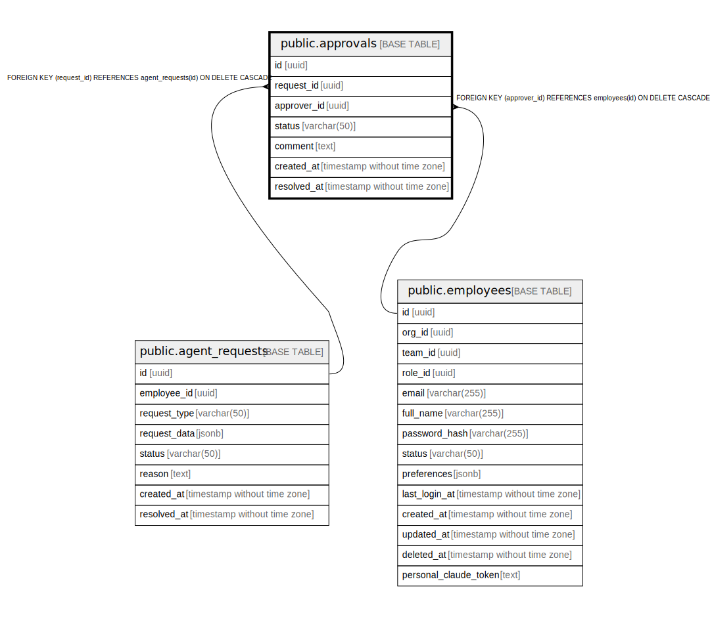

# public.approvals

## Description

## Columns

| Name | Type | Default | Nullable | Children | Parents | Comment |
| ---- | ---- | ------- | -------- | -------- | ------- | ------- |
| id | uuid | uuid_generate_v4() | false |  |  |  |
| request_id | uuid |  | false |  | [public.agent_requests](public.agent_requests.md) |  |
| approver_id | uuid |  | false |  | [public.employees](public.employees.md) |  |
| status | varchar(50) |  | false |  |  |  |
| comment | text |  | true |  |  |  |
| created_at | timestamp without time zone | now() | false |  |  |  |
| resolved_at | timestamp without time zone |  | true |  |  |  |

## Constraints

| Name | Type | Definition |
| ---- | ---- | ---------- |
| approvals_approver_id_fkey | FOREIGN KEY | FOREIGN KEY (approver_id) REFERENCES employees(id) ON DELETE CASCADE |
| approvals_request_id_fkey | FOREIGN KEY | FOREIGN KEY (request_id) REFERENCES agent_requests(id) ON DELETE CASCADE |
| approvals_pkey | PRIMARY KEY | PRIMARY KEY (id) |

## Indexes

| Name | Definition |
| ---- | ---------- |
| approvals_pkey | CREATE UNIQUE INDEX approvals_pkey ON public.approvals USING btree (id) |
| idx_approvals_request_id | CREATE INDEX idx_approvals_request_id ON public.approvals USING btree (request_id) |
| idx_approvals_approver_id | CREATE INDEX idx_approvals_approver_id ON public.approvals USING btree (approver_id) |

## Relations

---

> Generated by [tbls](https://github.com/k1LoW/tbls)
