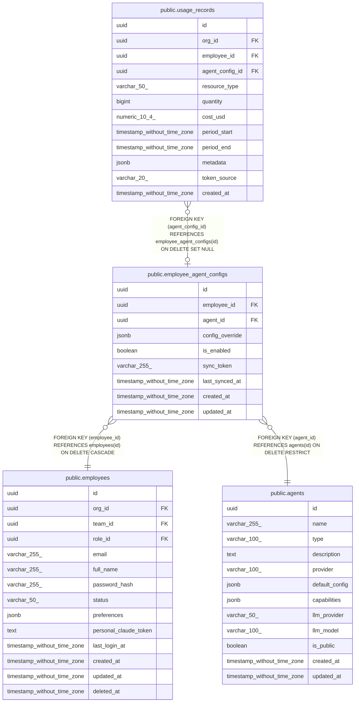

# public.employee_agent_configs

## Description

## Columns

| Name | Type | Default | Nullable | Children | Parents | Comment |
| ---- | ---- | ------- | -------- | -------- | ------- | ------- |
| id | uuid | uuid_generate_v4() | false | [public.usage_records](public.usage_records.md) |  |  |
| employee_id | uuid |  | false |  | [public.employees](public.employees.md) |  |
| agent_id | uuid |  | false |  | [public.agents](public.agents.md) |  |
| config_override | jsonb | '{}'::jsonb | false |  |  |  |
| is_enabled | boolean | true | false |  |  |  |
| sync_token | varchar(255) |  | true |  |  |  |
| last_synced_at | timestamp without time zone |  | true |  |  |  |
| created_at | timestamp without time zone | now() | false |  |  |  |
| updated_at | timestamp without time zone | now() | false |  |  |  |

## Constraints

| Name | Type | Definition |
| ---- | ---- | ---------- |
| employee_agent_configs_employee_id_fkey | FOREIGN KEY | FOREIGN KEY (employee_id) REFERENCES employees(id) ON DELETE CASCADE |
| employee_agent_configs_agent_id_fkey | FOREIGN KEY | FOREIGN KEY (agent_id) REFERENCES agents(id) ON DELETE RESTRICT |
| employee_agent_configs_pkey | PRIMARY KEY | PRIMARY KEY (id) |
| employee_agent_configs_sync_token_key | UNIQUE | UNIQUE (sync_token) |
| unique_employee_agent | UNIQUE | UNIQUE (employee_id, agent_id) |

## Indexes

| Name | Definition |
| ---- | ---------- |
| employee_agent_configs_pkey | CREATE UNIQUE INDEX employee_agent_configs_pkey ON public.employee_agent_configs USING btree (id) |
| employee_agent_configs_sync_token_key | CREATE UNIQUE INDEX employee_agent_configs_sync_token_key ON public.employee_agent_configs USING btree (sync_token) |
| unique_employee_agent | CREATE UNIQUE INDEX unique_employee_agent ON public.employee_agent_configs USING btree (employee_id, agent_id) |
| idx_employee_agent_configs_employee_id | CREATE INDEX idx_employee_agent_configs_employee_id ON public.employee_agent_configs USING btree (employee_id) |
| idx_employee_agent_configs_agent_id | CREATE INDEX idx_employee_agent_configs_agent_id ON public.employee_agent_configs USING btree (agent_id) |
| idx_employee_agent_configs_is_enabled | CREATE INDEX idx_employee_agent_configs_is_enabled ON public.employee_agent_configs USING btree (is_enabled) |
| idx_employee_agent_configs_sync_token | CREATE INDEX idx_employee_agent_configs_sync_token ON public.employee_agent_configs USING btree (sync_token) WHERE (sync_token IS NOT NULL) |

## Triggers

| Name | Definition |
| ---- | ---------- |
| update_employee_agent_configs_updated_at | CREATE TRIGGER update_employee_agent_configs_updated_at BEFORE UPDATE ON public.employee_agent_configs FOR EACH ROW EXECUTE FUNCTION update_updated_at_column() |
| generate_agent_config_sync_token | CREATE TRIGGER generate_agent_config_sync_token BEFORE INSERT ON public.employee_agent_configs FOR EACH ROW EXECUTE FUNCTION generate_sync_token() |

## Relations

---

> Generated by [tbls](https://github.com/k1LoW/tbls)
