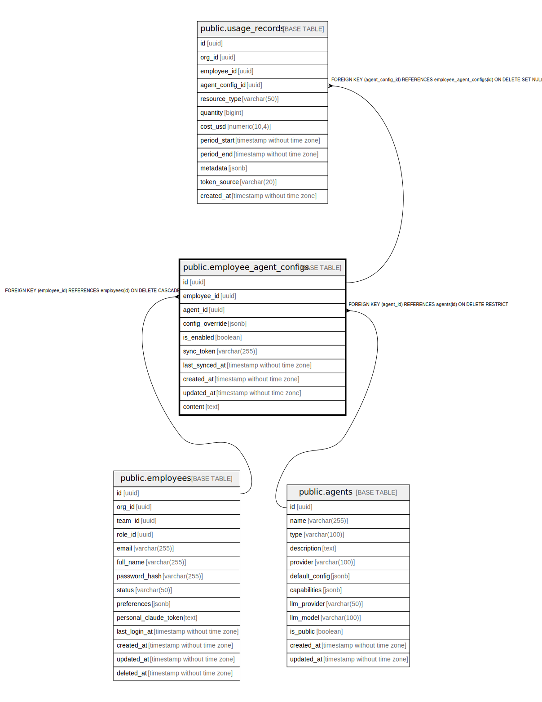

# public.employee_agent_configs

## Description

## Columns

| Name | Type | Default | Nullable | Children | Parents | Comment |
| ---- | ---- | ------- | -------- | -------- | ------- | ------- |
| id | uuid | uuid_generate_v4() | false | [public.usage_records](public.usage_records.md) |  |  |
| employee_id | uuid |  | false |  | [public.employees](public.employees.md) |  |
| agent_catalog_id | uuid |  | false |  | [public.agent_catalog](public.agent_catalog.md) |  |
| name | varchar(255) |  | false |  |  |  |
| status | varchar(50) | 'active'::character varying | false |  |  |  |
| config_override | jsonb | '{}'::jsonb | false |  |  |  |
| sync_token | varchar(255) |  | true |  |  |  |
| last_sync_at | timestamp without time zone |  | true |  |  |  |
| created_at | timestamp without time zone | now() | false |  |  |  |
| updated_at | timestamp without time zone | now() | false |  |  |  |

## Constraints

| Name | Type | Definition |
| ---- | ---- | ---------- |
| employee_agent_configs_employee_id_fkey | FOREIGN KEY | FOREIGN KEY (employee_id) REFERENCES employees(id) ON DELETE CASCADE |
| employee_agent_configs_agent_catalog_id_fkey | FOREIGN KEY | FOREIGN KEY (agent_catalog_id) REFERENCES agent_catalog(id) ON DELETE RESTRICT |
| employee_agent_configs_pkey | PRIMARY KEY | PRIMARY KEY (id) |
| employee_agent_configs_sync_token_key | UNIQUE | UNIQUE (sync_token) |
| unique_agent_name_per_employee | UNIQUE | UNIQUE (employee_id, name) |

## Indexes

| Name | Definition |
| ---- | ---------- |
| employee_agent_configs_pkey | CREATE UNIQUE INDEX employee_agent_configs_pkey ON public.employee_agent_configs USING btree (id) |
| employee_agent_configs_sync_token_key | CREATE UNIQUE INDEX employee_agent_configs_sync_token_key ON public.employee_agent_configs USING btree (sync_token) |
| unique_agent_name_per_employee | CREATE UNIQUE INDEX unique_agent_name_per_employee ON public.employee_agent_configs USING btree (employee_id, name) |
| idx_employee_agent_configs_employee_id | CREATE INDEX idx_employee_agent_configs_employee_id ON public.employee_agent_configs USING btree (employee_id) |
| idx_employee_agent_configs_agent_catalog_id | CREATE INDEX idx_employee_agent_configs_agent_catalog_id ON public.employee_agent_configs USING btree (agent_catalog_id) |
| idx_employee_agent_configs_status | CREATE INDEX idx_employee_agent_configs_status ON public.employee_agent_configs USING btree (status) |
| idx_employee_agent_configs_sync_token | CREATE INDEX idx_employee_agent_configs_sync_token ON public.employee_agent_configs USING btree (sync_token) WHERE (sync_token IS NOT NULL) |

## Triggers

| Name | Definition |
| ---- | ---------- |
| update_employee_agent_configs_updated_at | CREATE TRIGGER update_employee_agent_configs_updated_at BEFORE UPDATE ON public.employee_agent_configs FOR EACH ROW EXECUTE FUNCTION update_updated_at_column() |
| generate_agent_config_sync_token | CREATE TRIGGER generate_agent_config_sync_token BEFORE INSERT ON public.employee_agent_configs FOR EACH ROW EXECUTE FUNCTION generate_sync_token() |

## Relations

---

> Generated by [tbls](https://github.com/k1LoW/tbls)
