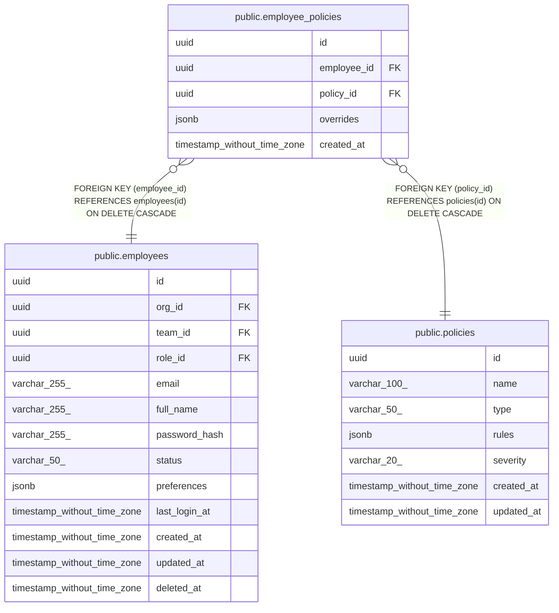

# public.employee_policies

## Description

## Columns

| Name | Type | Default | Nullable | Children | Parents | Comment |
| ---- | ---- | ------- | -------- | -------- | ------- | ------- |
| id | uuid | uuid_generate_v4() | false |  |  |  |
| employee_id | uuid |  | false |  | [public.employees](public.employees.md) |  |
| policy_id | uuid |  | false |  | [public.policies](public.policies.md) |  |
| overrides | jsonb | '{}'::jsonb | false |  |  |  |
| created_at | timestamp without time zone | now() | false |  |  |  |

## Constraints

| Name | Type | Definition |
| ---- | ---- | ---------- |
| employee_policies_employee_id_fkey | FOREIGN KEY | FOREIGN KEY (employee_id) REFERENCES employees(id) ON DELETE CASCADE |
| employee_policies_policy_id_fkey | FOREIGN KEY | FOREIGN KEY (policy_id) REFERENCES policies(id) ON DELETE CASCADE |
| employee_policies_pkey | PRIMARY KEY | PRIMARY KEY (id) |
| unique_employee_policy | UNIQUE | UNIQUE (employee_id, policy_id) |

## Indexes

| Name | Definition |
| ---- | ---------- |
| employee_policies_pkey | CREATE UNIQUE INDEX employee_policies_pkey ON public.employee_policies USING btree (id) |
| unique_employee_policy | CREATE UNIQUE INDEX unique_employee_policy ON public.employee_policies USING btree (employee_id, policy_id) |

## Relations

---

> Generated by [tbls](https://github.com/k1LoW/tbls)
