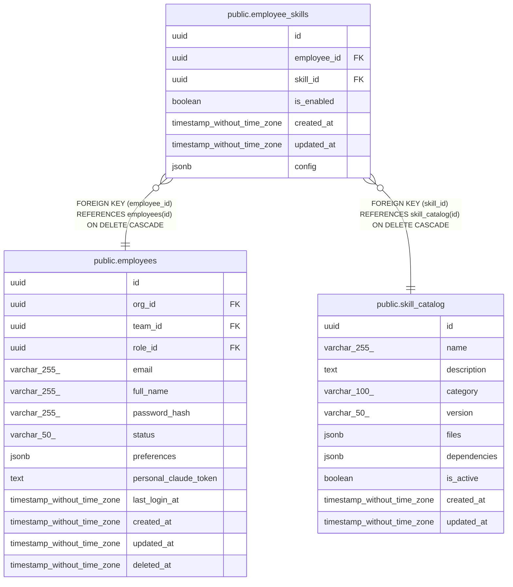

# public.employee_skills

## Description

## Columns

| Name | Type | Default | Nullable | Children | Parents | Comment |
| ---- | ---- | ------- | -------- | -------- | ------- | ------- |
| id | uuid | uuid_generate_v4() | false |  |  |  |
| employee_id | uuid |  | false |  | [public.employees](public.employees.md) |  |
| skill_id | uuid |  | false |  | [public.skill_catalog](public.skill_catalog.md) |  |
| is_enabled | boolean | true | false |  |  |  |
| created_at | timestamp without time zone | now() | false |  |  |  |
| updated_at | timestamp without time zone | now() | false |  |  |  |
| config | jsonb | '{}'::jsonb | false |  |  |  |

## Constraints

| Name | Type | Definition |
| ---- | ---- | ---------- |
| employee_skills_employee_id_fkey | FOREIGN KEY | FOREIGN KEY (employee_id) REFERENCES employees(id) ON DELETE CASCADE |
| employee_skills_skill_id_fkey | FOREIGN KEY | FOREIGN KEY (skill_id) REFERENCES skill_catalog(id) ON DELETE CASCADE |
| employee_skills_pkey | PRIMARY KEY | PRIMARY KEY (id) |
| employee_skills_employee_id_skill_id_key | UNIQUE | UNIQUE (employee_id, skill_id) |

## Indexes

| Name | Definition |
| ---- | ---------- |
| employee_skills_pkey | CREATE UNIQUE INDEX employee_skills_pkey ON public.employee_skills USING btree (id) |
| employee_skills_employee_id_skill_id_key | CREATE UNIQUE INDEX employee_skills_employee_id_skill_id_key ON public.employee_skills USING btree (employee_id, skill_id) |

## Relations

---

> Generated by [tbls](https://github.com/k1LoW/tbls)
