# public.employees

## Description

## Columns

| Name | Type | Default | Nullable | Children | Parents | Comment |
| ---- | ---- | ------- | -------- | -------- | ------- | ------- |
| id | uuid | uuid_generate_v4() | false | [public.sessions](public.sessions.md) [public.employee_agent_configs](public.employee_agent_configs.md) [public.employee_policies](public.employee_policies.md) [public.employee_mcp_configs](public.employee_mcp_configs.md) [public.agent_requests](public.agent_requests.md) [public.approvals](public.approvals.md) [public.activity_logs](public.activity_logs.md) [public.usage_records](public.usage_records.md) [public.employee_skills](public.employee_skills.md) |  |  |
| org_id | uuid |  | false |  | [public.organizations](public.organizations.md) |  |
| team_id | uuid |  | true |  | [public.teams](public.teams.md) |  |
| role_id | uuid |  | false |  | [public.roles](public.roles.md) |  |
| email | varchar(255) |  | false |  |  |  |
| full_name | varchar(255) |  | false |  |  |  |
| password_hash | varchar(255) |  | false |  |  |  |
| status | varchar(50) | 'active'::character varying | false |  |  |  |
| preferences | jsonb | '{}'::jsonb | false |  |  |  |
| personal_claude_token | text |  | true |  |  |  |
| last_login_at | timestamp without time zone |  | true |  |  |  |
| created_at | timestamp without time zone | now() | false |  |  |  |
| updated_at | timestamp without time zone | now() | false |  |  |  |
| deleted_at | timestamp without time zone |  | true |  |  |  |

## Constraints

| Name | Type | Definition |
| ---- | ---- | ---------- |
| employees_org_id_fkey | FOREIGN KEY | FOREIGN KEY (org_id) REFERENCES organizations(id) ON DELETE CASCADE |
| employees_team_id_fkey | FOREIGN KEY | FOREIGN KEY (team_id) REFERENCES teams(id) ON DELETE SET NULL |
| employees_role_id_fkey | FOREIGN KEY | FOREIGN KEY (role_id) REFERENCES roles(id) |
| employees_pkey | PRIMARY KEY | PRIMARY KEY (id) |
| employees_email_key | UNIQUE | UNIQUE (email) |

## Indexes

| Name | Definition |
| ---- | ---------- |
| employees_pkey | CREATE UNIQUE INDEX employees_pkey ON public.employees USING btree (id) |
| employees_email_key | CREATE UNIQUE INDEX employees_email_key ON public.employees USING btree (email) |
| idx_employees_org_id | CREATE INDEX idx_employees_org_id ON public.employees USING btree (org_id) |
| idx_employees_team_id | CREATE INDEX idx_employees_team_id ON public.employees USING btree (team_id) |
| idx_employees_email | CREATE INDEX idx_employees_email ON public.employees USING btree (email) |
| idx_employees_status | CREATE INDEX idx_employees_status ON public.employees USING btree (status) |
| idx_employees_personal_token | CREATE INDEX idx_employees_personal_token ON public.employees USING btree (org_id, personal_claude_token) WHERE (personal_claude_token IS NOT NULL) |

## Triggers

| Name | Definition |
| ---- | ---------- |
| update_employees_updated_at | CREATE TRIGGER update_employees_updated_at BEFORE UPDATE ON public.employees FOR EACH ROW EXECUTE FUNCTION update_updated_at_column() |

## Relations

```mermaid
erDiagram

"public.sessions" }o--|| "public.employees" : "FOREIGN KEY (employee_id) REFERENCES employees(id) ON DELETE CASCADE"
"public.employee_agent_configs" }o--|| "public.employees" : "FOREIGN KEY (employee_id) REFERENCES employees(id) ON DELETE CASCADE"
"public.employee_policies" }o--|| "public.employees" : "FOREIGN KEY (employee_id) REFERENCES employees(id) ON DELETE CASCADE"
"public.employee_mcp_configs" }o--|| "public.employees" : "FOREIGN KEY (employee_id) REFERENCES employees(id) ON DELETE CASCADE"
"public.agent_requests" }o--|| "public.employees" : "FOREIGN KEY (employee_id) REFERENCES employees(id) ON DELETE CASCADE"
"public.approvals" }o--|| "public.employees" : "FOREIGN KEY (approver_id) REFERENCES employees(id) ON DELETE CASCADE"
"public.activity_logs" }o--o| "public.employees" : "FOREIGN KEY (employee_id) REFERENCES employees(id) ON DELETE SET NULL"
"public.usage_records" }o--o| "public.employees" : "FOREIGN KEY (employee_id) REFERENCES employees(id) ON DELETE SET NULL"
"public.employee_skills" }o--|| "public.employees" : "FOREIGN KEY (employee_id) REFERENCES employees(id) ON DELETE CASCADE"
"public.employees" }o--|| "public.organizations" : "FOREIGN KEY (org_id) REFERENCES organizations(id) ON DELETE CASCADE"
"public.employees" }o--o| "public.teams" : "FOREIGN KEY (team_id) REFERENCES teams(id) ON DELETE SET NULL"
"public.employees" }o--|| "public.roles" : "FOREIGN KEY (role_id) REFERENCES roles(id)"

"public.employees" {
  uuid id
  uuid org_id FK
  uuid team_id FK
  uuid role_id FK
  varchar_255_ email
  varchar_255_ full_name
  varchar_255_ password_hash
  varchar_50_ status
  jsonb preferences
  text personal_claude_token
  timestamp_without_time_zone last_login_at
  timestamp_without_time_zone created_at
  timestamp_without_time_zone updated_at
  timestamp_without_time_zone deleted_at
}
"public.sessions" {
  uuid id
  uuid employee_id FK
  varchar_255_ token_hash
  varchar_45_ ip_address
  text user_agent
  timestamp_without_time_zone expires_at
  timestamp_without_time_zone created_at
}
"public.employee_agent_configs" {
  uuid id
  uuid employee_id FK
  uuid agent_id FK
  jsonb config_override
  boolean is_enabled
  varchar_255_ sync_token
  timestamp_without_time_zone last_synced_at
  timestamp_without_time_zone created_at
  timestamp_without_time_zone updated_at
}
"public.employee_policies" {
  uuid id
  uuid employee_id FK
  uuid policy_id FK
  jsonb overrides
  timestamp_without_time_zone created_at
}
"public.employee_mcp_configs" {
  uuid id
  uuid employee_id FK
  uuid mcp_catalog_id FK
  varchar_50_ status
  jsonb connection_config
  text credentials_encrypted
  varchar_255_ sync_token
  timestamp_without_time_zone last_sync_at
  timestamp_without_time_zone created_at
  timestamp_without_time_zone updated_at
  boolean is_enabled
}
"public.agent_requests" {
  uuid id
  uuid employee_id FK
  varchar_50_ request_type
  jsonb request_data
  varchar_50_ status
  text reason
  timestamp_without_time_zone created_at
  timestamp_without_time_zone resolved_at
}
"public.approvals" {
  uuid id
  uuid request_id FK
  uuid approver_id FK
  varchar_50_ status
  text comment
  timestamp_without_time_zone created_at
  timestamp_without_time_zone resolved_at
}
"public.activity_logs" {
  uuid id
  uuid org_id FK
  uuid employee_id FK
  uuid session_id
  uuid agent_id FK
  varchar_100_ event_type
  varchar_50_ event_category
  text content
  jsonb payload
  timestamp_without_time_zone created_at
}
"public.usage_records" {
  uuid id
  uuid org_id FK
  uuid employee_id FK
  uuid agent_config_id FK
  varchar_50_ resource_type
  bigint quantity
  numeric_10_4_ cost_usd
  timestamp_without_time_zone period_start
  timestamp_without_time_zone period_end
  jsonb metadata
  varchar_20_ token_source
  timestamp_without_time_zone created_at
}
"public.employee_skills" {
  uuid id
  uuid employee_id FK
  uuid skill_id FK
  boolean is_enabled
  timestamp_without_time_zone created_at
  timestamp_without_time_zone updated_at
  jsonb config
}
"public.organizations" {
  uuid id
  varchar_255_ name
  varchar_100_ slug
  varchar_50_ plan
  jsonb settings
  integer max_employees
  integer max_agents_per_employee
  text claude_api_token
  timestamp_without_time_zone created_at
  timestamp_without_time_zone updated_at
}
"public.teams" {
  uuid id
  uuid org_id FK
  varchar_255_ name
  text description
  timestamp_without_time_zone created_at
  timestamp_without_time_zone updated_at
}
"public.roles" {
  uuid id
  varchar_100_ name
  text description
  jsonb permissions
  timestamp_without_time_zone created_at
  timestamp_without_time_zone updated_at
}
```

---

> Generated by [tbls](https://github.com/k1LoW/tbls)
