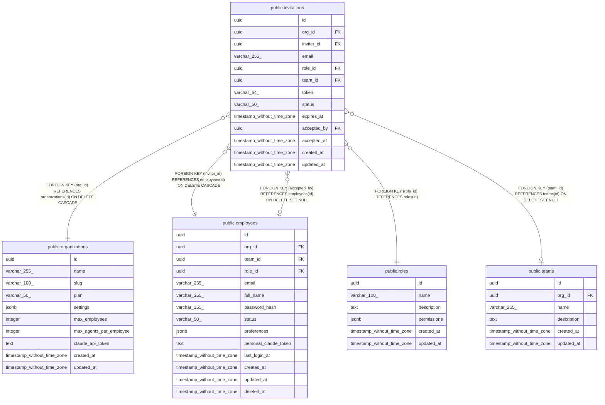

# public.invitations

## Description

## Columns

| Name | Type | Default | Nullable | Children | Parents | Comment |
| ---- | ---- | ------- | -------- | -------- | ------- | ------- |
| id | uuid | uuid_generate_v4() | false |  |  |  |
| org_id | uuid |  | false |  | [public.organizations](public.organizations.md) |  |
| inviter_id | uuid |  | false |  | [public.employees](public.employees.md) |  |
| email | varchar(255) |  | false |  |  |  |
| role_id | uuid |  | false |  | [public.roles](public.roles.md) |  |
| team_id | uuid |  | true |  | [public.teams](public.teams.md) |  |
| token | varchar(64) |  | false |  |  |  |
| status | varchar(50) | 'pending'::character varying | false |  |  |  |
| expires_at | timestamp without time zone | (now() + '7 days'::interval) | false |  |  |  |
| accepted_by | uuid |  | true |  | [public.employees](public.employees.md) |  |
| accepted_at | timestamp without time zone |  | true |  |  |  |
| created_at | timestamp without time zone | now() | false |  |  |  |
| updated_at | timestamp without time zone | now() | false |  |  |  |

## Constraints

| Name | Type | Definition |
| ---- | ---- | ---------- |
| invitations_org_id_fkey | FOREIGN KEY | FOREIGN KEY (org_id) REFERENCES organizations(id) ON DELETE CASCADE |
| invitations_team_id_fkey | FOREIGN KEY | FOREIGN KEY (team_id) REFERENCES teams(id) ON DELETE SET NULL |
| invitations_role_id_fkey | FOREIGN KEY | FOREIGN KEY (role_id) REFERENCES roles(id) |
| invitations_accepted_by_fkey | FOREIGN KEY | FOREIGN KEY (accepted_by) REFERENCES employees(id) ON DELETE SET NULL |
| invitations_inviter_id_fkey | FOREIGN KEY | FOREIGN KEY (inviter_id) REFERENCES employees(id) ON DELETE CASCADE |
| invitations_pkey | PRIMARY KEY | PRIMARY KEY (id) |
| invitations_token_key | UNIQUE | UNIQUE (token) |
| unique_pending_invitation | UNIQUE | UNIQUE (org_id, email, status) |

## Indexes

| Name | Definition |
| ---- | ---------- |
| invitations_pkey | CREATE UNIQUE INDEX invitations_pkey ON public.invitations USING btree (id) |
| invitations_token_key | CREATE UNIQUE INDEX invitations_token_key ON public.invitations USING btree (token) |
| unique_pending_invitation | CREATE UNIQUE INDEX unique_pending_invitation ON public.invitations USING btree (org_id, email, status) |
| idx_invitations_org_id | CREATE INDEX idx_invitations_org_id ON public.invitations USING btree (org_id) |
| idx_invitations_email | CREATE INDEX idx_invitations_email ON public.invitations USING btree (email) |
| idx_invitations_token | CREATE INDEX idx_invitations_token ON public.invitations USING btree (token) |
| idx_invitations_status | CREATE INDEX idx_invitations_status ON public.invitations USING btree (status) |
| idx_invitations_expires_at | CREATE INDEX idx_invitations_expires_at ON public.invitations USING btree (expires_at) |
| idx_invitations_inviter_id | CREATE INDEX idx_invitations_inviter_id ON public.invitations USING btree (inviter_id) |

## Triggers

| Name | Definition |
| ---- | ---------- |
| update_invitations_updated_at | CREATE TRIGGER update_invitations_updated_at BEFORE UPDATE ON public.invitations FOR EACH ROW EXECUTE FUNCTION update_updated_at_column() |
| generate_invitation_token_trigger | CREATE TRIGGER generate_invitation_token_trigger BEFORE INSERT ON public.invitations FOR EACH ROW EXECUTE FUNCTION generate_invitation_token() |

## Relations

---

> Generated by [tbls](https://github.com/k1LoW/tbls)
