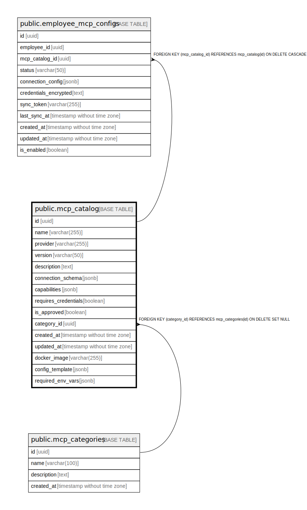

# public.mcp_catalog

## Description

## Columns

| Name | Type | Default | Nullable | Children | Parents | Comment |
| ---- | ---- | ------- | -------- | -------- | ------- | ------- |
| id | uuid | uuid_generate_v4() | false | [public.employee_mcp_configs](public.employee_mcp_configs.md) |  |  |
| name | varchar(255) |  | false |  |  |  |
| provider | varchar(255) |  | false |  |  |  |
| version | varchar(50) |  | false |  |  |  |
| description | text |  | false |  |  |  |
| connection_schema | jsonb |  | false |  |  |  |
| capabilities | jsonb | '[]'::jsonb | false |  |  |  |
| requires_credentials | boolean | false | false |  |  |  |
| is_approved | boolean | false | false |  |  |  |
| category_id | uuid |  | true |  | [public.mcp_categories](public.mcp_categories.md) |  |
| created_at | timestamp without time zone | now() | false |  |  |  |
| updated_at | timestamp without time zone | now() | false |  |  |  |

## Constraints

| Name | Type | Definition |
| ---- | ---- | ---------- |
| mcp_catalog_category_id_fkey | FOREIGN KEY | FOREIGN KEY (category_id) REFERENCES mcp_categories(id) ON DELETE SET NULL |
| mcp_catalog_pkey | PRIMARY KEY | PRIMARY KEY (id) |
| mcp_catalog_name_key | UNIQUE | UNIQUE (name) |

## Indexes

| Name | Definition |
| ---- | ---------- |
| mcp_catalog_pkey | CREATE UNIQUE INDEX mcp_catalog_pkey ON public.mcp_catalog USING btree (id) |
| mcp_catalog_name_key | CREATE UNIQUE INDEX mcp_catalog_name_key ON public.mcp_catalog USING btree (name) |

## Triggers

| Name | Definition |
| ---- | ---------- |
| update_mcp_catalog_updated_at | CREATE TRIGGER update_mcp_catalog_updated_at BEFORE UPDATE ON public.mcp_catalog FOR EACH ROW EXECUTE FUNCTION update_updated_at_column() |

## Relations

---

> Generated by [tbls](https://github.com/k1LoW/tbls)
