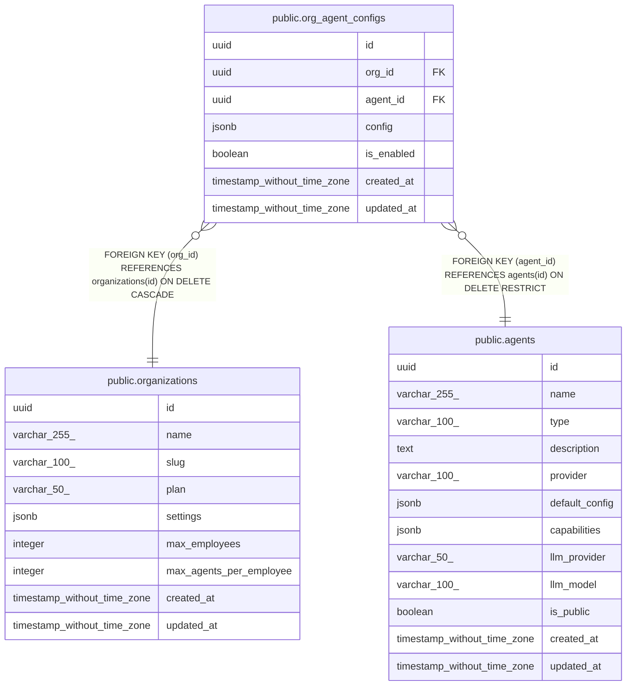

# public.org_agent_configs

## Description

## Columns

| Name | Type | Default | Nullable | Children | Parents | Comment |
| ---- | ---- | ------- | -------- | -------- | ------- | ------- |
| id | uuid | uuid_generate_v4() | false |  |  |  |
| org_id | uuid |  | false |  | [public.organizations](public.organizations.md) |  |
| agent_id | uuid |  | false |  | [public.agents](public.agents.md) |  |
| config | jsonb | '{}'::jsonb | false |  |  |  |
| is_enabled | boolean | true | false |  |  |  |
| created_at | timestamp without time zone | now() | false |  |  |  |
| updated_at | timestamp without time zone | now() | false |  |  |  |

## Constraints

| Name | Type | Definition |
| ---- | ---- | ---------- |
| org_agent_configs_org_id_fkey | FOREIGN KEY | FOREIGN KEY (org_id) REFERENCES organizations(id) ON DELETE CASCADE |
| org_agent_configs_agent_id_fkey | FOREIGN KEY | FOREIGN KEY (agent_id) REFERENCES agents(id) ON DELETE RESTRICT |
| org_agent_configs_pkey | PRIMARY KEY | PRIMARY KEY (id) |
| unique_org_agent | UNIQUE | UNIQUE (org_id, agent_id) |

## Indexes

| Name | Definition |
| ---- | ---------- |
| org_agent_configs_pkey | CREATE UNIQUE INDEX org_agent_configs_pkey ON public.org_agent_configs USING btree (id) |
| unique_org_agent | CREATE UNIQUE INDEX unique_org_agent ON public.org_agent_configs USING btree (org_id, agent_id) |

## Relations

---

> Generated by [tbls](https://github.com/k1LoW/tbls)
