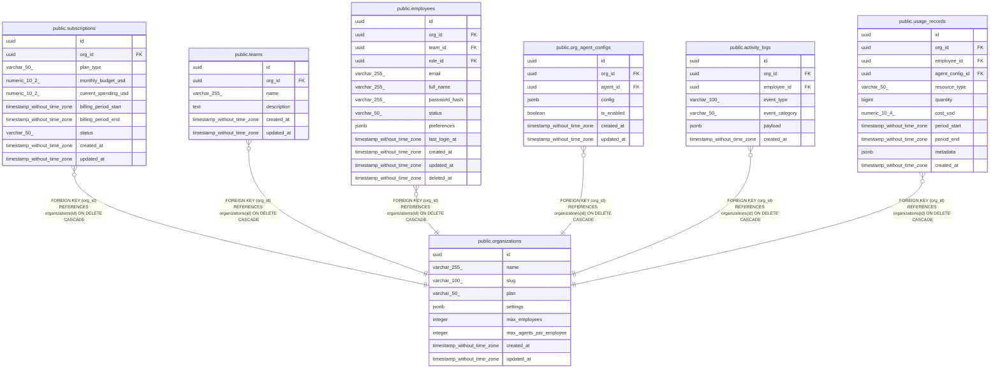

# public.organizations

## Description

## Columns

| Name | Type | Default | Nullable | Children | Parents | Comment |
| ---- | ---- | ------- | -------- | -------- | ------- | ------- |
| id | uuid | uuid_generate_v4() | false | [public.subscriptions](public.subscriptions.md) [public.teams](public.teams.md) [public.employees](public.employees.md) [public.org_agent_configs](public.org_agent_configs.md) [public.activity_logs](public.activity_logs.md) [public.usage_records](public.usage_records.md) |  |  |
| name | varchar(255) |  | false |  |  |  |
| slug | varchar(100) |  | false |  |  |  |
| plan | varchar(50) | 'starter'::character varying | false |  |  |  |
| settings | jsonb | '{}'::jsonb | false |  |  |  |
| max_employees | integer | 10 | false |  |  |  |
| max_agents_per_employee | integer | 3 | false |  |  |  |
| created_at | timestamp without time zone | now() | false |  |  |  |
| updated_at | timestamp without time zone | now() | false |  |  |  |

## Constraints

| Name | Type | Definition |
| ---- | ---- | ---------- |
| organizations_pkey | PRIMARY KEY | PRIMARY KEY (id) |
| organizations_slug_key | UNIQUE | UNIQUE (slug) |

## Indexes

| Name | Definition |
| ---- | ---------- |
| organizations_pkey | CREATE UNIQUE INDEX organizations_pkey ON public.organizations USING btree (id) |
| organizations_slug_key | CREATE UNIQUE INDEX organizations_slug_key ON public.organizations USING btree (slug) |
| idx_organizations_slug | CREATE INDEX idx_organizations_slug ON public.organizations USING btree (slug) |

## Triggers

| Name | Definition |
| ---- | ---------- |
| update_organizations_updated_at | CREATE TRIGGER update_organizations_updated_at BEFORE UPDATE ON public.organizations FOR EACH ROW EXECUTE FUNCTION update_updated_at_column() |

## Relations

---

> Generated by [tbls](https://github.com/k1LoW/tbls)
