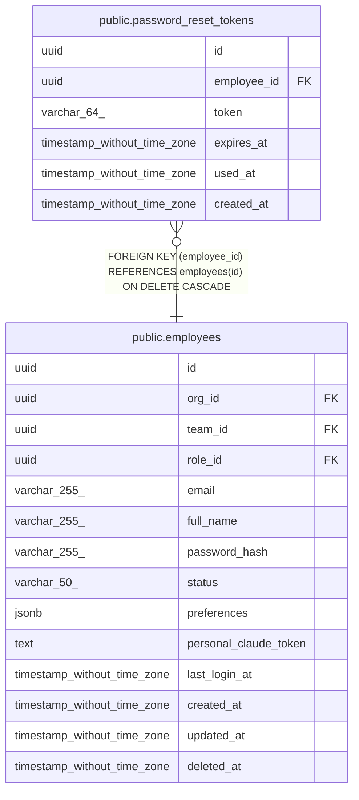

# public.password_reset_tokens

## Description

## Columns

| Name | Type | Default | Nullable | Children | Parents | Comment |
| ---- | ---- | ------- | -------- | -------- | ------- | ------- |
| id | uuid | uuid_generate_v4() | false |  |  |  |
| employee_id | uuid |  | false |  | [public.employees](public.employees.md) |  |
| token | varchar(64) |  | false |  |  |  |
| expires_at | timestamp without time zone | (now() + '01:00:00'::interval) | false |  |  |  |
| used_at | timestamp without time zone |  | true |  |  |  |
| created_at | timestamp without time zone | now() | false |  |  |  |

## Constraints

| Name | Type | Definition |
| ---- | ---- | ---------- |
| password_reset_tokens_employee_id_fkey | FOREIGN KEY | FOREIGN KEY (employee_id) REFERENCES employees(id) ON DELETE CASCADE |
| password_reset_tokens_pkey | PRIMARY KEY | PRIMARY KEY (id) |
| password_reset_tokens_token_key | UNIQUE | UNIQUE (token) |

## Indexes

| Name | Definition |
| ---- | ---------- |
| password_reset_tokens_pkey | CREATE UNIQUE INDEX password_reset_tokens_pkey ON public.password_reset_tokens USING btree (id) |
| password_reset_tokens_token_key | CREATE UNIQUE INDEX password_reset_tokens_token_key ON public.password_reset_tokens USING btree (token) |
| idx_password_reset_tokens_token | CREATE INDEX idx_password_reset_tokens_token ON public.password_reset_tokens USING btree (token) |
| idx_password_reset_tokens_employee_id | CREATE INDEX idx_password_reset_tokens_employee_id ON public.password_reset_tokens USING btree (employee_id) |

## Relations

---

> Generated by [tbls](https://github.com/k1LoW/tbls)
