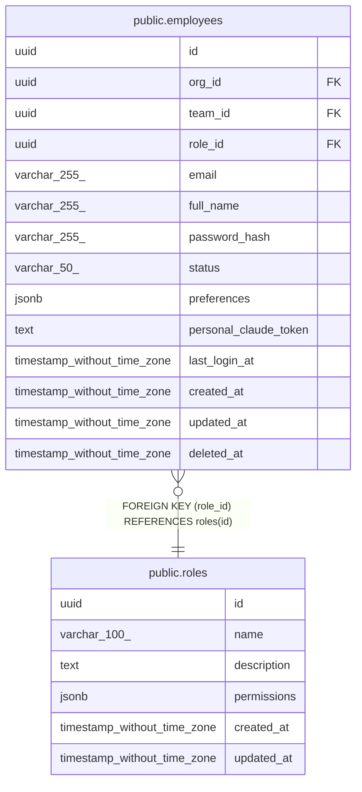

# public.roles

## Description

## Columns

| Name | Type | Default | Nullable | Children | Parents | Comment |
| ---- | ---- | ------- | -------- | -------- | ------- | ------- |
| id | uuid | uuid_generate_v4() | false | [public.employees](public.employees.md) |  |  |
| name | varchar(100) |  | false |  |  |  |
| description | text |  | true |  |  |  |
| permissions | jsonb | '[]'::jsonb | false |  |  |  |
| created_at | timestamp without time zone | now() | false |  |  |  |
| updated_at | timestamp without time zone | now() | false |  |  |  |

## Constraints

| Name | Type | Definition |
| ---- | ---- | ---------- |
| roles_pkey | PRIMARY KEY | PRIMARY KEY (id) |
| roles_name_key | UNIQUE | UNIQUE (name) |

## Indexes

| Name | Definition |
| ---- | ---------- |
| roles_pkey | CREATE UNIQUE INDEX roles_pkey ON public.roles USING btree (id) |
| roles_name_key | CREATE UNIQUE INDEX roles_name_key ON public.roles USING btree (name) |

## Triggers

| Name | Definition |
| ---- | ---------- |
| update_roles_updated_at | CREATE TRIGGER update_roles_updated_at BEFORE UPDATE ON public.roles FOR EACH ROW EXECUTE FUNCTION update_updated_at_column() |

## Relations

---

> Generated by [tbls](https://github.com/k1LoW/tbls)
