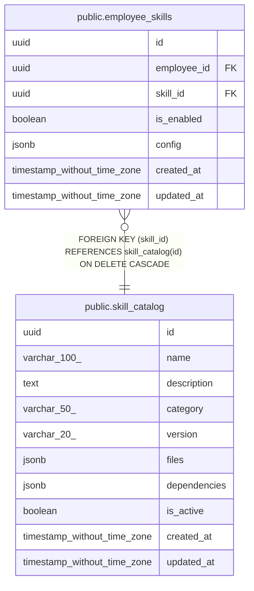

# public.skill_catalog

## Description

Available skills for Claude Code agents

## Columns

| Name | Type | Default | Nullable | Children | Parents | Comment |
| ---- | ---- | ------- | -------- | -------- | ------- | ------- |
| id | uuid | uuid_generate_v4() | false | [public.employee_skills](public.employee_skills.md) |  |  |
| name | varchar(100) |  | false |  |  |  |
| description | text |  | true |  |  |  |
| category | varchar(50) |  | true |  |  |  |
| version | varchar(20) |  | false |  |  |  |
| files | jsonb |  | false |  |  | Array of file objects with path and content |
| dependencies | jsonb |  | true |  |  | Required MCP servers and other skills |
| is_active | boolean | true | true |  |  |  |
| created_at | timestamp without time zone | now() | false |  |  |  |
| updated_at | timestamp without time zone | now() | false |  |  |  |

## Constraints

| Name | Type | Definition |
| ---- | ---- | ---------- |
| skill_catalog_pkey | PRIMARY KEY | PRIMARY KEY (id) |
| skill_catalog_name_key | UNIQUE | UNIQUE (name) |

## Indexes

| Name | Definition |
| ---- | ---------- |
| skill_catalog_pkey | CREATE UNIQUE INDEX skill_catalog_pkey ON public.skill_catalog USING btree (id) |
| skill_catalog_name_key | CREATE UNIQUE INDEX skill_catalog_name_key ON public.skill_catalog USING btree (name) |
| idx_skill_catalog_name | CREATE INDEX idx_skill_catalog_name ON public.skill_catalog USING btree (name) |
| idx_skill_catalog_category | CREATE INDEX idx_skill_catalog_category ON public.skill_catalog USING btree (category) |
| idx_skill_catalog_is_active | CREATE INDEX idx_skill_catalog_is_active ON public.skill_catalog USING btree (is_active) |

## Triggers

| Name | Definition |
| ---- | ---------- |
| update_skill_catalog_updated_at | CREATE TRIGGER update_skill_catalog_updated_at BEFORE UPDATE ON public.skill_catalog FOR EACH ROW EXECUTE FUNCTION update_updated_at_column() |

## Relations

---

> Generated by [tbls](https://github.com/k1LoW/tbls)
