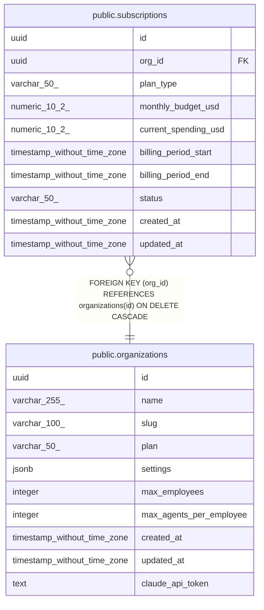

# public.subscriptions

## Description

## Columns

| Name | Type | Default | Nullable | Children | Parents | Comment |
| ---- | ---- | ------- | -------- | -------- | ------- | ------- |
| id | uuid | uuid_generate_v4() | false |  |  |  |
| org_id | uuid |  | false |  | [public.organizations](public.organizations.md) |  |
| plan_type | varchar(50) |  | false |  |  |  |
| monthly_budget_usd | numeric(10,2) | 100.00 | false |  |  |  |
| current_spending_usd | numeric(10,2) | 0.00 | false |  |  |  |
| billing_period_start | timestamp without time zone |  | false |  |  |  |
| billing_period_end | timestamp without time zone |  | false |  |  |  |
| status | varchar(50) | 'active'::character varying | false |  |  |  |
| created_at | timestamp without time zone | now() | false |  |  |  |
| updated_at | timestamp without time zone | now() | false |  |  |  |

## Constraints

| Name | Type | Definition |
| ---- | ---- | ---------- |
| subscriptions_org_id_fkey | FOREIGN KEY | FOREIGN KEY (org_id) REFERENCES organizations(id) ON DELETE CASCADE |
| subscriptions_pkey | PRIMARY KEY | PRIMARY KEY (id) |

## Indexes

| Name | Definition |
| ---- | ---------- |
| subscriptions_pkey | CREATE UNIQUE INDEX subscriptions_pkey ON public.subscriptions USING btree (id) |

## Triggers

| Name | Definition |
| ---- | ---------- |
| update_subscriptions_updated_at | CREATE TRIGGER update_subscriptions_updated_at BEFORE UPDATE ON public.subscriptions FOR EACH ROW EXECUTE FUNCTION update_updated_at_column() |

## Relations

---

> Generated by [tbls](https://github.com/k1LoW/tbls)
