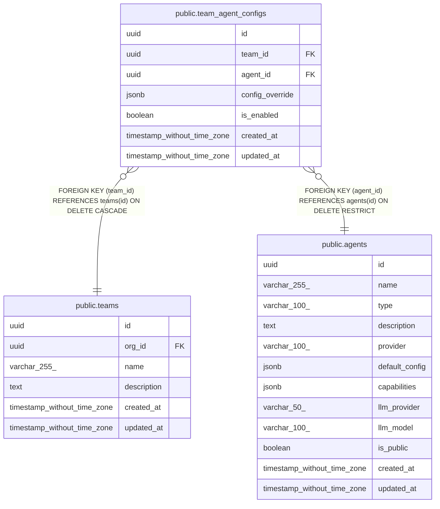

# public.team_agent_configs

## Description

## Columns

| Name | Type | Default | Nullable | Children | Parents | Comment |
| ---- | ---- | ------- | -------- | -------- | ------- | ------- |
| id | uuid | uuid_generate_v4() | false |  |  |  |
| team_id | uuid |  | false |  | [public.teams](public.teams.md) |  |
| agent_id | uuid |  | false |  | [public.agents](public.agents.md) |  |
| config_override | jsonb | '{}'::jsonb | false |  |  |  |
| is_enabled | boolean | true | false |  |  |  |
| created_at | timestamp without time zone | now() | false |  |  |  |
| updated_at | timestamp without time zone | now() | false |  |  |  |

## Constraints

| Name | Type | Definition |
| ---- | ---- | ---------- |
| team_agent_configs_team_id_fkey | FOREIGN KEY | FOREIGN KEY (team_id) REFERENCES teams(id) ON DELETE CASCADE |
| team_agent_configs_agent_id_fkey | FOREIGN KEY | FOREIGN KEY (agent_id) REFERENCES agents(id) ON DELETE RESTRICT |
| team_agent_configs_pkey | PRIMARY KEY | PRIMARY KEY (id) |
| unique_team_agent | UNIQUE | UNIQUE (team_id, agent_id) |

## Indexes

| Name | Definition |
| ---- | ---------- |
| team_agent_configs_pkey | CREATE UNIQUE INDEX team_agent_configs_pkey ON public.team_agent_configs USING btree (id) |
| unique_team_agent | CREATE UNIQUE INDEX unique_team_agent ON public.team_agent_configs USING btree (team_id, agent_id) |

## Relations

---

> Generated by [tbls](https://github.com/k1LoW/tbls)
