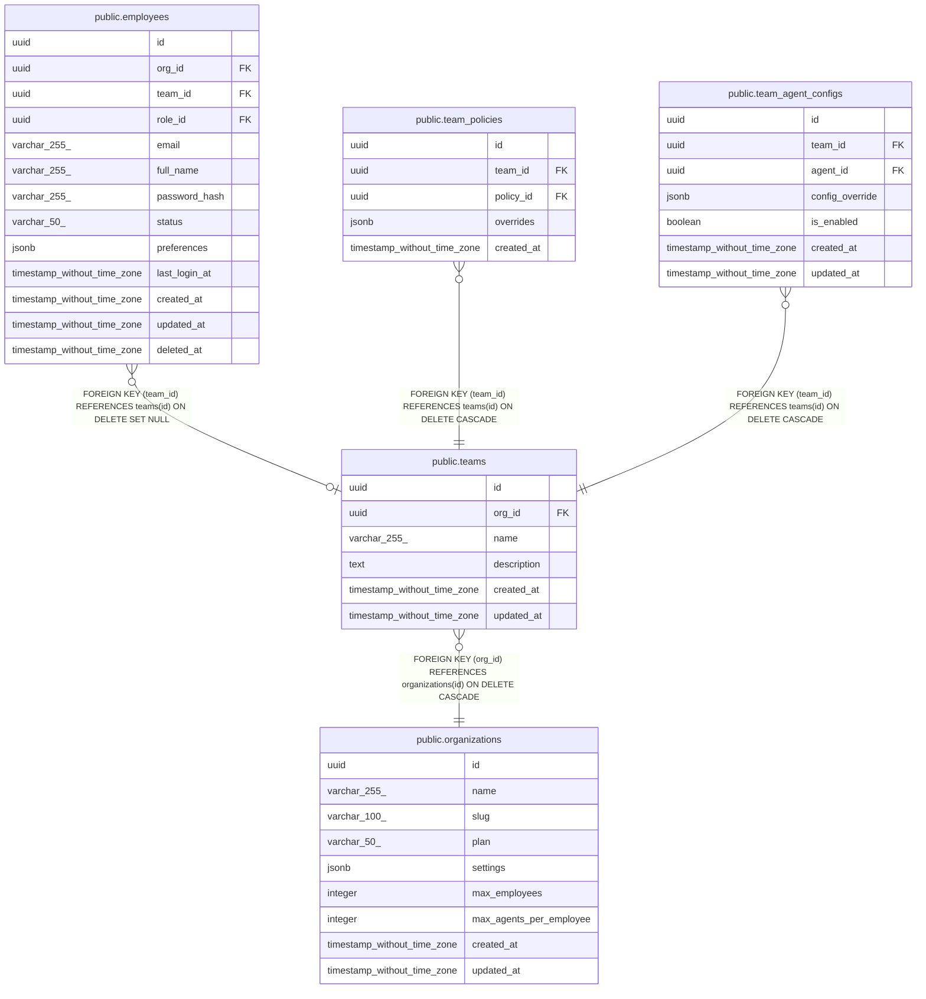

# public.teams

## Description

## Columns

| Name | Type | Default | Nullable | Children | Parents | Comment |
| ---- | ---- | ------- | -------- | -------- | ------- | ------- |
| id | uuid | uuid_generate_v4() | false | [public.employees](public.employees.md) [public.team_policies](public.team_policies.md) [public.team_agent_configs](public.team_agent_configs.md) |  |  |
| org_id | uuid |  | false |  | [public.organizations](public.organizations.md) |  |
| name | varchar(255) |  | false |  |  |  |
| description | text |  | true |  |  |  |
| created_at | timestamp without time zone | now() | false |  |  |  |
| updated_at | timestamp without time zone | now() | false |  |  |  |

## Constraints

| Name | Type | Definition |
| ---- | ---- | ---------- |
| teams_org_id_fkey | FOREIGN KEY | FOREIGN KEY (org_id) REFERENCES organizations(id) ON DELETE CASCADE |
| teams_pkey | PRIMARY KEY | PRIMARY KEY (id) |
| unique_team_name_per_org | UNIQUE | UNIQUE (org_id, name) |

## Indexes

| Name | Definition |
| ---- | ---------- |
| teams_pkey | CREATE UNIQUE INDEX teams_pkey ON public.teams USING btree (id) |
| unique_team_name_per_org | CREATE UNIQUE INDEX unique_team_name_per_org ON public.teams USING btree (org_id, name) |
| idx_teams_org_id | CREATE INDEX idx_teams_org_id ON public.teams USING btree (org_id) |

## Triggers

| Name | Definition |
| ---- | ---------- |
| update_teams_updated_at | CREATE TRIGGER update_teams_updated_at BEFORE UPDATE ON public.teams FOR EACH ROW EXECUTE FUNCTION update_updated_at_column() |

## Relations

---

> Generated by [tbls](https://github.com/k1LoW/tbls)
