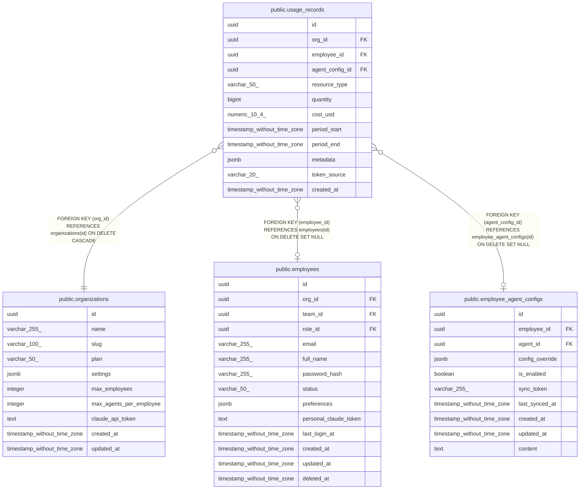

# public.usage_records

## Description

## Columns

| Name | Type | Default | Nullable | Children | Parents | Comment |
| ---- | ---- | ------- | -------- | -------- | ------- | ------- |
| id | uuid | uuid_generate_v4() | false |  |  |  |
| org_id | uuid |  | false |  | [public.organizations](public.organizations.md) |  |
| employee_id | uuid |  | true |  | [public.employees](public.employees.md) |  |
| agent_config_id | uuid |  | true |  | [public.employee_agent_configs](public.employee_agent_configs.md) |  |
| resource_type | varchar(50) |  | false |  |  |  |
| quantity | bigint |  | false |  |  |  |
| cost_usd | numeric(10,4) |  | false |  |  |  |
| period_start | timestamp without time zone |  | false |  |  |  |
| period_end | timestamp without time zone |  | false |  |  |  |
| metadata | jsonb | '{}'::jsonb | false |  |  |  |
| token_source | varchar(20) | 'company'::character varying | true |  |  |  |
| created_at | timestamp without time zone | now() | false |  |  |  |

## Constraints

| Name | Type | Definition |
| ---- | ---- | ---------- |
| usage_records_token_source_check | CHECK | CHECK (((token_source)::text = ANY ((ARRAY['company'::character varying, 'personal'::character varying])::text[]))) |
| usage_records_org_id_fkey | FOREIGN KEY | FOREIGN KEY (org_id) REFERENCES organizations(id) ON DELETE CASCADE |
| usage_records_employee_id_fkey | FOREIGN KEY | FOREIGN KEY (employee_id) REFERENCES employees(id) ON DELETE SET NULL |
| usage_records_agent_config_id_fkey | FOREIGN KEY | FOREIGN KEY (agent_config_id) REFERENCES employee_agent_configs(id) ON DELETE SET NULL |
| usage_records_pkey | PRIMARY KEY | PRIMARY KEY (id) |

## Indexes

| Name | Definition |
| ---- | ---------- |
| usage_records_pkey | CREATE UNIQUE INDEX usage_records_pkey ON public.usage_records USING btree (id) |
| idx_usage_records_org_id | CREATE INDEX idx_usage_records_org_id ON public.usage_records USING btree (org_id) |
| idx_usage_records_employee_id | CREATE INDEX idx_usage_records_employee_id ON public.usage_records USING btree (employee_id) |
| idx_usage_records_agent_config_id | CREATE INDEX idx_usage_records_agent_config_id ON public.usage_records USING btree (agent_config_id) |
| idx_usage_records_period | CREATE INDEX idx_usage_records_period ON public.usage_records USING btree (period_start, period_end) |

## Relations

---

> Generated by [tbls](https://github.com/k1LoW/tbls)
