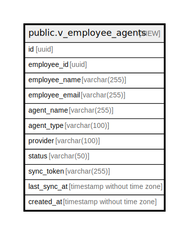

# public.v_employee_agents

## Description

Complete view of employee agent configurations with catalog details

<details>
<summary><strong>Table Definition</strong></summary>

```sql
CREATE VIEW v_employee_agents AS (
 SELECT eac.id,
    eac.employee_id,
    e.full_name AS employee_name,
    e.email AS employee_email,
    ac.name AS agent_name,
    ac.type AS agent_type,
    ac.provider,
    eac.status,
    eac.sync_token,
    eac.last_sync_at,
    eac.created_at
   FROM ((employee_agent_configs eac
     JOIN employees e ON ((eac.employee_id = e.id)))
     JOIN agent_catalog ac ON ((eac.agent_catalog_id = ac.id)))
)
```

</details>

## Columns

| Name | Type | Default | Nullable | Children | Parents | Comment |
| ---- | ---- | ------- | -------- | -------- | ------- | ------- |
| id | uuid |  | true |  |  |  |
| employee_id | uuid |  | true |  |  |  |
| employee_name | varchar(255) |  | true |  |  |  |
| employee_email | varchar(255) |  | true |  |  |  |
| agent_name | varchar(255) |  | true |  |  |  |
| agent_type | varchar(100) |  | true |  |  |  |
| provider | varchar(100) |  | true |  |  |  |
| status | varchar(50) |  | true |  |  |  |
| sync_token | varchar(255) |  | true |  |  |  |
| last_sync_at | timestamp without time zone |  | true |  |  |  |
| created_at | timestamp without time zone |  | true |  |  |  |

## Referenced Tables

| Name | Columns | Comment | Type |
| ---- | ------- | ------- | ---- |
| [public.employee_agent_configs](public.employee_agent_configs.md) | 10 |  | BASE TABLE |
| [public.employees](public.employees.md) | 12 |  | BASE TABLE |
| [public.agent_catalog](public.agent_catalog.md) | 12 |  | BASE TABLE |

## Relations



---

> Generated by [tbls](https://github.com/k1LoW/tbls)
