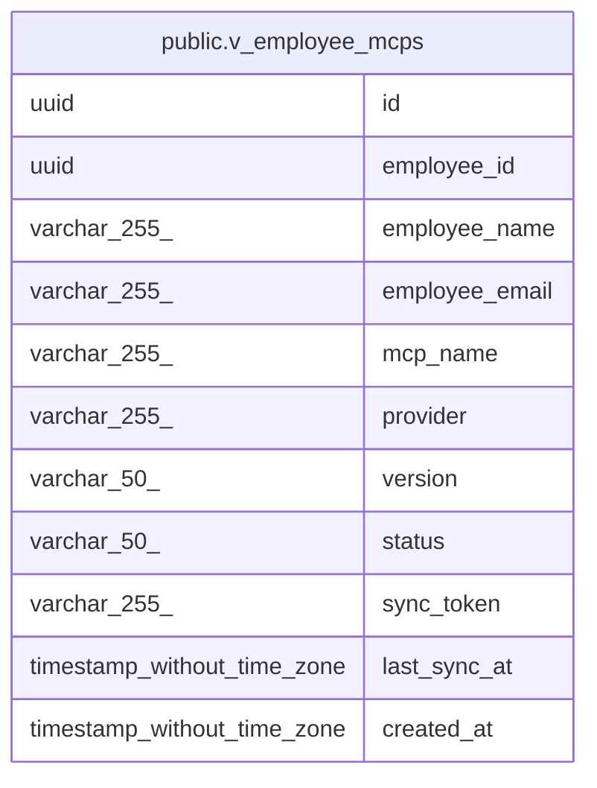

# public.v_employee_mcps

## Description

Complete view of employee MCP configurations with catalog details

<details>
<summary><strong>Table Definition</strong></summary>

```sql
CREATE VIEW v_employee_mcps AS (
 SELECT emc.id,
    emc.employee_id,
    e.full_name AS employee_name,
    e.email AS employee_email,
    mc.name AS mcp_name,
    mc.provider,
    mc.version,
    emc.status,
    emc.sync_token,
    emc.last_sync_at,
    emc.created_at
   FROM ((employee_mcp_configs emc
     JOIN employees e ON ((emc.employee_id = e.id)))
     JOIN mcp_catalog mc ON ((emc.mcp_catalog_id = mc.id)))
)
```

</details>

## Columns

| Name | Type | Default | Nullable | Children | Parents | Comment |
| ---- | ---- | ------- | -------- | -------- | ------- | ------- |
| id | uuid |  | true |  |  |  |
| employee_id | uuid |  | true |  |  |  |
| employee_name | varchar(255) |  | true |  |  |  |
| employee_email | varchar(255) |  | true |  |  |  |
| mcp_name | varchar(255) |  | true |  |  |  |
| provider | varchar(255) |  | true |  |  |  |
| version | varchar(50) |  | true |  |  |  |
| status | varchar(50) |  | true |  |  |  |
| sync_token | varchar(255) |  | true |  |  |  |
| last_sync_at | timestamp without time zone |  | true |  |  |  |
| created_at | timestamp without time zone |  | true |  |  |  |

## Referenced Tables

| Name | Columns | Comment | Type |
| ---- | ------- | ------- | ---- |
| [public.employee_mcp_configs](public.employee_mcp_configs.md) | 11 |  | BASE TABLE |
| [public.employees](public.employees.md) | 14 |  | BASE TABLE |
| [public.mcp_catalog](public.mcp_catalog.md) | 15 |  | BASE TABLE |

## Relations



---

> Generated by [tbls](https://github.com/k1LoW/tbls)
