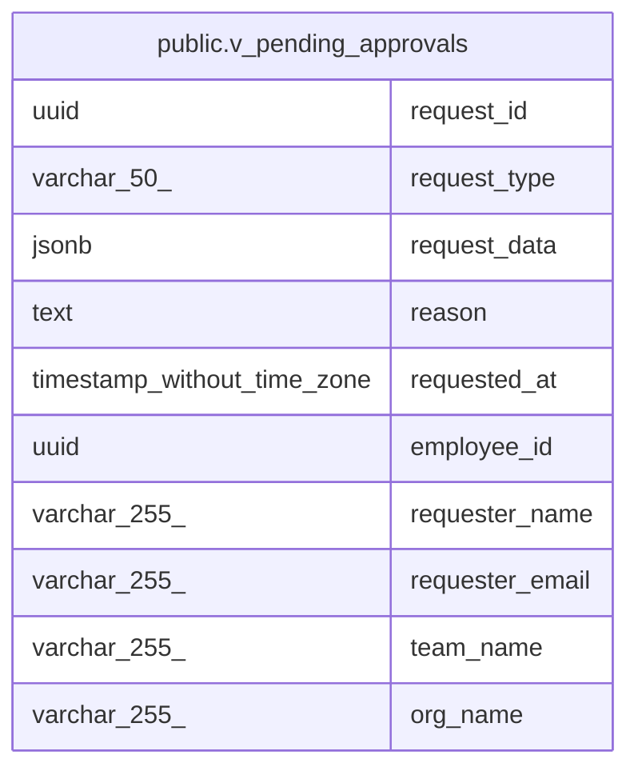

# public.v_pending_approvals

## Description

Pending approval requests with full requester context

<details>
<summary><strong>Table Definition</strong></summary>

```sql
CREATE VIEW v_pending_approvals AS (
 SELECT ar.id AS request_id,
    ar.request_type,
    ar.request_data,
    ar.reason,
    ar.created_at AS requested_at,
    e.id AS employee_id,
    e.full_name AS requester_name,
    e.email AS requester_email,
    t.name AS team_name,
    o.name AS org_name
   FROM (((agent_requests ar
     JOIN employees e ON ((ar.employee_id = e.id)))
     JOIN organizations o ON ((e.org_id = o.id)))
     LEFT JOIN teams t ON ((e.team_id = t.id)))
  WHERE ((ar.status)::text = 'pending'::text)
)
```

</details>

## Columns

| Name | Type | Default | Nullable | Children | Parents | Comment |
| ---- | ---- | ------- | -------- | -------- | ------- | ------- |
| request_id | uuid |  | true |  |  |  |
| request_type | varchar(50) |  | true |  |  |  |
| request_data | jsonb |  | true |  |  |  |
| reason | text |  | true |  |  |  |
| requested_at | timestamp without time zone |  | true |  |  |  |
| employee_id | uuid |  | true |  |  |  |
| requester_name | varchar(255) |  | true |  |  |  |
| requester_email | varchar(255) |  | true |  |  |  |
| team_name | varchar(255) |  | true |  |  |  |
| org_name | varchar(255) |  | true |  |  |  |

## Referenced Tables

| Name | Columns | Comment | Type |
| ---- | ------- | ------- | ---- |
| [public.agent_requests](public.agent_requests.md) | 8 |  | BASE TABLE |
| [public.employees](public.employees.md) | 13 |  | BASE TABLE |
| [public.organizations](public.organizations.md) | 9 |  | BASE TABLE |
| [public.teams](public.teams.md) | 6 |  | BASE TABLE |

## Relations



---

> Generated by [tbls](https://github.com/k1LoW/tbls)
