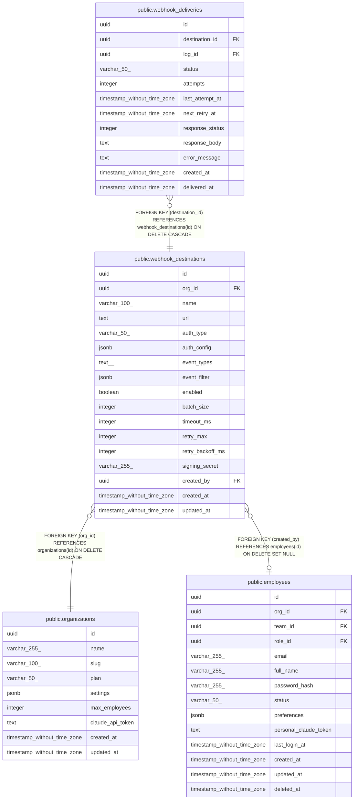

# public.webhook_destinations

## Description

## Columns

| Name | Type | Default | Nullable | Children | Parents | Comment |
| ---- | ---- | ------- | -------- | -------- | ------- | ------- |
| id | uuid | gen_random_uuid() | false | [public.webhook_deliveries](public.webhook_deliveries.md) |  |  |
| org_id | uuid |  | false |  | [public.organizations](public.organizations.md) |  |
| name | varchar(100) |  | false |  |  |  |
| url | text |  | false |  |  |  |
| auth_type | varchar(50) | 'none'::character varying | false |  |  |  |
| auth_config | jsonb | '{}'::jsonb | true |  |  |  |
| event_types | text[] | '{}'::text[] | true |  |  |  |
| event_filter | jsonb | '{}'::jsonb | true |  |  |  |
| enabled | boolean | true | false |  |  |  |
| batch_size | integer | 1 | false |  |  |  |
| timeout_ms | integer | 5000 | false |  |  |  |
| retry_max | integer | 3 | false |  |  |  |
| retry_backoff_ms | integer | 1000 | false |  |  |  |
| signing_secret | varchar(255) |  | true |  |  |  |
| created_by | uuid |  | true |  | [public.employees](public.employees.md) |  |
| created_at | timestamp without time zone | now() | false |  |  |  |
| updated_at | timestamp without time zone | now() | false |  |  |  |

## Constraints

| Name | Type | Definition |
| ---- | ---- | ---------- |
| webhook_destinations_auth_type_check | CHECK | CHECK (((auth_type)::text = ANY ((ARRAY['none'::character varying, 'bearer'::character varying, 'header'::character varying, 'basic'::character varying])::text[]))) |
| webhook_destinations_batch_size_check | CHECK | CHECK (((batch_size >= 1) AND (batch_size <= 100))) |
| webhook_destinations_retry_backoff_ms_check | CHECK | CHECK ((retry_backoff_ms >= 100)) |
| webhook_destinations_retry_max_check | CHECK | CHECK (((retry_max >= 0) AND (retry_max <= 10))) |
| webhook_destinations_timeout_ms_check | CHECK | CHECK (((timeout_ms >= 1000) AND (timeout_ms <= 30000))) |
| webhook_destinations_org_id_fkey | FOREIGN KEY | FOREIGN KEY (org_id) REFERENCES organizations(id) ON DELETE CASCADE |
| webhook_destinations_created_by_fkey | FOREIGN KEY | FOREIGN KEY (created_by) REFERENCES employees(id) ON DELETE SET NULL |
| webhook_destinations_pkey | PRIMARY KEY | PRIMARY KEY (id) |
| webhook_destinations_org_id_name_key | UNIQUE | UNIQUE (org_id, name) |

## Indexes

| Name | Definition |
| ---- | ---------- |
| webhook_destinations_pkey | CREATE UNIQUE INDEX webhook_destinations_pkey ON public.webhook_destinations USING btree (id) |
| webhook_destinations_org_id_name_key | CREATE UNIQUE INDEX webhook_destinations_org_id_name_key ON public.webhook_destinations USING btree (org_id, name) |
| idx_webhook_destinations_org_id | CREATE INDEX idx_webhook_destinations_org_id ON public.webhook_destinations USING btree (org_id) |
| idx_webhook_destinations_enabled | CREATE INDEX idx_webhook_destinations_enabled ON public.webhook_destinations USING btree (org_id, enabled) WHERE (enabled = true) |

## Relations

---

> Generated by [tbls](https://github.com/k1LoW/tbls)
