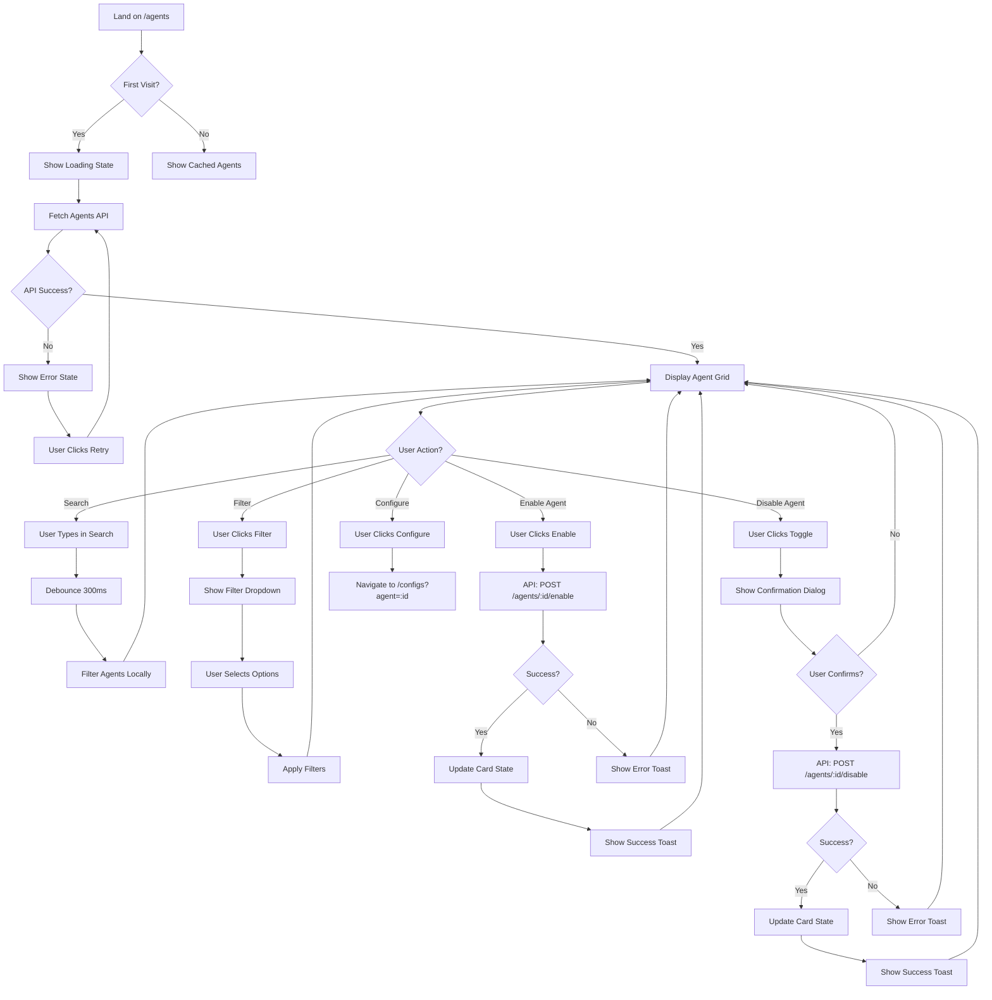

# Agents Page - User Flows

Complete user journey mapping for all agent management operations.

---

## User Flow Diagram



---

## Flow 1: Initial Page Load

### Happy Path
```
1. User navigates to /agents
   ↓
2. Show skeleton loading cards (3 cards)
   ↓
3. API: GET /api/v1/agents?org_id={org_id}
   ↓
4. Receive response (6 agents)
   ↓
5. Render agent grid with actual data
   ↓
6. Focus on search input (accessibility)
```

### Error Path
```
1. User navigates to /agents
   ↓
2. Show skeleton loading cards
   ↓
3. API: GET /api/v1/agents?org_id={org_id}
   ↓
4. API fails (500 error)
   ↓
5. Show error state:
   ┌──────────────────────────────────────┐
   │ ⚠️ Failed to load agents             │
   │ We couldn't retrieve the agent       │
   │ catalog. Please try again.           │
   │        [Retry]                       │
   └──────────────────────────────────────┘
   ↓
6. User clicks [Retry]
   ↓
7. Return to step 2
```

### Empty State Path
```
1. User navigates to /agents
   ↓
2. Show skeleton loading cards
   ↓
3. API: GET /api/v1/agents?org_id={org_id}
   ↓
4. Receive empty response (0 agents)
   ↓
5. Show empty state:
   ┌──────────────────────────────────────┐
   │         🤖                           │
   │    No Agents Available               │
   │ Contact support to add agents        │
   └──────────────────────────────────────┘
```

---

## Flow 2: Enable Agent (Disabled → Enabled)

### Happy Path
```
1. User views agent card (Cursor - Disabled)
   ┌─────────────────────┐
   │ Cursor              │
   │ Type: IDE Agent     │
   │ AI pair programming │
   │ [○ Disabled]        │
   │ [Enable]            │
   └─────────────────────┘
   ↓
2. User clicks [Enable] button
   ↓
3. Optimistic UI update:
   - Button text: "Enabling..."
   - Button disabled with spinner
   - Toggle shows loading state
   ↓
4. API: POST /api/v1/agents/{agent_id}/enable
   Request: { org_id: "org_123" }
   ↓
5. API responds: 200 OK
   Response: {
     agent_id: "cursor",
     enabled: true,
     enabled_at: "2025-12-12T10:30:00Z"
   }
   ↓
6. Update card state:
   ┌─────────────────────┐
   │ Cursor              │
   │ Type: IDE Agent     │
   │ AI pair programming │
   │ [◉ Enabled]         │
   │ [Configure →]       │
   └─────────────────────┘
   ↓
7. Show success toast:
   "✓ Cursor enabled for organization"
   ↓
8. Toast auto-dismisses after 3 seconds
```

### Error Path
```
1. User clicks [Enable] button
   ↓
2. Optimistic UI update (loading state)
   ↓
3. API: POST /api/v1/agents/{agent_id}/enable
   ↓
4. API fails: 403 Forbidden
   Response: { error: "Subscription limit reached" }
   ↓
5. Rollback UI to disabled state
   ↓
6. Show error toast:
   ┌──────────────────────────────────────┐
   │ ✕ Failed to enable Cursor            │
   │ Subscription limit reached. Upgrade  │
   │ your plan to enable more agents.     │
   │        [Dismiss]  [Upgrade Plan]     │
   └──────────────────────────────────────┘
   ↓
7. If user clicks [Upgrade Plan]:
   Navigate to /settings/billing
```

---

## Flow 3: Disable Agent (Enabled → Disabled)

### Happy Path
```
1. User views enabled agent card
   ┌─────────────────────┐
   │ Claude Code         │
   │ Type: IDE Agent     │
   │ AI-powered CLI      │
   │ [◉ Enabled]         │
   │ [Configure →]       │
   └─────────────────────┘
   ↓
2. User clicks toggle switch (left side)
   ↓
3. Confirmation dialog appears:
   ┌─────────────────────────────────────┐
   │ Disable Claude Code?                │
   │                                     │
   │ This will remove access for all     │
   │ teams (3) and employees (15).       │
   │                                     │
   │ Configurations will be preserved    │
   │ and can be restored when you        │
   │ re-enable this agent.               │
   │                                     │
   │ ┌─────────────────────────────────┐ │
   │ │ [Cancel]  [Disable Agent]       │ │
   │ └─────────────────────────────────┘ │
   └─────────────────────────────────────┘
   ↓
4. User clicks [Disable Agent]
   ↓
5. Dialog closes, optimistic UI update:
   - Toggle switches to disabled
   - Button text: "Disabling..."
   ↓
6. API: POST /api/v1/agents/{agent_id}/disable
   Request: { org_id: "org_123" }
   ↓
7. API responds: 200 OK
   Response: {
     agent_id: "claude-code",
     enabled: false,
     disabled_at: "2025-12-12T10:35:00Z",
     affected_teams: 3,
     affected_employees: 15
   }
   ↓
8. Update card state:
   ┌─────────────────────┐
   │ Claude Code         │
   │ Type: IDE Agent     │
   │ AI-powered CLI      │
   │ [○ Disabled]        │
   │ [Enable]            │
   └─────────────────────┘
   ↓
9. Show success toast:
   "✓ Claude Code disabled. 15 employees affected."
   ↓
10. Toast auto-dismisses after 5 seconds
```

### Cancellation Path
```
1. User clicks toggle
   ↓
2. Confirmation dialog appears
   ↓
3. User clicks [Cancel]
   ↓
4. Dialog closes
   ↓
5. Toggle remains in enabled state
   ↓
6. No API call made
```

### Error Path
```
1. User confirms disable
   ↓
2. Dialog closes, optimistic UI update
   ↓
3. API: POST /api/v1/agents/{agent_id}/disable
   ↓
4. API fails: 500 Internal Server Error
   ↓
5. Rollback UI to enabled state
   ↓
6. Show error toast:
   "✕ Failed to disable Claude Code. Please try again."
   ↓
7. Toast includes [Retry] button
```

---

## Flow 4: Configure Agent

### Happy Path
```
1. User views enabled agent card
   ┌─────────────────────┐
   │ Claude Code         │
   │ [◉ Enabled]         │
   │ [Configure →]       │
   └─────────────────────┘
   ↓
2. User clicks [Configure →] button
   ↓
3. Navigate to: /configs?agent=claude-code
   ↓
4. Configs page loads with:
   - Agent filter pre-selected (Claude Code)
   - Shows all configs for this agent
   - Breadcrumb: Agents > Claude Code > Configurations
```

### No Configuration Path
```
1. User clicks [Configure →] on newly enabled agent
   ↓
2. Navigate to /configs?agent=cursor
   ↓
3. Configs page shows empty state:
   ┌─────────────────────────────────────┐
   │ No configurations yet               │
   │ Create your first configuration for │
   │ Cursor to get started.              │
   │        [Create Configuration]        │
   └─────────────────────────────────────┘
```

---

## Flow 5: Search Agents

### Happy Path
```
1. User views agent grid (6 agents visible)
   ↓
2. User clicks search input (or presses /)
   ↓
3. Search input gains focus
   ↓
4. User types: "claude"
   ↓
5. After 300ms debounce, filter executes
   ↓
6. Grid updates to show matches:
   - Claude Code (visible)
   - Cursor (hidden)
   - Windsurf (hidden)
   - etc.
   ↓
7. Show results count: "Showing 1 of 6 agents"
   ↓
8. User clears search (clicks [×] button)
   ↓
9. Grid resets to show all 6 agents
```

### No Results Path
```
1. User types: "copilot pro"
   ↓
2. After debounce, filter executes
   ↓
3. No matches found
   ↓
4. Show empty state:
   ┌─────────────────────────────────────┐
   │         🔍                          │
   │    No agents match "copilot pro"    │
   │ Try different keywords or clear     │
   │ your search.                        │
   │        [Clear Search]                │
   └─────────────────────────────────────┘
```

---

## Flow 6: Filter Agents

### Happy Path (Desktop)
```
1. User views agent grid
   ↓
2. User clicks [All Types ▼] dropdown
   ↓
3. Dropdown menu appears:
   ┌─────────────────────┐
   │ All Types       ✓   │
   │ IDE Agent       ( ) │
   │ Code Assistant  ( ) │
   │ Chat Assistant  ( ) │
   └─────────────────────┘
   ↓
4. User clicks "IDE Agent"
   ↓
5. Dropdown closes
   ↓
6. Filter chip updates: [Type: IDE Agent ▼]
   ↓
7. Grid updates to show only IDE agents (3 agents)
   ↓
8. Results count: "Showing 3 of 6 agents"
```

### Multi-Filter Path
```
1. User selects filter: "IDE Agent"
   → Shows 3 agents
   ↓
2. User selects filter: "Enabled"
   → Shows 1 agent (Claude Code)
   ↓
3. Active filters display:
   [Type: IDE Agent ×] [Status: Enabled ×]
   ↓
4. User clicks [×] on "Type: IDE Agent"
   → Shows 2 enabled agents (all types)
   ↓
5. User clicks "Clear all filters"
   → Shows all 6 agents
```

### Mobile Filter (Bottom Sheet)
```
1. User taps [Filters: All Types ▼]
   ↓
2. Bottom sheet slides up from bottom
   ┌─────────────────────────────────┐
   │ ─── (handle bar)                │
   │ Filter Agents                   │
   │                                 │
   │ Agent Type                      │
   │ ☑ IDE Agent (3)                 │
   │ ☐ Code Assistant (3)            │
   │                                 │
   │ Status                          │
   │ ☑ Enabled (2)                   │
   │ ☑ Disabled (4)                  │
   │                                 │
   │ [Clear All] [Apply (6)]         │
   └─────────────────────────────────┘
   ↓
3. User unchecks "Disabled"
   → Count updates: [Apply (2)]
   ↓
4. User taps [Apply (2)]
   ↓
5. Bottom sheet slides down
   ↓
6. Grid updates to show 2 enabled agents
```

---

## Flow 7: Pull-to-Refresh (Mobile)

```
1. User scrolls to top of agent list
   ↓
2. User pulls down on screen
   ↓
3. Refresh indicator appears
   ┌─────────────────────┐
   │      ⟳              │
   │ Release to refresh  │
   └─────────────────────┘
   ↓
4. User releases
   ↓
5. Spinner animates while fetching
   ↓
6. API: GET /api/v1/agents?org_id={org_id}
   ↓
7. Response received
   ↓
8. Grid updates with new data
   ↓
9. Refresh indicator fades out
   ↓
10. If new agents found, show toast:
    "✓ 2 new agents added to catalog"
```

---

## Flow 8: Keyboard Navigation

```
1. User presses Tab
   → Focus on search input
   ↓
2. User types search query
   ↓
3. User presses Tab
   → Focus on first agent card
   ↓
4. User presses Tab
   → Focus on toggle switch
   ↓
5. User presses Space
   → Activates toggle (opens confirmation)
   ↓
6. User presses Tab
   → Focus on [Cancel] button
   ↓
7. User presses Tab
   → Focus on [Disable Agent] button
   ↓
8. User presses Enter
   → Executes disable action
```

---

## Flow 9: Error Recovery

### Network Error
```
1. User is viewing agents page
   ↓
2. Network connection lost
   ↓
3. User tries to enable agent
   ↓
4. API call fails (network error)
   ↓
5. Show error toast:
   ┌─────────────────────────────────────┐
   │ ✕ Network error                     │
   │ Check your connection and try again │
   │        [Retry]                      │
   └─────────────────────────────────────┘
   ↓
6. User regains connection
   ↓
7. User clicks [Retry]
   ↓
8. API call succeeds
   ↓
9. Agent enabled successfully
```

### Session Expired
```
1. User session expires after 24 hours
   ↓
2. User tries to enable agent
   ↓
3. API returns: 401 Unauthorized
   ↓
4. Show modal:
   ┌─────────────────────────────────────┐
   │ Session Expired                     │
   │                                     │
   │ Your session has expired. Please    │
   │ sign in again to continue.          │
   │                                     │
   │        [Sign In]                    │
   └─────────────────────────────────────┘
   ↓
5. User clicks [Sign In]
   ↓
6. Redirect to /login?redirect=/agents
   ↓
7. After login, return to /agents
```

---

## Flow 10: Concurrent Updates

### Scenario: Another admin disables agent
```
1. User A is viewing agents page
   Claude Code: [◉ Enabled]
   ↓
2. User B (different browser) disables Claude Code
   ↓
3. Server broadcasts WebSocket event:
   { type: "agent.disabled", agent_id: "claude-code" }
   ↓
4. User A's browser receives WebSocket message
   ↓
5. Show toast notification:
   "ℹ️ Claude Code was disabled by another admin"
   ↓
6. Update card state optimistically:
   Claude Code: [○ Disabled]
   ↓
7. If User A had unsaved changes, show conflict:
   ┌─────────────────────────────────────┐
   │ Conflict Detected                   │
   │                                     │
   │ Another admin changed this agent.   │
   │ Your changes cannot be saved.       │
   │                                     │
   │        [Reload Page]                │
   └─────────────────────────────────────┘
```

---

## Edge Cases

### 1. Rate Limiting
```
User rapidly toggles agent on/off
↓
API returns: 429 Too Many Requests
↓
Show toast: "Too many requests. Please wait 30 seconds."
↓
Disable all toggles for 30 seconds
↓
Re-enable after cooldown period
```

### 2. Subscription Limit
```
User tries to enable 6th agent
↓
API returns: 403 Forbidden
{ error: "Subscription allows max 5 agents" }
↓
Show modal:
┌─────────────────────────────────────┐
│ Subscription Limit Reached          │
│                                     │
│ Your plan allows 5 agents maximum.  │
│ Disable another agent or upgrade.   │
│                                     │
│ [View Plans]  [Cancel]              │
└─────────────────────────────────────┘
```

### 3. Partial Failure (Multi-Select)
```
Future feature: Bulk enable multiple agents
↓
User selects 3 agents to enable
↓
API partially succeeds:
- Agent 1: Success
- Agent 2: Failed (quota)
- Agent 3: Success
↓
Show summary toast:
"✓ 2 agents enabled, 1 failed. View details."
```

---

## Performance Optimizations

### 1. Optimistic UI
```
User action → Immediate UI update → API call → Rollback if failed
(Reduces perceived latency from ~500ms to ~50ms)
```

### 2. Debounced Search
```
User types: c-l-a-u-d-e
↓
Wait 300ms after last keystroke
↓
Execute search filter
(Reduces unnecessary re-renders from 6 to 1)
```

### 3. Local Filtering
```
Filter by type/status → No API call, filter in memory
(Instant response, no network latency)
```

### 4. WebSocket Updates
```
Polling (old): GET /agents every 30s
WebSocket (new): Server pushes changes in real-time
(Reduces API calls by 95%)
```

---

## Related Wireframes

- [agents-redesign-desktop.md](./agents-redesign-desktop.md) - Desktop layout
- [agents-redesign-mobile.md](./agents-redesign-mobile.md) - Mobile layout
- [agents-redesign-specs.md](./agents-redesign-specs.md) - Design system specs
