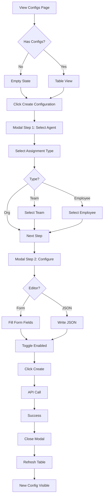
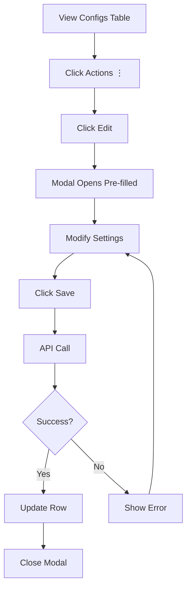
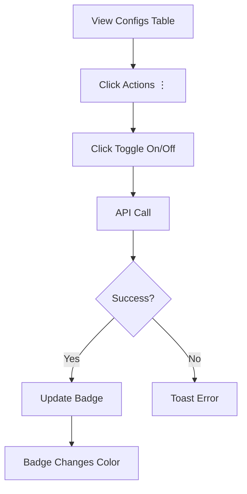
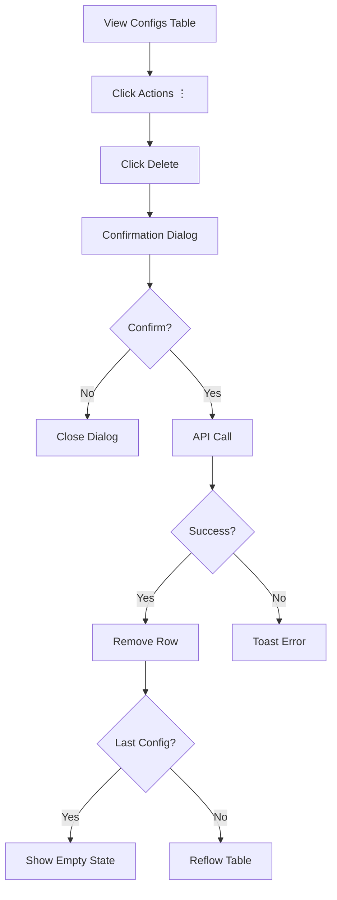
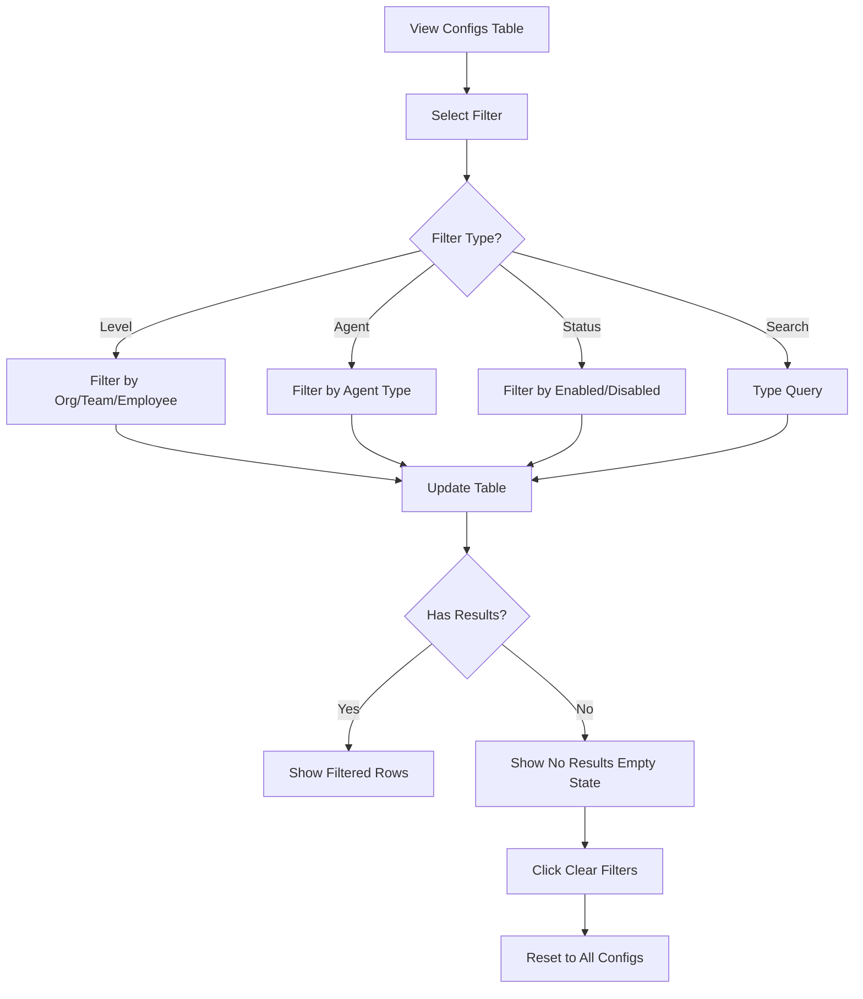

# Agent Configurations Page - Design Overview

## Purpose

Replace the confusing agents page with a unified "Configs" page that consolidates all AI agent configurations (organization-level, team-level, and employee-level) into a single, filterable view.

## User Stories

### Primary User: Admin

**As an admin, I want to:**

1. **View all configurations in one place**
   - See org, team, and employee configs in unified table
   - Understand at a glance which level each config applies to
   - Quickly scan configuration details without drilling down

2. **Filter and search effectively**
   - Filter by level (Organization / Team / Employee)
   - Filter by agent type (Claude Code / Cursor / Windsurf)
   - Filter by status (Enabled / Disabled)
   - Search configurations by any field

3. **Create configurations efficiently**
   - Single workflow for all assignment levels
   - Clear agent selection
   - Flexible assignment (org, team, or employee)
   - Toggle between form and JSON editor
   - Enable/disable immediately

4. **Manage configurations easily**
   - Edit any configuration inline
   - Duplicate to save time on similar configs
   - Toggle enabled/disabled without editing
   - Delete with confirmation

5. **Understand the system state**
   - Empty state guides first-time setup
   - Loading states show progress
   - Error states provide actionable feedback
   - Filter results show clear "no matches" messaging

## Wireframes Created

| File | Purpose | Viewport |
|------|---------|----------|
| [configs-desktop.md](./configs-desktop.md) | Main table view with filters, actions, states | 1440px |
| [configs-create-modal.md](./configs-create-modal.md) | 2-step creation wizard | 640px modal |
| [configs-empty-state.md](./configs-empty-state.md) | Empty, loading, error states | 1440px |
| [configs-mobile.md](./configs-mobile.md) | Responsive card-based view | 375px |

## Key Design Decisions

### 1. Unified Table vs Separate Tabs

**Decision:** Single table with level filter

**Rationale:**
- Admins need to compare configs across levels
- Single view reduces cognitive load
- Filtering is faster than tab switching
- Easier to spot gaps (e.g., team has config but org doesn't)

### 2. Configuration Preview vs Full Display

**Decision:** Show first 3 key-value pairs inline

**Rationale:**
- Balances visibility with table density
- Most important settings visible at a glance
- Click edit for full details
- Avoids overwhelming admins with JSON dumps

### 3. Two-Step Create Modal vs Single Form

**Decision:** Two steps (selection → configuration)

**Rationale:**
- Step 1 establishes context (what agent, where)
- Step 2 focuses on config details
- Conditional fields (team/employee dropdown) appear only when needed
- Reduces cognitive load by chunking decisions

### 4. Form Editor vs JSON Editor

**Decision:** Toggle between both

**Rationale:**
- Form is approachable for beginners
- JSON is powerful for advanced users
- Toggle allows users to learn JSON structure
- Validation works for both modes

### 5. Inline Actions vs Detail Page

**Decision:** Inline actions menu (⋮)

**Rationale:**
- Common actions (edit, toggle, delete) are one click away
- No navigation required
- Faster workflow for bulk changes
- Detail page not needed for simple configs

## Component Hierarchy

```
/configs
├── PageHeader
│   └── Breadcrumb: Dashboard → Configs
├── FilterBar
│   ├── LevelFilter (dropdown)
│   ├── AgentFilter (dropdown)
│   ├── StatusFilter (dropdown)
│   └── SearchInput
├── ActionBar
│   └── NewConfigButton → CreateModal
├── ConfigTable
│   ├── TableHeader
│   │   ├── AgentColumn
│   │   ├── AssignedToColumn
│   │   ├── ConfigurationColumn
│   │   ├── StatusColumn
│   │   └── ActionsColumn
│   └── TableBody
│       └── ConfigRow[]
│           ├── AgentCell
│           ├── AssignedToCell
│           ├── ConfigPreviewCell (3 lines)
│           ├── StatusBadge
│           └── ActionsMenu
│               ├── Edit
│               ├── Duplicate
│               ├── Toggle
│               └── Delete
├── EmptyState (conditional)
│   ├── Icon
│   ├── Title
│   ├── Description
│   └── PrimaryCTA
├── LoadingState (conditional)
│   └── SkeletonRows[]
└── Pagination
    └── PageNumbers
```

## State Management

### Page States

1. **Loading:** Initial page load
2. **Populated:** Configurations exist
3. **Empty:** No configurations created yet
4. **Filtered Empty:** Filters applied, no matches
5. **Error:** API failure

### Configuration States

1. **Enabled:** Active, applied to users
2. **Disabled:** Inactive, not applied

### Modal States

1. **Step 1 - Selection:** Agent + assignment
2. **Step 2 - Configuration:** Settings + status
3. **Submitting:** Creating configuration
4. **Error:** Validation or API error

## User Flows

### Create Configuration (Happy Path)



### Edit Configuration



### Toggle Status



### Delete Configuration



### Filter Configurations



## API Integration

### Endpoints Required

| Method | Endpoint | Purpose |
|--------|----------|---------|
| GET | `/api/v1/configs` | List all configs (org + team + employee) |
| GET | `/api/v1/configs?level={org\|team\|employee}` | Filter by level |
| GET | `/api/v1/configs?agent={claude-code\|cursor\|windsurf}` | Filter by agent |
| GET | `/api/v1/configs?status={enabled\|disabled}` | Filter by status |
| GET | `/api/v1/configs?q={query}` | Search configs |
| POST | `/api/v1/configs` | Create new config |
| PATCH | `/api/v1/configs/{id}` | Update config |
| PATCH | `/api/v1/configs/{id}/status` | Toggle enabled/disabled |
| DELETE | `/api/v1/configs/{id}` | Delete config |

### Response Schema

```json
{
  "configs": [
    {
      "id": "cfg_123",
      "agent": "claude-code",
      "level": "organization",
      "org_id": "org_abc",
      "team_id": null,
      "employee_id": null,
      "assigned_to": {
        "type": "organization",
        "name": "Acme Corp"
      },
      "configuration": {
        "model": "claude-opus-4.5",
        "temperature": 0.7,
        "max_tokens": 4096
      },
      "enabled": true,
      "created_at": "2025-01-15T10:00:00Z",
      "updated_at": "2025-01-15T10:00:00Z"
    }
  ],
  "total": 42,
  "page": 1,
  "per_page": 20
}
```

## Implementation Checklist

### Phase 1: Table View (Core)
- [ ] Create `/configs` page route
- [ ] Implement ConfigTable component
- [ ] Add FilterBar with 3 dropdowns + search
- [ ] Fetch configs from API endpoint
- [ ] Display configs in table rows
- [ ] Show first 3 config key-values inline
- [ ] Add status badge (Enabled/Disabled)
- [ ] Implement pagination
- [ ] Loading state (skeleton rows)
- [ ] Empty state (no configs)

### Phase 2: Create Modal
- [ ] Create CreateConfigModal component
- [ ] Step 1: Agent selection dropdown
- [ ] Step 1: Assignment radio buttons
- [ ] Step 1: Conditional team/employee dropdowns
- [ ] Step 1 validation
- [ ] Step 2: Configuration form editor
- [ ] Step 2: JSON editor with syntax highlighting
- [ ] Step 2: Toggle between form/JSON
- [ ] Step 2: Enabled toggle
- [ ] API integration (POST /configs)
- [ ] Success handling (close modal, refresh table)
- [ ] Error handling (show inline errors)

### Phase 3: Actions & Edit
- [ ] Actions menu (⋮) component
- [ ] Edit action → Open modal pre-filled
- [ ] Duplicate action → Clone config
- [ ] Toggle action → PATCH status endpoint
- [ ] Delete action → Confirmation dialog
- [ ] API integration (PATCH, DELETE endpoints)
- [ ] Optimistic UI updates
- [ ] Error handling with toast notifications

### Phase 4: Filtering & Search
- [ ] Level filter dropdown
- [ ] Agent filter dropdown
- [ ] Status filter dropdown
- [ ] Search input with debounce (300ms)
- [ ] Update API call with query params
- [ ] "No results" empty state
- [ ] Clear filters button
- [ ] URL query param persistence (shareable links)

### Phase 5: Mobile Responsive
- [ ] Card-based layout for mobile
- [ ] Collapsible filter accordion
- [ ] Responsive modal (full-screen on mobile)
- [ ] Touch-friendly buttons (44x44px)
- [ ] Swipe gestures for card actions
- [ ] Mobile-optimized pagination

### Phase 6: Accessibility
- [ ] Keyboard navigation (Tab order)
- [ ] ARIA labels on all interactive elements
- [ ] Focus management (modals, dropdowns)
- [ ] Screen reader announcements
- [ ] Color contrast validation (WCAG AA)
- [ ] Focus visible indicators
- [ ] Skip links
- [ ] Error message associations

### Phase 7: Polish
- [ ] Loading transitions
- [ ] Success toast notifications
- [ ] Error toast notifications
- [ ] Hover states
- [ ] Animation polish (reduce motion support)
- [ ] Dark mode support (optional)
- [ ] Help tooltips (optional)
- [ ] Bulk actions (optional)

## Testing Strategy

### Unit Tests
- Component rendering
- Filter logic
- Form validation
- JSON parsing
- Status badge colors

### Integration Tests
- API calls with mock responses
- Create config flow (end-to-end)
- Edit config flow
- Delete config flow
- Filter application

### E2E Tests (Playwright)
- Full create workflow
- Edit existing config
- Toggle status
- Delete with confirmation
- Empty state → first config created
- Mobile touch interactions

### Accessibility Tests
- Keyboard-only navigation
- Screen reader compatibility (NVDA, JAWS, VoiceOver)
- Color contrast ratios
- Focus indicators
- ARIA attribute validation

## Design System Components Used

### shadcn/ui Components

- **Table:** Main config table
- **Button:** Primary, secondary, tertiary buttons
- **Dialog:** Create/edit modal
- **Dropdown Menu:** Filters, actions menu
- **Input:** Search, form fields
- **Badge:** Status indicators
- **Skeleton:** Loading state
- **Alert:** Error banners
- **Toast:** Success/error notifications
- **Radio Group:** Assignment type selection
- **Checkbox:** Feature toggles
- **Slider:** Temperature range
- **Switch:** Enabled toggle
- **Select:** Dropdowns (agent, team, employee)

### Tailwind Utilities

- **Layout:** flex, grid, container
- **Spacing:** p-*, m-*, gap-*
- **Typography:** text-*, font-*
- **Colors:** bg-*, text-*, border-*
- **States:** hover:*, focus:*, active:*
- **Responsive:** sm:*, md:*, lg:*

## Performance Considerations

### Optimization Strategies

1. **Pagination:** Load 20 configs per page (not all at once)
2. **Debounced Search:** 300ms delay to reduce API calls
3. **Optimistic Updates:** Toggle status without waiting for API
4. **Lazy Loading:** Modal opens instantly, data loads after
5. **Memoization:** Cache filter results, avoid re-renders
6. **Virtual Scrolling:** For very long lists (100+ configs)

### Metrics Targets

- **Initial Load:** < 2 seconds (LCP)
- **Filter Change:** < 200ms (perceived instant)
- **Modal Open:** < 100ms
- **Create Config:** < 3 seconds (API dependent)
- **Table Render:** 60fps scrolling

## Future Enhancements

### V2 Features (Not in MVP)

- [ ] Bulk actions (select multiple, enable/disable all)
- [ ] Export configs (JSON, CSV)
- [ ] Import configs (bulk upload)
- [ ] Config versioning (history, rollback)
- [ ] Config templates (pre-filled common setups)
- [ ] Drag-and-drop to reorder
- [ ] Column customization (show/hide columns)
- [ ] Advanced search (boolean operators)
- [ ] Config validation warnings (before save)
- [ ] Real-time updates (WebSocket for multi-user)

### Analytics to Track

- Most used filters
- Most created agent types
- Average configs per org
- Edit vs create ratio
- Delete frequency (pain point?)
- Modal step abandonment rate

## Questions for Product Review

1. **Permissions:** Should all admins see all configs, or scope by team?
2. **Defaults:** Should creating an org config auto-apply to all teams/employees?
3. **Conflicts:** If employee has config AND team has config, which wins?
4. **Audit:** Do we need to track who created/modified each config?
5. **Approval:** Should config changes require approval workflow?
6. **Notifications:** Should employees be notified when their config changes?

## Design Assets

All wireframes saved to: `/docs/wireframes/`

| File | Description |
|------|-------------|
| `configs-desktop.md` | Desktop table view with all interactions |
| `configs-create-modal.md` | Create configuration 2-step wizard |
| `configs-empty-state.md` | Empty, loading, error states |
| `configs-mobile.md` | Mobile responsive card layout |
| `configs-overview.md` | This summary document |

## Next Steps

1. **Review wireframes with product-strategist** - Validate user stories and flows
2. **Review wireframes with tech-lead** - Validate API feasibility
3. **Approve wireframes** - Sign-off to proceed
4. **Create GitHub issue** - Detailed implementation ticket
5. **Hand off to frontend-developer** - Begin implementation

---

**Wireframes Status:** ✅ Complete - Ready for Review

**Approval Required From:**
- [ ] Product Strategist (user stories validation)
- [ ] Tech Lead (API feasibility)
- [ ] Project Lead (scope approval)

**Estimated Implementation:** 3-4 sprints (assuming 2-week sprints)
- Sprint 1: Table view + API integration
- Sprint 2: Create modal + edit functionality
- Sprint 3: Filtering + mobile responsive
- Sprint 4: Accessibility + polish
