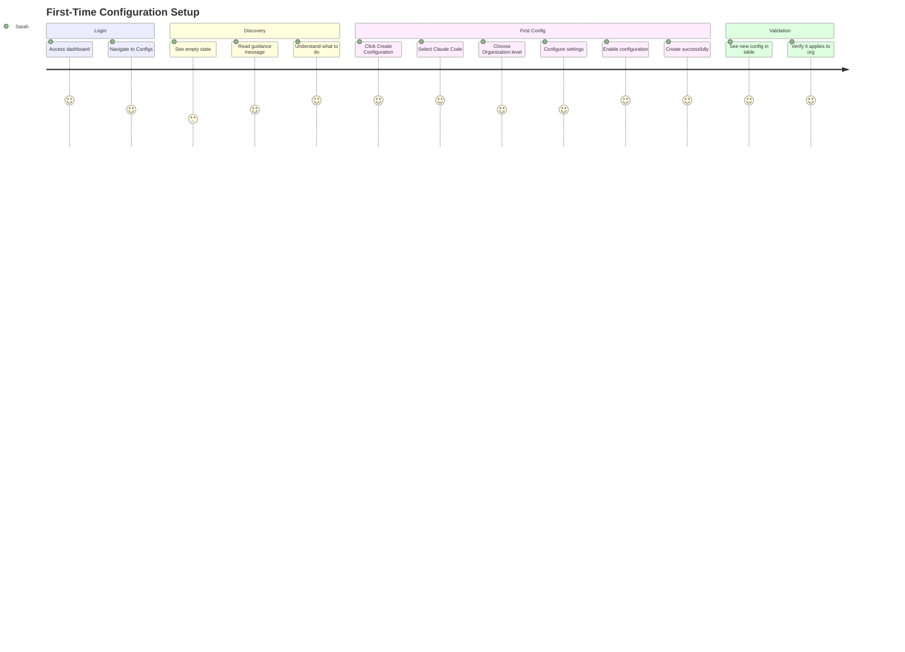
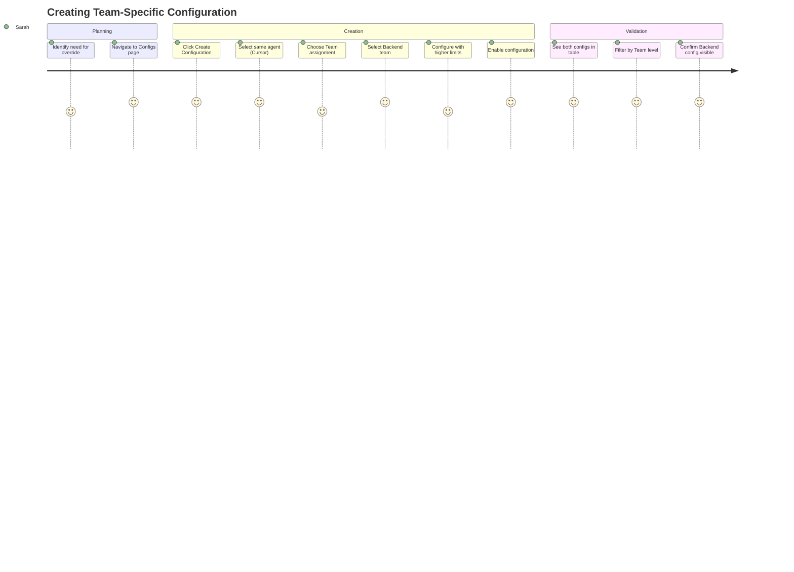
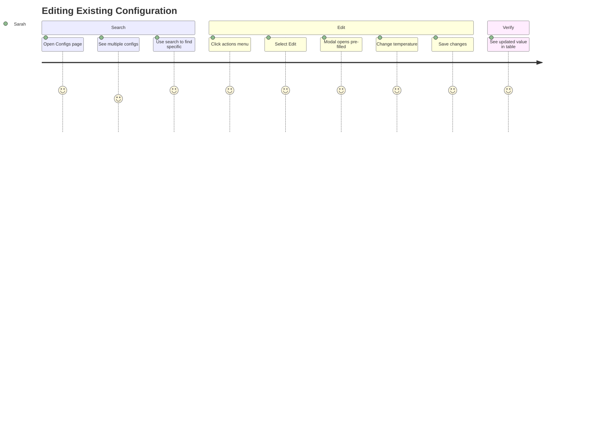
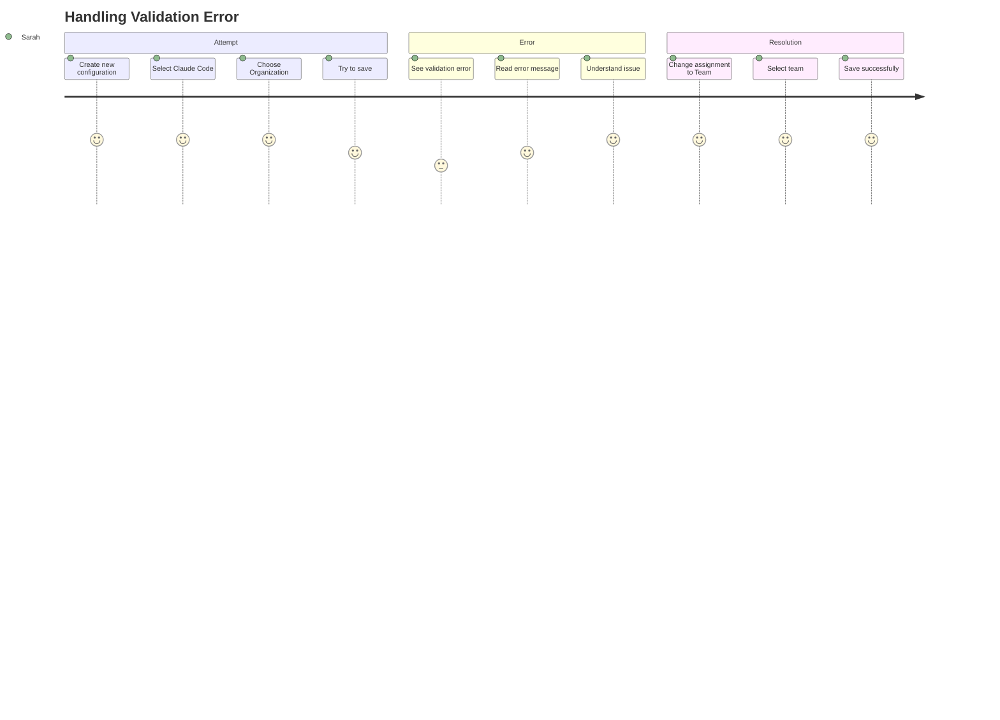
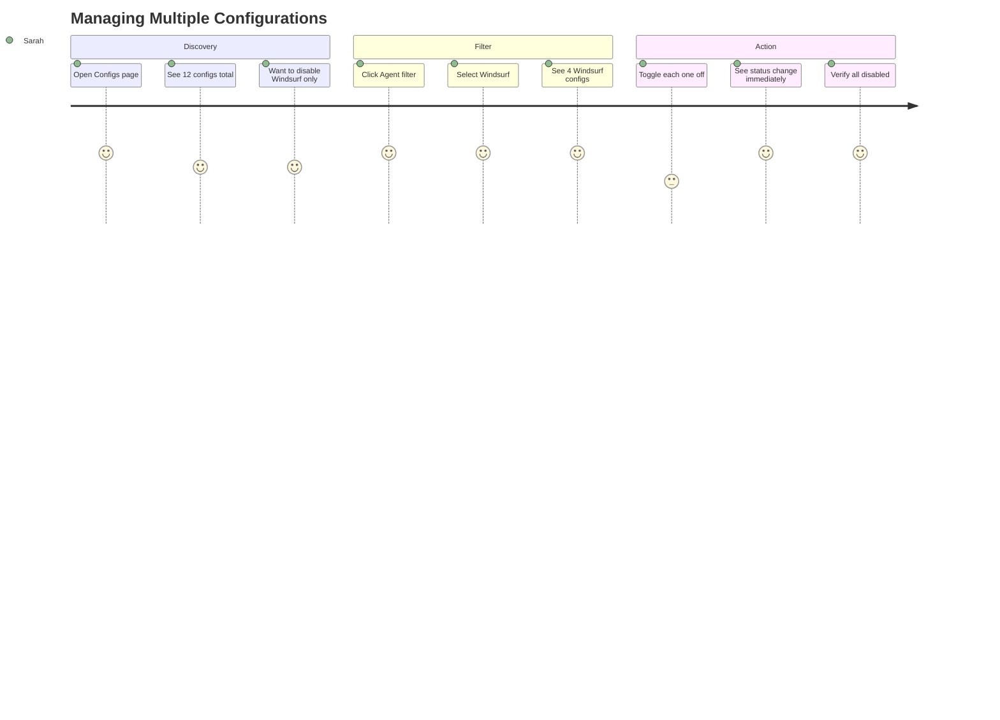
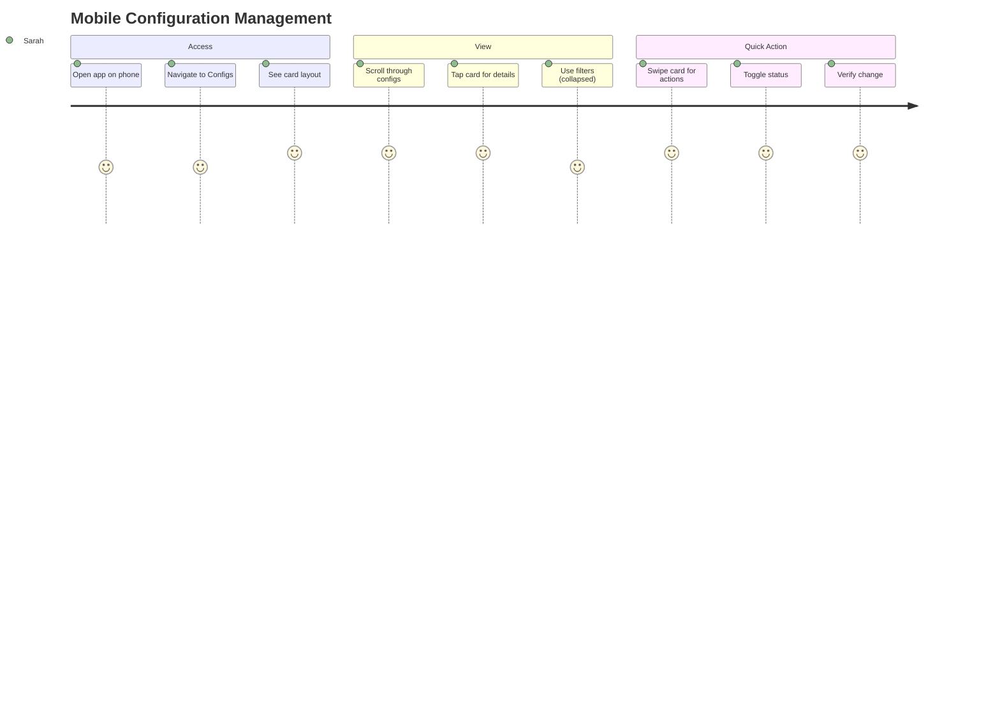

# Agent Configurations - User Journey Map

## Primary Persona: Sarah - IT Admin

**Role:** IT Administrator at Acme Corp (50 employees)
**Goal:** Configure AI agents for different teams with appropriate settings
**Tech Savvy:** High
**Pain Points:** Current system is confusing, hard to see what's configured where

---

## Journey: First-Time Setup (Empty State)

### Context
Sarah logs into Ubik Enterprise for the first time. No configurations exist yet.



### Step-by-Step Experience

#### 1. Empty State Discovery

```
┌─────────────────────────────────────────────┐
│  Agent Configurations                      │
├─────────────────────────────────────────────┤
│                                             │
│           ⚙️                                 │
│                                             │
│    No agent configurations yet              │
│                                             │
│  Create your first configuration to         │
│  get started with AI agents                 │
│                                             │
│       [+ Create Configuration]              │
│                                             │
│  Learn more about configurations →          │
└─────────────────────────────────────────────┘
```

**Emotions:** 😐 Uncertain → 🙂 Guided
**Thoughts:** "Okay, I need to create a config. That button is obvious."

#### 2. Creation Modal - Step 1

```
┌─────────────────────────────────────────┐
│  Create Agent Configuration        [X] │
├─────────────────────────────────────────┤
│  Select Agent *                         │
│  ┌───────────────────────────────────┐ │
│  │ Claude Code                      ▾│ │ ← Sarah selects this
│  └───────────────────────────────────┘ │
│                                         │
│  Assign To *                            │
│  ┌───┐  Organization                   │
│  │ ● │  Apply to entire organization   │ ← Sarah chooses this
│  └───┘                                  │
│  ┌───┐  Team                            │
│  │ ○ │  Apply to specific team         │
│  └───┘                                  │
│  ┌───┐  Employee                        │
│  │ ○ │  Apply to specific employee     │
│  └───┘                                  │
│                                         │
│            [Cancel]  [Next: Configure] │
└─────────────────────────────────────────┘
```

**Emotions:** 🙂 Clear choices
**Thoughts:** "I want all 50 employees to have Claude Code, so Organization makes sense."

#### 3. Creation Modal - Step 2

```
┌─────────────────────────────────────────┐
│  Create Agent Configuration        [X] │
├─────────────────────────────────────────┤
│  Claude Code → Organization             │
│                                         │
│  Configuration         [Toggle JSON]   │
│  ┌─────────────────────────────────┐   │
│  │ Model *                         │   │
│  │ ┌─────────────────────────────┐ │   │
│  │ │ claude-opus-4.5            ▾│ │   │ ← Sarah picks powerful model
│  │ └─────────────────────────────┘ │   │
│  │                                 │   │
│  │ Temperature                     │   │
│  │ ┌─────────────────────────────┐ │   │
│  │ │ 0.7                         │ │   │ ← Keeps default
│  │ └─────────────────────────────┘ │   │
│  │                                 │   │
│  │ ☑ Enable custom prompts         │   │ ← Sarah enables this
│  │ ☐ Enable MCP tools              │   │
│  │ ☑ Auto-save workspace           │   │ ← Sarah enables this
│  └─────────────────────────────────┘   │
│                                         │
│  Status                                 │
│  ┌────┐ Enabled                         │
│  │ ON │ Configuration is active         │ ← ON by default
│  └────┘                                 │
│                                         │
│       [← Back]  [Cancel]  [Create]     │
└─────────────────────────────────────────┘
```

**Emotions:** 😊 Confident
**Thoughts:** "Nice form interface. I can see JSON option if I need it later."

#### 4. Success State

```
┌─────────────────────────────────────────────────────────────┐
│  Agent Configurations                 [+ New Configuration] │
├─────────────────────────────────────────────────────────────┤
│  Filters: [Level: All] [Agent: All] [Status: All] [Search] │
├─────────────────────────────────────────────────────────────┤
│ Agent         Assigned To      Configuration      Status   │
├─────────────────────────────────────────────────────────────┤
│ Claude Code   Organization     model: opus-4.5    [Enabled]│ ← Sarah's config!
│                                temperature: 0.7             │
│                                custom_prompts: true         │
└─────────────────────────────────────────────────────────────┘
```

**Emotions:** 😄 Accomplished
**Thoughts:** "Great! Now all employees can use Claude Code with these settings."

**Satisfaction Score:** ⭐⭐⭐⭐⭐ (5/5)

---

## Journey: Adding Team-Specific Overrides

### Context
Sarah wants the Backend team to use different settings than the org default.



### Step-by-Step Experience

#### 1. Viewing Existing Configs

```
┌─────────────────────────────────────────────────────────────┐
│ Agent         Assigned To      Configuration      Status   │
├─────────────────────────────────────────────────────────────┤
│ Claude Code   Organization     model: opus-4.5    [Enabled]│
│                                temperature: 0.7             │
│                                max_tokens: 4096             │
│                                                        [⋮]  │
├─────────────────────────────────────────────────────────────┤
│ Cursor        Organization     model: sonnet-4.5   [Enabled]│
│                                auto_save: true              │
│                                theme: dark                  │
│                                                        [⋮]  │
└─────────────────────────────────────────────────────────────┘
```

**Thoughts:** "Backend team needs more power. I'll create a team-specific config."

#### 2. Team Selection in Modal

```
┌─────────────────────────────────────────┐
│  Create Agent Configuration        [X] │
├─────────────────────────────────────────┤
│  Select Agent *                         │
│  ┌───────────────────────────────────┐ │
│  │ Cursor                           ▾│ │
│  └───────────────────────────────────┘ │
│                                         │
│  Assign To *                            │
│  ┌───┐  Organization                   │
│  │ ○ │  Apply to entire organization   │
│  └───┘                                  │
│  ┌───┐  Team                            │
│  │ ● │  Apply to specific team         │ ← Sarah selects Team
│  └───┘                                  │
│       ┌───────────────────────────────┐ │
│       │ Backend Team              ▾│ │ ← Dropdown appears!
│       └───────────────────────────────┘ │
│  ┌───┐  Employee                        │
│  │ ○ │  Apply to specific employee     │
│  └───┘                                  │
└─────────────────────────────────────────┘
```

**Emotions:** 🙂 Smooth interaction
**Thoughts:** "Perfect! The team dropdown appeared right when I needed it."

#### 3. Result - Mixed Configs

```
┌─────────────────────────────────────────────────────────────┐
│  Filters: [Level: All▾] [Agent: All▾] [Status: All▾] [...] │
├─────────────────────────────────────────────────────────────┤
│ Agent         Assigned To      Configuration      Status   │
├─────────────────────────────────────────────────────────────┤
│ Claude Code   Organization     model: opus-4.5    [Enabled]│
│ Cursor        Organization     model: sonnet-4.5   [Enabled]│
│ Cursor        Team: Backend    model: opus-4.5    [Enabled]│ ← New!
│                                max_tokens: 8192             │
│                                advanced: true               │
└─────────────────────────────────────────────────────────────┘
```

**Emotions:** 😊 Clear visibility
**Thoughts:** "I can see both the org-wide Cursor config and the Backend team override."

**Satisfaction Score:** ⭐⭐⭐⭐⭐ (5/5)

---

## Journey: Finding and Editing Configuration

### Context
Sarah needs to adjust the temperature setting for the org-wide Claude Code config.



### Step-by-Step Experience

#### 1. Using Search

```
┌─────────────────────────────────────────────────────────────┐
│  Filters:                                                   │
│  [Level: All] [Agent: All] [Status: All]                   │
│  ┌──────────────────────────────┐                          │
│  │ [🔍] claude code org         │ ← Sarah types search     │
│  └──────────────────────────────┘                          │
└─────────────────────────────────────────────────────────────┘

Results filtered:
┌─────────────────────────────────────────────────────────────┐
│ Agent         Assigned To      Configuration      Status   │
├─────────────────────────────────────────────────────────────┤
│ Claude Code   Organization     model: opus-4.5    [Enabled]│ ← Only match
│                                temperature: 0.7             │
│                                max_tokens: 4096             │
│                                                        [⋮]  │
└─────────────────────────────────────────────────────────────┘
```

**Emotions:** 🙂 Efficient
**Thoughts:** "Search works great. Found exactly what I needed."

#### 2. Actions Menu

```
┌─────────────────────────────────────────────────────────────┐
│ Claude Code   Organization     model: opus-4.5    [Ena [⋮]│ ← Click
│                                temperature: 0.7    ┌────────┴─────┐
│                                max_tokens: 4096    │ Edit         │ ← Select
│                                                    │ Duplicate    │
│                                                    │ Toggle Off   │
│                                                    │ ───────────│
│                                                    │ Delete       │
│                                                    └──────────────┘
└─────────────────────────────────────────────────────────────┘
```

**Emotions:** 😊 Intuitive
**Thoughts:** "All the actions I need are right here."

#### 3. Edit Modal (Pre-filled)

```
┌─────────────────────────────────────────┐
│  Edit Agent Configuration          [X] │
├─────────────────────────────────────────┤
│  Claude Code → Organization             │
│                                         │
│  Configuration         [Toggle JSON]   │
│  ┌─────────────────────────────────┐   │
│  │ Model                           │   │
│  │ ┌─────────────────────────────┐ │   │
│  │ │ claude-opus-4.5            ▾│ │   │
│  │ └─────────────────────────────┘ │   │
│  │                                 │   │
│  │ Temperature                     │   │
│  │ ┌─────────────────────────────┐ │   │
│  │ │ 0.9   ← Changed from 0.7    │ │   │
│  │ └─────────────────────────────┘ │   │
│  │ [─────────────●─────────] 0-1  │   │
│  └─────────────────────────────────┘   │
│                                         │
│            [Cancel]  [Save Changes]    │
└─────────────────────────────────────────┘
```

**Emotions:** 😄 Seamless
**Thoughts:** "All my settings were there. Just changed temperature and saved."

**Satisfaction Score:** ⭐⭐⭐⭐⭐ (5/5)

---

## Journey: Troubleshooting (Error State)

### Context
Sarah tries to create a duplicate config by mistake. System prevents it.



### Step-by-Step Experience

#### 1. Validation Error

```
┌─────────────────────────────────────────┐
│  Create Agent Configuration        [X] │
├─────────────────────────────────────────┤
│  ┌───────────────────────────────────┐ │
│  │ ⚠ Configuration already exists    │ │
│  │ Claude Code is already configured │ │
│  │ for Organization. Use a different │ │
│  │ assignment or edit the existing.  │ │
│  └───────────────────────────────────┘ │
│                                         │
│  Select Agent *                         │
│  ┌───────────────────────────────────┐ │
│  │ Claude Code                      ▾│ │
│  └───────────────────────────────────┘ │
└─────────────────────────────────────────┘
```

**Emotions:** 😐 Confused → 🙂 Informed
**Thoughts:** "Oh right, I already have an org-wide config. The error tells me what to do."

#### 2. Fix by Choosing Team

```
┌─────────────────────────────────────────┐
│  Create Agent Configuration        [X] │
├─────────────────────────────────────────┤
│  Select Agent *                         │
│  ┌───────────────────────────────────┐ │
│  │ Claude Code                      ▾│ │
│  └───────────────────────────────────┘ │
│                                         │
│  Assign To *                            │
│  ┌───┐  Organization                   │
│  │ ○ │  Apply to entire organization   │
│  └───┘                                  │
│  ┌───┐  Team                            │
│  │ ● │  Apply to specific team         │ ← Changed to Team
│  └───┘                                  │
│       ┌───────────────────────────────┐ │
│       │ Frontend Team             ▾│ │ ← Selected Frontend
│       └───────────────────────────────┘ │
└─────────────────────────────────────────┘
```

**Emotions:** 😊 Problem solved
**Thoughts:** "I'll create a team-specific override instead."

**Satisfaction Score:** ⭐⭐⭐⭐ (4/5) - Error was handled well

---

## Journey: Bulk Management

### Context
Sarah needs to disable all Windsurf configurations temporarily.



### Step-by-Step Experience

#### 1. Filter by Agent

```
┌─────────────────────────────────────────────────────────────┐
│  Filters:                                                   │
│  [Level: All▾] [Agent: Windsurf▾] [Status: All▾] [Search] │ ← Filter active
└─────────────────────────────────────────────────────────────┘

┌─────────────────────────────────────────────────────────────┐
│ Agent         Assigned To        Configuration    Status   │
├─────────────────────────────────────────────────────────────┤
│ Windsurf      Organization       model: opus-4.5  [Enabled]│
│ Windsurf      Team: Backend      model: sonnet    [Enabled]│
│ Windsurf      Team: Frontend     model: sonnet    [Enabled]│
│ Windsurf      Employee: John     model: opus-4.5  [Enabled]│
└─────────────────────────────────────────────────────────────┘

Showing 4 configurations (filtered from 12 total)
```

**Emotions:** 😊 Organized view
**Thoughts:** "Perfect! Filter shows only Windsurf configs."

#### 2. Toggle Status

```
┌─────────────────────────────────────────────────────────────┐
│ Windsurf      Organization       model: opus-4.5  [Ena [⋮]│
│                                                   ┌────────┴─┐
│                                                   │ Edit     │
│                                                   │ Duplicate│
│                                                   │ Toggle Off│ ← Click
│                                                   │ ─────────│
│                                                   │ Delete   │
│                                                   └──────────┘
└─────────────────────────────────────────────────────────────┘

Immediately updates to:
┌─────────────────────────────────────────────────────────────┐
│ Windsurf      Organization       model: opus-4.5 [Disabled]│ ← Changed!
└─────────────────────────────────────────────────────────────┘
```

**Emotions:** 😊 Quick action
**Thoughts:** "No confirmation needed for toggle. Fast!"

**Satisfaction Score:** ⭐⭐⭐⭐ (4/5) - Wish there was bulk select

---

## Journey: Mobile Usage

### Context
Sarah is traveling and needs to check configs on her phone.



### Mobile Experience

#### Card View (Mobile)

```
┌───────────────────────────────────────┐
│  ☰  Agent Configurations      [👤 ▾] │
├───────────────────────────────────────┤
│  ┌─────────────────────────────────┐ │
│  │ [🔍] Search configurations...   │ │
│  └─────────────────────────────────┘ │
│                                       │
│  ┌─────────────────────────────────┐ │
│  │ Filters                        ▾│ │ ← Collapsed by default
│  └─────────────────────────────────┘ │
│                                       │
│  ┌─────────────────────────────────┐ │
│  │   [+] New Configuration         │ │
│  └─────────────────────────────────┘ │
│                                       │
│  ┌─────────────────────────────────┐ │
│  │ Claude Code             [Enabled]│ │ ← Card (tap for details)
│  │ Organization                     │ │
│  │ ─────────────────────────────── │ │
│  │ model: opus-4.5                  │ │
│  │ temperature: 0.7                 │ │
│  │ max_tokens: 4096                 │ │
│  │                            [⋮]   │ │
│  └─────────────────────────────────┘ │
└───────────────────────────────────────┘
```

**Emotions:** 🙂 Readable on small screen
**Thoughts:** "Cards are easier to scan than a table on mobile."

**Satisfaction Score:** ⭐⭐⭐⭐ (4/5) - Mobile works well

---

## Pain Points Addressed

### Old System vs New System

| Pain Point | Old System | New System | Impact |
|------------|-----------|------------|---------|
| **Visibility** | Separate pages for org/team/employee | Unified table with filters | ⭐⭐⭐⭐⭐ High |
| **Navigation** | 3+ clicks to view all configs | 1 click to Configs page | ⭐⭐⭐⭐⭐ High |
| **Search** | No search, manual scrolling | Full-text search + filters | ⭐⭐⭐⭐ Medium |
| **Creation** | Confusing multi-page flow | Clear 2-step wizard | ⭐⭐⭐⭐⭐ High |
| **Assignment** | Unclear who config applies to | "Assigned To" column explicit | ⭐⭐⭐⭐⭐ High |
| **Quick Actions** | Edit requires 2-3 clicks | Actions menu (1 click) | ⭐⭐⭐⭐ Medium |
| **Status Toggle** | Edit modal just to enable/disable | Toggle in actions menu | ⭐⭐⭐⭐ Medium |
| **Mobile** | Desktop-only, not responsive | Fully responsive card layout | ⭐⭐⭐ Low |
| **Empty State** | Confusing blank page | Guided empty state with CTA | ⭐⭐⭐⭐ Medium |

---

## Success Metrics

### Quantitative Goals

| Metric | Baseline | Target | Measurement |
|--------|----------|--------|-------------|
| Time to create first config | 5 minutes | 2 minutes | User session tracking |
| Clicks to view all configs | 8+ clicks | 1 click | Analytics |
| Search usage | 0% (doesn't exist) | 60%+ | Feature adoption |
| Mobile traffic | 5% (broken) | 20% | Device analytics |
| Support tickets (configs) | 15/month | <5/month | Support system |

### Qualitative Goals

| Goal | Measurement | Target |
|------|-------------|--------|
| User understands config hierarchy | User survey | 90% clarity score |
| First-time users complete setup | Onboarding completion | 95% success rate |
| Users feel confident editing configs | User survey | 85% confidence score |
| Mobile experience is satisfactory | Mobile user survey | 80% satisfaction |

---

## Emotional Journey Summary

```
Setup Journey (First-Time User):
😐 Uncertain → 🙂 Guided → 😊 Confident → 😄 Accomplished
Overall: Positive arc, clear progression

Override Journey (Experienced User):
🙂 Smooth → 😊 Efficient → 😄 Accomplished
Overall: Consistently positive, no friction

Edit Journey (Routine Task):
🙂 Easy → 😊 Intuitive → 😄 Quick
Overall: Fast and frictionless

Error Journey (Problem Resolution):
😐 Confused → 🙂 Informed → 😊 Resolved
Overall: Error handled well, user not stuck

Mobile Journey (On-the-Go):
🙂 Readable → 😊 Functional → 🙂 Satisfied
Overall: Good enough for mobile tasks
```

---

## Next Steps: User Testing

### Testing Plan

1. **Prototype Testing** (Before implementation)
   - Clickable prototype in Figma or HTML
   - 5 users: 3 experienced admins, 2 new admins
   - Tasks: Create config, edit config, filter, search
   - Measure: Time to complete, errors, satisfaction

2. **Alpha Testing** (During implementation)
   - Staging environment with real data
   - Internal team + 2 friendly customers
   - Full feature usage for 1 week
   - Collect: Feedback, bug reports, suggestions

3. **Beta Testing** (Before launch)
   - Production environment, limited rollout
   - 10 customers, various org sizes
   - 2 weeks full usage
   - Measure: Success metrics, support tickets

4. **Post-Launch Monitoring**
   - Analytics tracking (Mixpanel, Amplitude)
   - User surveys (NPS, CSAT)
   - Support ticket analysis
   - Iterate based on feedback

---

**Document Status:** ✅ Complete
**Last Updated:** 2025-01-15
**Maintained By:** Product Designer
**Next Review:** After user testing
